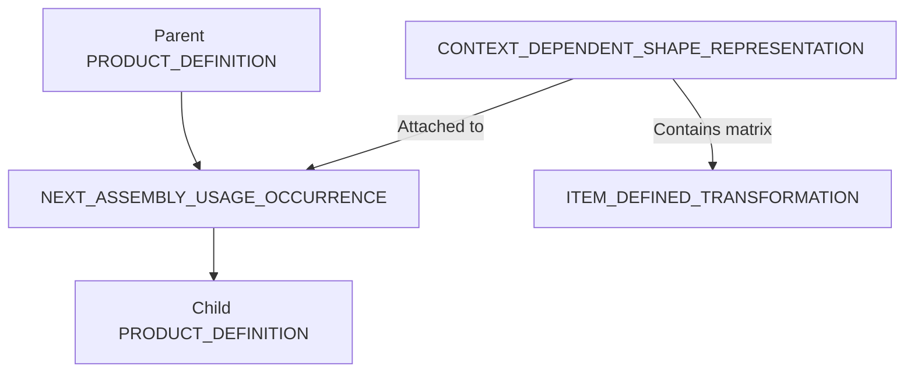

# Assembly Support

This document explains how assemblies (hierarchical structures) are represented in STEP files.

## 1. Hierarchy Mechanism

In STEP, parent-child relationships and their associated transformation (placement) information are described separately.

- **NEXT_ASSEMBLY_USAGE_OCCURRENCE (NAUO)**: The central entity that logically connects a parent part to a child part.
- **ITEM_DEFINED_TRANSFORMATION**: The coordinate transformation matrix (rotation and translation).

## 2. External References

When dealing with large assemblies, there are two common management methods:

| Method | Characteristics | Compatibility Risks |
| :--- | :--- | :--- |
| **Monolithic** | All data is packed into a single file. | File size can become massive, sometimes leading to loading failures. |
| **External Reference** | Geometry data is stored in separate files and referenced via paths. | Relative paths may break, or the receiver may not support reference resolution. |

## 3. Mathematical Details of Transformation

Assembly placement information is typically described in one of two ways:

### A. Transformation Matrix (`ITEM_DEFINED_TRANSFORMATION`)
Describes the transformation from the parent coordinate system to the child coordinate system as a direct matrix (or a 3x3 matrix and a translation vector).
- **Application Order**: If $P_{child}$ is the local coordinate of the child part and $M$ is the transformation matrix, the position in the parent coordinate system $P_{parent}$ is usually $P_{parent} = M \times P_{child}$.
- **Note**: While formulated in the STEP standard, some CAD kernels may require the matrix to be transposed.

### B. Definition via Axis Placement (`AXIS2_PLACEMENT_3D`)
Uses `REPRESENTATION_RELATIONSHIP_WITH_TRANSFORMATION` to specify the origin in the parent (From) and the target placement for the child (To) using `AXIS2_PLACEMENT_3D`.
- **Pros**: More intuitive than numerical matrices and tends to have higher interoperability between CAD systems.

## 4. Implementation Notes
* **Transformation Reversal**: The order of matrix application (Parent to Child vs. Child to Parent) is defined in the standard, but some implementations may read them in reverse.
* **Unit Propagation**: If a parent assembly is in mm and a child part is in inches, units must be converted before applying the transformation matrix.

---
## 📚 Next Steps
- **[PMI Support](./pmi-support.md)** - Definition of dimensions and tolerances.

[Back to README](../README.md)
