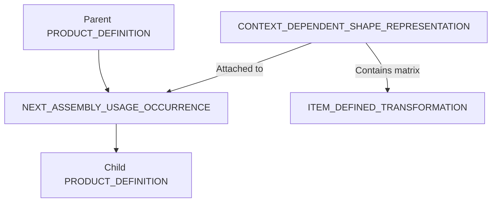

# アセンブリ構造 (Assembly Support)

STEPファイルにおけるアセンブリ（階層構造）の表現方法についての解説です。

## 1. 階層の仕組み

STEPでは、親子関係(Relationship)と、それに付随する配置情報(Transformation)を分離して記述します。

- **NEXT_ASSEMBLY_USAGE_OCCURRENCE (NAUO)**: 親部品と子部品を論理的につなぐ中心エンティティ。
- **ITEM_DEFINED_TRANSFORMATION**: 座標変換行列（回転・平行移動）。

## 2. 外部参照 (External References)

大規模なアセンブリを扱う際、以下の2通りの管理方法があります。

| 方式 | 特徴 | 互換性リスク |
| :--- | :--- | :--- |
| **Monolithic** | 1ファイルに全データを詰め込む | ファイルサイズが巨大化し、読み込みに失敗することがある |
| **External Reference** | 形状データを別ファイルにし、パスで参照する | 相対パスが壊れたり、受信側が参照解決をサポートしていないことがある |

## 3. 座標変換の数学的詳細 (Transformation Math)

アセンブリの配置情報は、以下の2つのケースで記述されます。

### A. 配置行列 (`ITEM_DEFINED_TRANSFORMATION`)
親の座標系から子の座標系への変換を、直接的な行列（または 3x3 行列と平行移動ベクトル）として記述します。
- **適用順序**: 子部品のローカル座標を $P_{child}$、変換行列を $M$ とすると、親座標系での位置 $P_{parent}$ は通常 $P_{parent} = M \times P_{child}$ となります。
- **注意**: STEP規格上は定式化されていますが、一部のCADカーネルでは行列の転置が必要な場合があります。

### B. 軸配置による定義 (`AXIS2_PLACEMENT_3D`)
`REPRESENTATION_RELATIONSHIP_WITH_TRANSFORMATION` を使用し、親の基準位置（From）と子の配置位置（To）を `AXIS2_PLACEMENT_3D` で指定します。
- **メリット**: 数値的な行列よりも直感的で、CAD間の互換性が高い傾向にあります。

## 4. 実装の注意点
* **Transformationの逆転**: 行列の適用順序（Parent to Child か Child to Parent か）は規格で定義されていますが、一部の実装で逆転して読み込まれることがあります。
* **単位の伝搬**: 親アセンブリが mm、子部品が inch の場合、変換行列を適用する前に単位変換を行う必要があります。

---
[READMEに戻る](../README.md)
