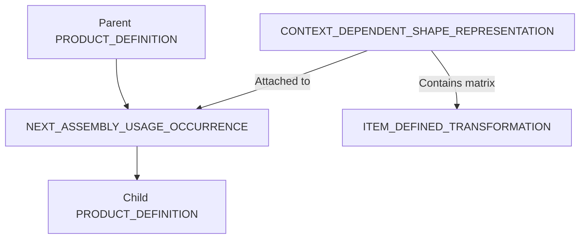

# アセンブリ構造 (Assembly Support)

STEPファイルにおけるアセンブリ（階層構造）の表現方法についての解説です。

## 1. 階層の仕組み

STEPでは、親子関係(Relationship)と、それに付随する配置情報(Transformation)を分離して記述します。

- **NEXT_ASSEMBLY_USAGE_OCCURRENCE (NAUO)**: 親部品と子部品を論理的につなぐ中心エンティティ。
- **ITEM_DEFINED_TRANSFORMATION**: 座標変換行列（回転・平行移動）。

## 2. 外部参照 (External References)

大規模なアセンブリを扱う際、以下の2通りの管理方法があります。

| 方式 | 特徴 | 互換性リスク |
| :--- | :--- | :--- |
| **Monolithic** | 1ファイルに全データを詰め込む | ファイルサイズが巨大化し、読み込みに失敗することがある |
| **External Reference** | 形状データを別ファイルにし、パスで参照する | 相対パスが壊れたり、受信側が参照解決をサポートしていないことがある |

## 3. 実装の注意点
* **Transformationの逆転**: 行列の適用順序（Parent to Child か Child to Parent か）は規格で定義されていますが、一部の実装で逆転して読み込まれることがあります。
* **Instance Names**: NAUO 内の属性として「インスタンス名」を記述できますが、これを無視するCADも多いため、重要な情報は `PRODUCT` 名に含めるのが安全です。

---
[READMEに戻る](../README.md)
