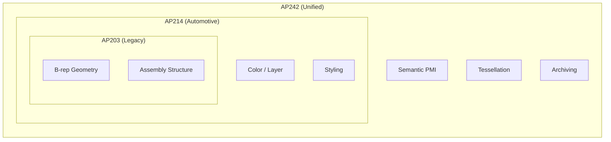

# Capability Matrix

A detailed comparison of which functions are supported by which AP.

### Functional Coverage Map

| Feature Category | Detailed Feature | AP203 | AP214 | AP242 |
| :--- | :--- | :---: | :---: | :---: |
| **Geometry** | B-rep | ✅ | ✅ | ✅ |
| | Surface / Wireframe | ✅ | ✅ | ✅ |
| | Tessellated (Mesh) | ❌ | ⚠ | ✅ |
| **Presentation** | Color / Layer | ❌ | ✅ | ✅ |
| | Transparency | ❌ | ✅ | ✅ |
| **Assembly** | Structure | ✅ | ✅ | ✅ |
| | Simplified Assembly | ❌ | ❌ | ✅ |
| **PMI** | Graphical PMI | ❌ | ⚠ | ✅ |
| | Semantic PMI | ❌ | ❌ | ✅ |
| **Admin** | Material Properties | ⚠ | ✅ | ✅ |
| | User Defined Props | ⚠ | ✅ | ✅ |

**Legend**: ✅ Fully Supported | ⚠ Partially Supported | ❌ Not Supported

---
## 📚 Next Steps
- **[STEP File Walkthrough](../examples/step-file-walkthrough.md)** - Understand real files line by line.

[Back to README](../README.md)
