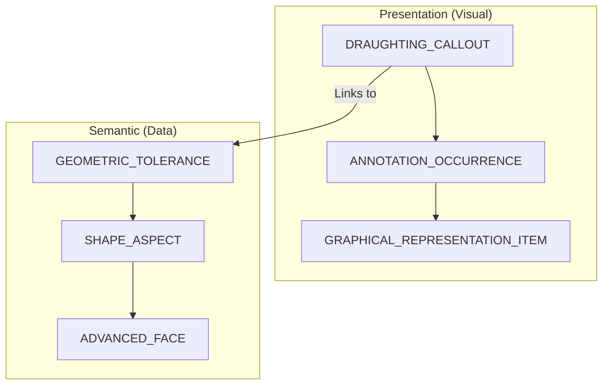

# PMI Support

Handling Product and Manufacturing Information (PMI) in STEP is one of the most significant implementation challenges.

## 1. Types of PMI

### Graphical PMI (Representation)
* "Visual lines and characters for human consumption."
* It looks correct in CAD, but it does not contain "tolerance values" as data (it's simply a collection of `POLYLINE`s).

### Semantic PMI (Data)
* "Attribute data that a computer can understand."
* Downstream software (CAM, inspection, etc.) can directly read the tolerance types and values. This is the core of AP242.

## 2. PMI Support by AP

| AP | Graphical | Semantic | Primary Entities |
| :--- | :---: | :---: | :--- |
| **AP203** | ❌ | ❌ | - |
| **AP214** | ✅ | ❌ | `DRAUGHTING_CALLOUT` |
| **AP242** | ✅ | ✅ | `GEOMETRIC_TOLERANCE`, `SHAPE_ASPECT` |

## 3. Implementation Structure (PMI Linkage)

This diagram shows how PMI "Location/Appearance (Presentation)" and "Meaning (Semantic)" are linked together.

### Important Links
- **SHAPE_ASPECT_RELATIONSHIP**: Used when defining a tolerance between two faces (e.g., perpendicularity between Datum A and Datum B).
- **REPRESENTATION_ITEM**: Stores the actual text data or polylines.

## 4. Implementation Hurdles

The most common reason why "PMI disappeared even though I used AP242" is either insufficient implementation on the receiving CAD side or the sender only outputting "Graphical" PMI.

- **CAx-IF Recommendation**: To exchange semantic information, you must strictly follow the CAx-IF `Recommended Practices for PMI` and correctly configure the `SHAPE_ASPECT` structure.

---
## 📚 Next Steps
- **[CAD Support Matrix](./cad-support-matrix.md)** - Check PMI support status across different CAD systems.

[Back to README](../README.md)
