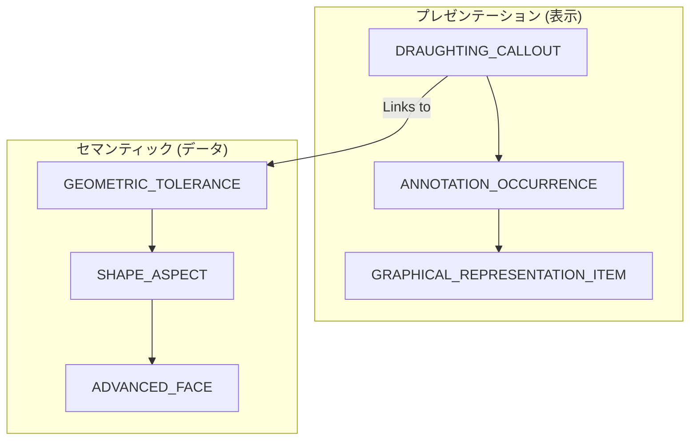

# PMI サポート状況 (PMI Support)

PMI (Product Manufacturing Information) のSTEPにおける扱いは、実装上の最も大きな課題の一つです。

## 1. PMIの種類

### Graphical PMI (Representation)
* 「人間が見るための線と文字」
* CAD上で見た目は正しいが、データとして「公差値」などは持っていない（単なる `POLYLINE` の集合）。

### Semantic PMI (Data)
* 「コンピュータが理解できる属性データ」
* 下流のCAMや計測ソフトが、公差タイプや数値を直接読み取れる。AP242の核心部分。

## 2. APごとのPMIサポート

| AP | Graphical | Semantic | 主要エンティティ |
| :--- | :---: | :---: | :--- |
| **AP203** | ❌ | ❌ | - |
| **AP214** | ✅ | ❌ | `DRAUGHTING_CALLOUT` |
| **AP242** | ✅ | ✅ | `GEOMETRIC_TOLERANCE`, `SHAPE_ASPECT` |

## 3. 実装の構造 (PMI Linkage)

PMIが「どこにあるか（プレゼンテーション）」と「何を表すか（セマンティック）」がどのように紐付くかの全体図です。

### 重要なリンク
- **SHAPE_ASPECT_RELATIONSHIP**: 2つの面（データムAとデータムB）の間の公差（直角度など）を定義する際に使用。
- **REPRESENTATION_ITEM**: ここに実際の文字データ（Text）やポリラインが格納されます。

## 4. 実装の壁
「AP242で出したのにPMIが消えた」原因のほとんどは、受信側CADの実装不足、または送信側が「グラフィカル」のみで出力していることにあります。
- **CAx-IF推奨**: セマンティック情報をやり取りするには、CAx-IFの `Recommended Practices for PMI` に厳密に従い、`SHAPE_ASPECT` を正しく構成する必要があります。

---
## 📚 次のステップ
- **[CADサポートマトリックス](./cad-support-matrix.md)** - 各CADでのPMI対応状況を確認

[READMEに戻る](../README.md)
