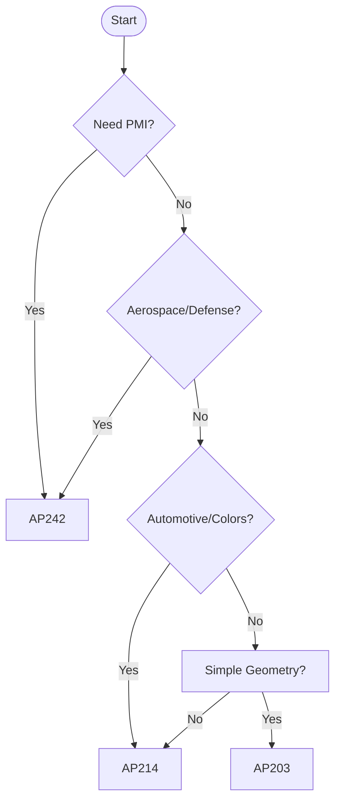

# Which AP should I use?

While many Application Protocols (APs) exist in STEP, three are primarily used in modern manufacturing and design environments.

## 1. Quick Diagnosis Flow

1. **Do you need to include PMI (dimensions and geometric tolerances) in the data?**
   - **Yes** → **AP242** is your only choice.
   - **No** → Next

2. **Is this for Aerospace, Defense, or modern MBD (Model Based Definition) processes?**
   - **Yes** → **AP242** is recommended.
   - **No** → Next

3. **Is this for the automotive industry, or is preserving "Colors and Layers" important?**
   - **Yes** → **AP214** is the de-facto standard.
   - **No** (simple geometry only) → **AP203** (e1/e2) might suffice, but **AP214** or later is now more common.

## 2. AP Characteristics Summary

| AP | Common Name | Characteristics | Key Data Preserved (beyond geometry) |
| :--- | :--- | :--- | :--- |
| **AP203** | Configuration Controlled Design | Legacy standard. Stable but limited in features. | Basic geometry, Management data |
| **AP214** | Core Data for Automotive Design | Originating from the automotive industry. Strong support for colors, layers, and assemblies. | Colors, Layers, Styling |
| **AP242** | Managed Model-based 3D Engineering | Latest standard. Integrates and evolves AP203 and AP214. | PMI, Tessellated geometry, LOTAR, etc. |

## 3. Recommendations by Industry/Use Case

* **General Data Exchange**: AP214 (or AP242)
* **Modern CAD Interoperability / MBD**: AP242
* **Legacy System Compatibility**: AP203
* **Long-Term Archiving (LOTAR)**: AP242 + LOTAR

---
## 📚 Next Steps
- **[Capability Matrix](../comparison/capability-matrix.md)** - Detailed functional comparison between APs.

[Back to README](../README.md)
