# Getting Started for STEP Implementers

**Estimated Time**: 10 minutes

This guide is a super-intro for implementers who have CAD experience but are new to the STEP standard. It aims to help you grasp the basics of STEP quickly.

---

## 🎯 What You'll Learn in 10 Minutes

1. What STEP is (from an implementer's perspective)
2. First step: Reading a STEP file
3. **[STEP File Basics](../format/step-file-basics.md)**: Understanding syntax and structure fundamentals
4. Recommended tools and resources
5. What to read next

---

## 1. What is STEP? (Implementer's Perspective)

### Core Mental Model

Before diving into the syntax, it is helpful to understand the relationship between the file structure and the data objects.


### Core Properties

**STEP** (Standard for the Exchange of Product model data, ISO 10303) is:
- A **text-based** CAD data exchange format.
- A way to represent 3D geometry using **B-rep** (Boundary Representation).
- Capable of storing not just geometry, but also **management information** (Products, Assemblies) and **PMI** (Product and Manufacturing Information/Tolerances).

---

## What is the Part 21 Format?

**Part 21** is the standard for saving STEP data as a text file.

### Official Name and Origins

- **Official Name**: ISO 10303-21 "Clear text encoding of the exchange structure"
- **Established by**: ISO (International Organization for Standardization)
- **First Published**: 1994
- **Latest Version**: ISO 10303-21:2016

### Why "Part 21"?

The STEP standard (ISO 10303) is a massive collection of hundreds of "parts":

#### Relationship Map of Major Parts


#### List of Major Parts

**Parts 1-20s: Fundamentals & Shared Specifications**
- Part 11: EXPRESS Language (Data modeling language)
- Part 21: **Clear text encoding (ASCII/Clear text)** ← **Most Important!**
- Part 28: XML representation

**Parts 40-50s: Integrated Resources**
- Part 41: Fundamentals of product description and support
- Part 42: Geometric and topological representation
- Part 43: Representation structures
- Part 44: Product structure configuration
- Part 45: Materials and others

**Parts 100s: Integrated Application Resources**
- Part 101: Draughting
- Part 104: Finite element analysis
- Part 105: Kinematics

**Parts 200s: Application Protocols (AP) - Most used by implementers**
- Part 203: **AP203** - Configuration controlled 3D design
- Part 214: **AP214** - Core data for automotive design
- Part 238: AP238 - Application protocol for computer controlled controllers
- Part 242: **AP242** - Managed model-based 3D engineering (Latest & Most Important)

**Parts 500s+: Abstract Test Suites, etc.**

#### Essential Parts for Implementers

In practice, only these five are essential:

1. **Part 21** (Text format) ← Reading and writing files
2. **Part 11** (EXPRESS) ← Understanding the schema
3. **Part 203, 214, 242** (APs) ← Deciding which standard to use

**Part 21** simply means the "21st part" of the standard, defining the **encoding method** (how data is saved to a file).

### Relationship with Other Formats

| Standard | File Format | Characteristics | CAD Support |
|------|------------|------|------------|
| **Part 21** | `.stp`, `.step` (ASCII) | Human-readable, most common | ✅ Almost all CAD |
| Part 28 | `.stpx`, `.stpZ` (XML) | XML-friendly, redundant | ❌ Very limited |
| - | (Binary Format) | No official binary format | - |

> [!IMPORTANT]
> **CAD Support Status**
> 
> - **Part 21**: Supported by **almost all CAD software** including SolidWorks, CATIA, NX, Creo, Inventor, and Fusion360.
> - **Part 28**: Only supported by specific tools. **Major CAD software often does not support it.**
>   - ✅ Supported: Siemens NX, Kubotek Kosmos, STEP Tools
>   - ❌ Not Supported: SolidWorks, Creo, Inventor, Fusion360, FreeCAD
> - In professional practice, **Part 21 (`.step`) is the standard.**
> 
> **Detail**: [Part 21 vs Part 28 Comparison](../comparison/part21-vs-part28.md)

**Note**: Over 99% of STEP files are in Part 21 format. Part 28 is mainly for academic or research purposes and is rarely used in actual CAD data exchange.

---

## Basic Structure of Part 21 Format

The most common STEP files (`.stp` / `.step`) use the **Part 21** format and have the following structure:

```step
ISO-10303-21;                  ← Part 21 format declaration
HEADER;                         ← File metadata
  FILE_DESCRIPTION(...);
  FILE_NAME(...);
  FILE_SCHEMA(...);            ← AP version (Crucial!)
ENDSEC;
DATA;                           ← Actual data
  #10 = PRODUCT(...);          ← Entity instances
  #20 = PRODUCT_DEFINITION_FORMATION(...);
  ...
ENDSEC;
END-ISO-10303-21;
```

### Three Key Concepts

#### ① Entity
The "type" of data. Equivalent to a "class" in object-oriented programming.
- Examples: `PRODUCT`, `SHAPE_REPRESENTATION`, `ADVANCED_FACE`
- Always written in uppercase.

#### ② Instance
Concrete data for an entity. Identified by `#number`.
```step
#10 = PRODUCT('Part_A', 'Part_A', 'Description', (#20));
```
- `#10` = Instance ID
- `PRODUCT` = Entity type
- `'Part_A', ...` = Attribute values

#### ③ Reference
Referencing other instances using their `#number`.
```step
#10 = PRODUCT(..., (#20));  ← References #20
#20 = PRODUCT_CONTEXT(...);
```

**Parsing Tips**:
- Instance IDs start from 1 and are unique within the file.
- **Forward references** are allowed (an ID can be referenced before it is defined).
- Using a hash map (dictionary) is efficient for resolving references.

---

## 2. First Step: Reading a STEP file

### Step 1: Open with a Text Editor

Since STEP files are plain text, you can open them with **Notepad** or **VS Code**.

1. Prepare any `.step` file.
2. Open it in your text editor.
3. Inspect the `HEADER` section.

### Step 2: Identify the AP Version

Check the `FILE_SCHEMA` in the `HEADER` section:

```step
FILE_SCHEMA(('AP214_AUTOMOTIVE_DESIGN { ... }'));
```
→ This is an AP214 file.

```step
FILE_SCHEMA(('AP242_MANAGED_MODEL_BASED_3D_ENGINEERING_MIM_LF { ... }'));
```
→ This is an AP242 file.

**Why is this important?**
- Different APs use different entities.
- Parsers need to load the schema corresponding to the AP.

### Step 3: Find the PRODUCT Entity

Search for `PRODUCT(` in the `DATA` section:
```step
#10 = PRODUCT('Part_A','Part_A','Simple part',(#20));
```
This is the top-level information for the part.

**Following the Related Entities**:
```
PRODUCT (#10)
  ↓ (via PRODUCT_DEFINITION_FORMATION)
PRODUCT_DEFINITION (#50)
  ↓ (via PRODUCT_DEFINITION_SHAPE)
SHAPE_REPRESENTATION (#90)
  ↓
REPRESENTATION_ITEM (#100-#500)  ← Geometry data is here
```

**Visual Traversal Path**:


**Traversal Steps**:
1. Start with `PRODUCT` (#10) - the top-level part information
2. Follow `PRODUCT_DEFINITION_FORMATION` to manage versions
3. Follow `PRODUCT_DEFINITION` to get design context
4. Follow `PRODUCT_DEFINITION_SHAPE` as the bridge to geometry
5. Follow `SHAPE_REPRESENTATION` to reach the geometry container
6. Extract `REPRESENTATION_ITEM` instances (faces, edges, vertices)

See the [Data Model Map](../format/data-model-map.md) for details.

### Step 4: How to Reach Geometry Data (Overview)

In an actual implementation:

**Pseudocode (Python-style)**:
```python
# 1. Get the PRODUCT instance
product = find_entity(step_file, 'PRODUCT')

# 2. Follow to PRODUCT_DEFINITION
product_def = traverse(product, 'PRODUCT_DEFINITION')

# 3. Get the SHAPE_REPRESENTATION
shape_rep = traverse(product_def, 'SHAPE_REPRESENTATION')

# 4. Get geometry elements (like FACES)
faces = filter_items(shape_rep.items, 'ADVANCED_FACE')
```

**Parser Processing Flow**:

```mermaid
graph TD
    START["Start: Read STEP File"] --> HEADER["Phase 1: Parse HEADER<br/>Extract FILE_SCHEMA<br/>Identify AP Version"]
    HEADER --> MAP["Phase 2: Build Instance Map<br/>Parse all #ID = ENTITY(...)<br/>Store in hash map"]
    MAP --> RESOLVE["Phase 3: Resolve References<br/>Replace #ID references<br/>with actual instances"]
    RESOLVE --> TRAVERSE["Phase 4: Traverse Hierarchy<br/>PRODUCT → PRODUCT_DEFINITION<br/>→ SHAPE_REPRESENTATION"]
    TRAVERSE --> EXTRACT["Phase 5: Extract Geometry<br/>Get ADVANCED_FACE, EDGE, VERTEX<br/>Build B-rep structure"]
    EXTRACT --> END["End: Geometry Ready"]
```



**Why Two-Pass Processing?**
- **Pass 1**: Build instance map (all `#ID = ENTITY(...)` entries)
- **Pass 2**: Resolve references (replace `#ID` with actual instance objects)
- Forward references require this approach - you cannot resolve references until all instances are parsed.

See [Data Model Map](../format/data-model-map.md) for detailed implementation examples.

---

## 4. Recommended Tools

### STEP Viewers (Free)

| Tool | Features | URL |
|--------|------|-----|
| **FreeCAD** | Open-source CAD. Can read and edit STEP. | https://www.freecad.org/ |
| **OpenCascade** | CAD library. C++/Python. | https://www.opencascade.com/ |
| **3D-Tool Free Viewer** | Lightweight viewer for Windows. | https://www.3d-tool.com/ |

### Validators

- **STEP Tools** (Paid): High-performance commercial validator.
- **CAx-IF Recommended Test Cases**: https://www.cax-if.org/

### Parser Libraries

| Language | Libraries / Tools |
|------|------------------|
| **Python** | `ifcopenshell` (for IFC but useful reference), `pythonOCC` (OpenCascade wrapper) |
| **C++** | OpenCascade, STEP Tools SDK |
| **JavaScript/TypeScript** | Mostly custom implementations (Part 21 parsers are relatively simple). |

---

## 5. What to Read Next

After understanding the basics, proceed in this order:

### ① Deepen Your Understanding

1. **[STEP File Basics](../format/step-file-basics.md)** - Syntax and structure fundamentals.
2. **[Glossary](./glossary.md)** - Memorize the Top 5 important terms.
3. **[FAQ](./faq.md)** - Resolve common questions.

### ② Select an AP

3. **[Which AP should I use?](../decision-guides/which-ap-should-i-use.md)**
4. **[Capability Matrix](../comparison/capability-matrix.md)**

### ③ Start Implementation

5. **[STEP File Walkthrough](../examples/step-file-walkthrough.md)** - Understand real files line-by-line.
6. **[Data Model Map](../format/data-model-map.md)** - Entity hierarchy.
7. **[Common Pitfalls](../implementation/common-pitfalls.md)** - Implementation warnings.

---

## 💡 Pre-Implementation Checklist

Before you start coding, ensure you:

- [ ] Understand the basic structure (HEADER + DATA) of a STEP file.
- [ ] Grasp the concepts of Entity, Instance, and Reference.
- [ ] Chose the appropriate AP for your project.
- [ ] Understand the syntax of Part 21 (basic parsing methods).
- [ ] Obtained sample STEP files for testing.
- [ ] Set up a STEP viewer to open actual files.

---

## 📚 Further Learning

### Official Resources

- **ISO 10303 Standards**: Official specifications (Paid).
- **CAx-IF Recommended Practices**: Implementation guidelines (Free).

### Communities

- **CAx-IF**: https://www.cax-if.org/
- **STEP modularization**: https://www.stepmod.org/

### Recommended Learning Path


---
## 📚 Next Steps
- **[FAQ](./faq.md)** - Resolve common questions.
- **[Which AP should I use?](../decision-guides/which-ap-should-i-use.md)** - Select the AP for your use case.

[Back to README](../README.md)
