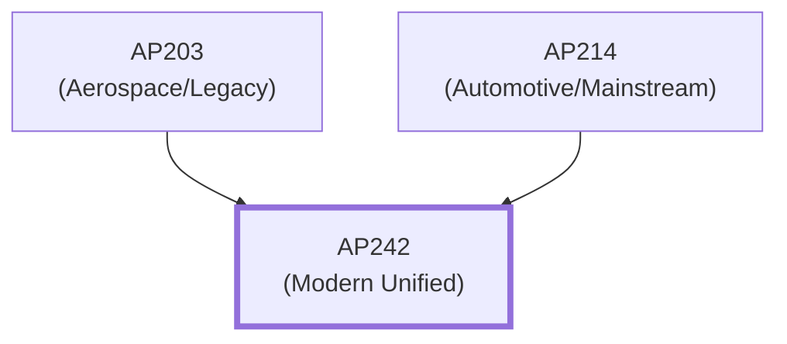
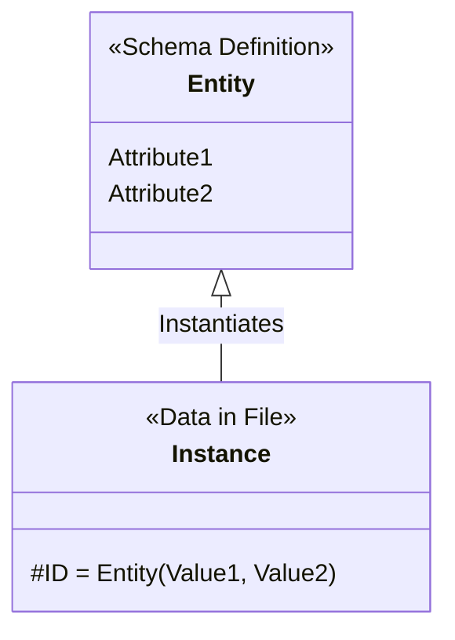
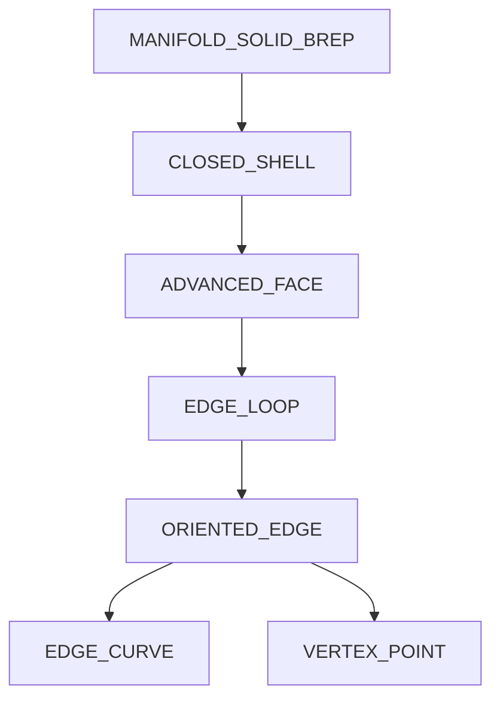

# Glossary

> [!IMPORTANT]
> **We strongly recommend reading this page first.**
> 
> Understanding the STEP standard begins with its terminology. By grasping these "Top 5 Most Important Terms," understanding other documents will become significantly easier.

---

## ⭐ Top 5 Most Important Terms (Start Here)

The five core concepts that every implementer should understand first.

### 1. AP (Application Protocol) ★★★

A subset of the standard defined for a specific industry or application.

**AP Evolution**:


**What Implementers Need to Know**:
- AP203, AP214, and AP242 are the major versions.
- Different APs support different entities (data structures).
- You can identify the AP in the `FILE_SCHEMA` of the STEP file's HEADER section.

**Example within a STEP file**:
```step
FILE_SCHEMA(('AP242_MANAGED_MODEL_BASED_3D_ENGINEERING_MIM_LF { 1 0 10303 442 1 1 4 }'));
```
→ This file uses AP242.

**Related Terms**: [MIM](#mim-mapped-interpreted-model), [AIM](#aim-application-interpreted-model)

---

### 2. Entity ★★★

The building blocks of STEP data. Equivalent to a "Class" in Object-Oriented Programming.

**Relationship Concept**:


**What Implementers Need to Know**:
- Written in all **UPPERCASE** (e.g., `PRODUCT`, `SHAPE_REPRESENTATION`).
- Has attributes.
- Supports inheritance (SUPERTYPE/SUBTYPE).

**Example within a STEP file**:
```step
#10 = PRODUCT('Part_A','Part_A','description',(#20));
```
- `PRODUCT` is the entity name.
- `#10` is the Instance ID (a unique identifier within this file).
- The values inside parentheses are the attribute values.

**Implementation Note**:
- Entity names are technically case-insensitive per the specification, but they are typically written in uppercase.
- Parsers must correctly resolve references using the `#number` format.

**Related Terms**: [EXPRESS](#express), [Instance](#instance)

---

### 3. B-rep (Boundary Representation) ★★★

A method of defining shapes by their boundaries: faces, edges, and vertices.

**Difference from STL**:
| | B-rep (STEP) | STL |
|---|---|---|
| Representation | Mathematically precise surfaces (NURBS, etc.) | Triangular mesh (approximate) |
| Precision | Theoretically infinite | Dependent on mesh size |
| File Size | Medium to Large | Small to Medium |
| Editability | Parametrically editable | Difficult |

**B-rep Hierarchy in STEP**:


**Related Terms**: [NURBS](#nurbs), [Tessellation](#tessellation)

---

### 4. PMI (Product and Manufacturing Information) ★★

Non-geometric design intent, such as dimensions, tolerances, and surface finish.

**Two Types of PMI**:

**Graphical PMI (Display type)**:
- Annotations for humans (visual lines and text).
- Can be displayed in 3D viewers.
- Cannot be semantically interpreted by computers.

**Semantic PMI (Representation type)**:
- Computer-processable information.
- Represented by entities like `GEOMETRIC_TOLERANCE`.
- Fully supported in AP242.

**Importance for Implementers**:
- The need for PMI dictates the AP choice (PMI required → AP242 mandatory).
- Parsing Semantic PMI requires knowledge of Geometric Dimensioning and Tolerancing (GD&T).
- PMI compatibility between CAD systems is not always perfect (refer to CAx-IF guidelines).

**Related Terms**: [GD&T](#gdt-geometric-dimensioning-and-tolerancing), [MBD](#mbd-model-based-definition)

---

### 5. EXPRESS ★★

The data modeling language used to define STEP (ISO 10303-11).

**What Implementers Need to Know**:
- The "Schema" for each AP is written in EXPRESS.
- It defines entities, attribute types, and constraints.
- Refer to the EXPRESS schema in the standard documents during implementation.

**EXPRESS Example**:
```express
ENTITY product;
  id : identifier;
  name : label;
  description : OPTIONAL text;
  frame_of_reference : SET [1:?] OF product_context;
END_ENTITY;
```
- `OPTIONAL`: This attribute can be omitted.
- `SET [1:?]`: A set of one or more unique items.

**Mapping to Programming Languages**:
| EXPRESS | Java/C++ | Python | Meaning |
|---------|----------|--------|---------|
| `ENTITY` | `class` | `class` | Class Definition |
| `TYPE` | `typedef` | `NewType` | Type Alias |
| `OPTIONAL` | `Optional<T>` | `Optional[T]` | Nullable |
| `SET [1:?]` | `Set<T>` | `set` | Unique Set |
| `LIST [0:?]` | `List<T>` | `list` | Ordered List |

**Related Terms**: [Entity](#2-entity), [Schema](#schema)

---

## 📂 Glossary by Category

### File Structure

#### Part 21 (ASCII / Clear Text)
The most common text-based file format for STEP, known by extensions `.stp` or `.step` (ISO 10303-21).

**Structure**:
```step
ISO-10303-21;
HEADER;
  FILE_DESCRIPTION(...);
  FILE_NAME(...);
  FILE_SCHEMA(...);
ENDSEC;
DATA;
  #10 = PRODUCT(...);
  #20 = ...;
ENDSEC;
END-ISO-10303-21;
```

#### Part 28 (XML)
An XML representation of STEP data. More redundant than Part 21 but compatible with XML technologies.

#### Instance
Concrete data with specific values for an entity. In `#10 = PRODUCT(...)`, `#10` is the instance identifier.

**Implementation Note**:
- Instance IDs start at 1 and are unique within the file.
- Forward references (referring to an ID defined later in the file) are permitted.

---

### Geometry & Topology

#### NURBS (Non-Uniform Rational B-Spline)
A mathematical way to represent complex curves and surfaces. Extensively used in STEP B-rep.

#### Tessellation
Approximating a surface with a mesh of triangles or polygons. Standardized in AP242.

**Uses**:
- Fast visualization (polygons are lighter to render).
- File size reduction (using tessellation alongside or instead of B-rep).

#### ADVANCED_FACE
The most common entity for representing faces in STEP. Defines the face boundary (edge loops) and its surface geometry.

---

### Management Data

#### PRODUCT
A top-level entity representing the part itself.

**Attributes**:
- `id`: Part ID (string).
- `name`: Part name.
- `description`: Description (optional).
- `frame_of_reference`: Context.

#### PRODUCT_DEFINITION
A definition of a product in a specific context (design, analysis, manufacturing). Geometry data is linked to this entity.

#### PRODUCT_DEFINITION_SHAPE
The "bridge" between management data and geometry. Links `PRODUCT_DEFINITION` to a `SHAPE_REPRESENTATION`.

---

### PMI & Tolerancing

#### GD&T (Geometric Dimensioning and Tolerancing)
A system for defining and communicating engineering tolerances.

**Major Tolerance Types**:
- Flatness, Straightness, Circularity (Form)
- Position, Coaxiality, Symmetry (Location)
- Parallelism, Perpendicularity, Angularity (Orientation)

#### GEOMETRIC_TOLERANCE
The base type for entities representing GD&T in STEP. Subtypes include `POSITION_TOLERANCE`, `FLATNESS_TOLERANCE`, etc.

#### DATUM
A theoretically exact point, axis, or plane derived from the true geometric counterpart of a specified datum feature. A basis for tolerances.

---

### AP & Schema

#### MIM (Mapped Interpreted Model)
The data model implementers actually work with, written in EXPRESS (the components of a STEP file).

#### AIM (Application Interpreted Model)
A shared data model across APs that serves as the foundation for the MIM.

#### ARM (Application Reference Model)
A high-level information model from a user's perspective, used to define business requirements. It is mapped to the MIM.

#### Schema
The entire data model definition written in EXPRESS. Each AP has its own unique schema.

---

### MBD & Digital Thread

#### MBD (Model Based Definition)
A practice of using 3D models (the "Master") to contain all design and manufacturing information.

**Difference from Traditional Methods**:
- Traditional: 2D drawings are the master; 3D is a reference.
- MBD: 3D model is the master; 2D drawings are unnecessary or subordinate.

#### LOTAR (Long Term Archiving and Retrieval)
A standard for the long-term preservation and retrieval of digital data. Supported in AP242.

**Purpose**:
- Ensure data remains readable decades later.
- Crucial in aerospace and defense industries.

#### CAx-IF (CAD-CAx Implementor Forum)
A group that establishes STEP implementation guidelines among CAD vendors.

**Importance for Implementers**:
- Following CAx-IF recommended practices improves interoperability.
- Provides test cases and benchmark files.

---

## 🔗 Related Resources

- **Official Standards**: ISO 10303 series (Paid)
- **CAx-IF Recommended Practices**: https://www.cax-if.org/
- **EXPRESS Schemas**: Found in the annexes of each AP standard document.

---
## 📚 Next Steps
- **[Getting Started Guide](./getting-started.md)** - Grasp the overall picture of STEP.

[Back to README](../README.md)
