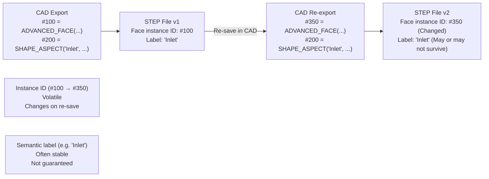
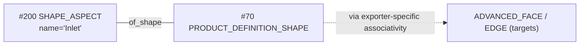

# Persistent IDs and Face Naming in STEP

For simulation (CAE) and manufacturing, being able to identify specific faces or edges consistently is crucial. This guide explains how names and IDs are handled in the STEP standard.

## 1. ID vs. Name: The Reality of Persistence

In the STEP file itself, every entity has an **Instance ID** (e.g., `#10`, `#500`). However, these are **not persistent**. If you re-save the file from your CAD software, these numbers will likely change.

To carry a **human-meaningful label** across systems (and *sometimes* across re-exports), STEP/AP242 commonly uses **`SHAPE_ASPECT`** as a semantic “handle” for a portion of the product’s shape. However, whether that label is preserved and usable in downstream tools (e.g., as Ansys Named Selections) depends heavily on the **CAD exporter** and the **import mapping/settings** in the receiver.

- **Internal ID (#123)**: Volatile. Changes every time the file is saved.
- **`SHAPE_ASPECT` name**: A semantic label (e.g., `'Inlet'`, `'FixedSupport'`). Often *more stable* than instance IDs, but **not guaranteed** to survive topology changes or vendor re-exports.

**Instance ID Lifecycle**:



**Key Insight**:
- **Instance IDs** (`#100`, `#350`) are **file-internal references** that can change arbitrarily
- **`SHAPE_ASPECT` names** (`'Inlet'`) are **semantic labels** intended to be stable identifiers for “portions of shape,” but the *actual persistence* depends on exporters and model changes
- For CAE automation, **never rely on Instance IDs**; prefer a stable *labeling strategy* that your toolchain demonstrably preserves

## 2. Technical Implementation (AP242)

In the ISO definition, `SHAPE_ASPECT` is defined “on” the product’s shape definition (`PRODUCT_DEFINITION_SHAPE`). Exporters then use additional associativity structures to connect that semantic label to specific faces/edges. The exact linking pattern varies by CAD and by the CAx-IF Recommended Practices being followed.

### Visual Relationship


### STEP Code Snippet
Here is a **schema-aligned** minimal example showing where the label lives:

```step
/* The label (semantic handle) */
/* SHAPE_ASPECT(name, description, of_shape, product_definitional) */
#70  = PRODUCT_DEFINITION_SHAPE('','',#50);
#200 = SHAPE_ASPECT('Inlet', 'Label for a portion of the shape', #70, .T.);

/* The target face/edge is linked via additional entities (varies by exporter). */
/* For interoperability, rely on CAx-IF Recommended Practices and test your toolchain. */
```

## 3. Rhino 8 / Grasshopper Workflow

Rhino 8 significantly improved the export of these attributes.

### Rhino 8 Manual Export
1. Select the face (Sub-object selection: `Ctrl+Shift+Click`).
2. In the **Properties** panel, set the **Object Name** (or use **User Text** field).
3. When exporting as STEP, select **AP242**.
4. In the export options, ensure that object names/text are exported (this may be enabled by default in Rhino 8).

### Grasshopper (Rhino 8)
1. Use **User Data** components or **Object Attributes** to assign names/text to geometry.
2. Use the **Bake** component to create Rhino objects with these attributes.
3. The names assigned to faces will carry through to the STEP export if AP242 is selected and the export settings preserve object names.

## 4. Ansys Workbench Integration

Ansys Workbench can generate **Named Selections** from STEP imports, but it is typically driven by **attribute processing** and a **mapping key** (e.g., color/layer/user-defined attributes), not simply “any `SHAPE_ASPECT` name in the file.”

### Required Settings in Ansys
1. **Geometry import preferences** (Workbench/Geometry interface; exact UI differs by version):
   - Enable **Named Selection Processing**
   - Enable **Attribute Processing**
   - Set the **Named Selections Key** to match what your exporter emits (commonly **Layer** or **Color**)
2. **What to verify after import**:
   - Do Named Selections exist and scope the expected faces?
   - If not: confirm the CAD export actually wrote the attributes, and confirm the “key” matches

Reference (Ansys Help): STEP interface mentions **Named Selection Processing** and **Attribute Processing** for STEP imports.
- `https://ansyshelp.ansys.com/public/Views/Secured/corp/v252/en/ref_cad/cadSTEP.html`

## 5. Summary Table

| Feature | AP203 | AP214 | AP242 |
| :--- | :---: | :---: | :---: |
| Instance IDs (#) | Volatile | Volatile | Volatile |
| Face/selection labeling strategy | ❌ Not Standard | ⚠ Vendor-Dependent | ✅ Best available (semantic constructs + CAx-IF practices) |
| “Persistence” across re-export | ❌ No | ⚠ Limited | ⚠ Depends on CAD/export + topology stability |

---
[Back to README](../README.md)

