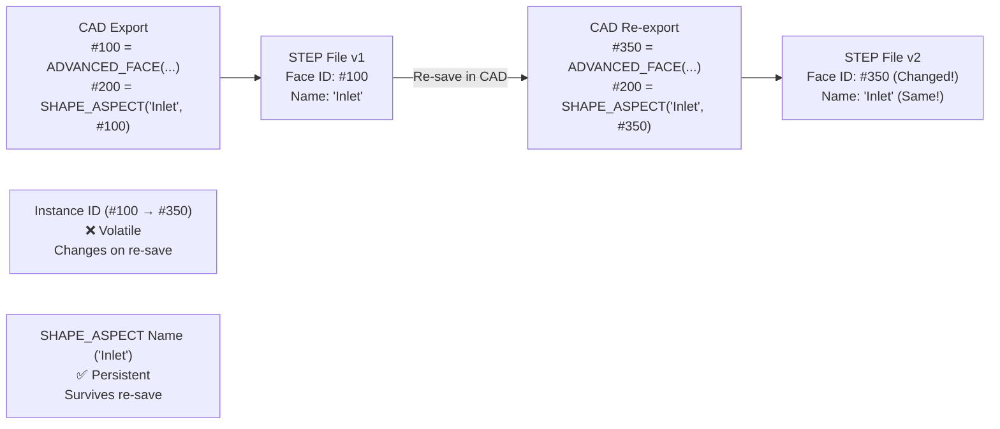
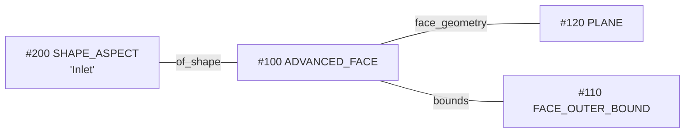

# Persistent IDs and Face Naming in STEP

For simulation (CAE) and manufacturing, being able to identify specific faces or edges consistently is crucial. This guide explains how names and IDs are handled in the STEP standard.

## 1. ID vs. Name: The Reality of Persistence

In the STEP file itself, every entity has an **Instance ID** (e.g., `#10`, `#500`). However, these are **not persistent**. If you re-save the file from your CAD software, these numbers will likely change.

For "Persistent IDs" that survive re-exports and work in tools like Ansys, the standard uses **`SHAPE_ASPECT`**.

- **Internal ID (#123)**: Volatile. Changes every time the file is saved.
- **`SHAPE_ASPECT` Name**: Persistent. This is a string label (e.g., `'Inlet'`, `'FixedSupport'`) attached to the geometry.

**Instance ID Lifecycle**:



**Key Insight**:
- **Instance IDs** (`#100`, `#350`) are **file-internal references** that can change arbitrarily
- **SHAPE_ASPECT names** (`'Inlet'`) are **semantic labels** that remain constant
- For simulation tools (Ansys), always use `SHAPE_ASPECT` names, never Instance IDs

## 2. Technical Implementation (AP242)

To name a face, the STEP file creates a link between the geometric face and a "Shape Aspect" entity.

### Visual Relationship


### STEP Code Snippet
Here is how a named face looks inside a Part 21 file:

```step
/* 1. The geometric face */
#100 = ADVANCED_FACE('', (#110), #120, .T.);

/* 2. The Semantic Label (The "Persistent ID") */
/* SHAPE_ASPECT(name, description, of_shape, product_definitional) */
#200 = SHAPE_ASPECT('Inlet', 'Description', #100, .T.);

/* 3. The link: SHAPE_ASPECT.of_shape directly references the ADVANCED_FACE */
/* Note: The actual linking mechanism varies by CAD implementation */
/* Some CAD systems may use intermediate entities, but the standard specifies */
/* that SHAPE_ASPECT.of_shape should reference GEOMETRIC_REPRESENTATION_ITEM (like ADVANCED_FACE) */
```

## 3. Rhino 8 / Grasshopper Workflow

Rhino 8 significantly improved the export of these attributes.

### Rhino 8 Manual Export
1. Select the face (Sub-object selection: `Ctrl+Shift+Click`).
2. In the **Properties** panel, set the **Object Name** (or use **User Text** field).
3. When exporting as STEP, select **AP242**.
4. In the export options, ensure that object names/text are exported (this may be enabled by default in Rhino 8).

### Grasshopper (Rhino 8)
1. Use **User Data** components or **Object Attributes** to assign names/text to geometry.
2. Use the **Bake** component to create Rhino objects with these attributes.
3. The names assigned to faces will carry through to the STEP export if AP242 is selected and the export settings preserve object names.

## 4. Ansys Workbench Integration

Ansys Workbench can read these labels and automatically convert them into **Named Selections**.

### Required Settings in Ansys
1. **Geometry Import Options** (in DesignModeler or SpaceClaim):
   - Enable **"Import Named Selections"** or similar option (exact menu name varies by Ansys version).
   - **Named Selection Key/Filter**: Optional prefix filter. If left blank, Ansys attempts to import all compatible labels from the STEP file.
2. **How Ansys Reads Names**:
   - Ansys typically looks for `SHAPE_ASPECT` entity names in AP242 files.
   - Some versions may also recognize `GEOMETRIC_SET` names or other entity labels.
   - If names don't appear, verify: (1) Export was **AP242**, (2) Face names were actually exported, (3) Import settings are correct.

## 5. Summary Table

| Feature | AP203 | AP214 | AP242 |
| :--- | :---: | :---: | :---: |
| Instance IDs (#) | Volatile | Volatile | Volatile |
| Face Names (Labels) | ❌ Not Standard | ⚠ Vendor-Dependent | ✅ Standard (SHAPE_ASPECT) |
| Persistence | ❌ No | ⚠ Limited | ✅ Semantic |

---
[Back to README](../README.md)

