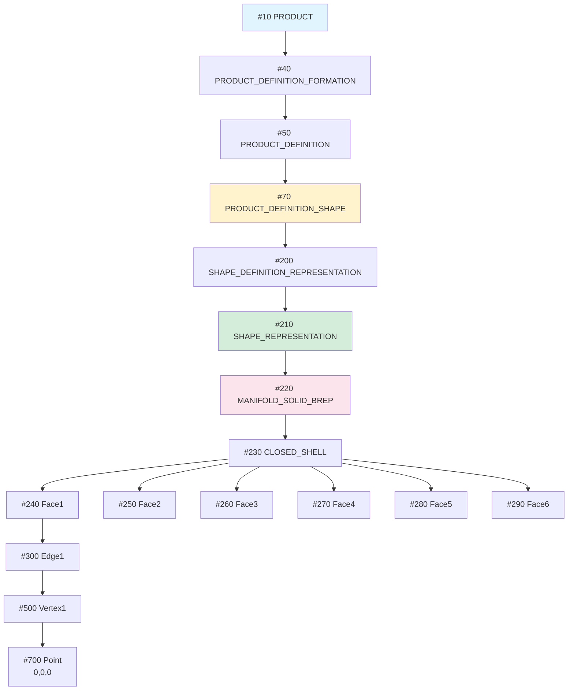

# STEPファイル完全解説 (Complete STEP File Walkthrough)

**所要時間**: 30-45分

このガイドでは、実際のSTEPファイル（シンプルな立方体）を**1行ずつ完全に解説**します。STEPファイルの構造を実例を通じて理解できます。

---

## 📦 サンプルファイル: Simple Cube (立方体)

以下は、一辺10mmの立方体を表現する完全なSTEPファイルです。コピー&ペーストして`.step`で保存すれば、CADソフトで開けます。

```step
ISO-10303-21;
HEADER;
FILE_DESCRIPTION(('Simple Cube Example'),'2;1');
FILE_NAME('cube.step','2025-12-19T09:00:00',('Author'),('Organization'),'Antigravity Tutorial','Antigravity STEP Writer','Unknown');
FILE_SCHEMA(('AP214_AUTOMOTIVE_DESIGN { 1 0 10303 214 3 1 1 }'));
ENDSEC;
DATA;
/* Product structure */
#10=PRODUCT('Cube','Cube','A simple 10mm cube',(#20));
#20=PRODUCT_CONTEXT('',#30,'mechanical');
#30=APPLICATION_CONTEXT('automotive design');
#40=PRODUCT_DEFINITION_FORMATION('1','First version',#10);
#50=PRODUCT_DEFINITION('design','',#40,#60);
#60=PRODUCT_DEFINITION_CONTEXT('part definition',#30,'design');
#70=PRODUCT_DEFINITION_SHAPE('','',#50);

/* Units and context */
#100=( GEOMETRIC_REPRESENTATION_CONTEXT(3) 
  GLOBAL_UNCERTAINTY_ASSIGNED_CONTEXT((#110)) 
  GLOBAL_UNIT_ASSIGNED_CONTEXT((#120,#130,#140)) 
  REPRESENTATION_CONTEXT('ID1','3D') );
#110=UNCERTAINTY_MEASURE_WITH_UNIT(LENGTH_MEASURE(1.0E-06),#120,'DISTANCE_ACCURACY_VALUE','Maximum model space distance between geometric entities at asserted connectivities');
#120=( LENGTH_UNIT() NAMED_UNIT(*) SI_UNIT(.MILLI.,.METRE.) );
#130=( NAMED_UNIT(*) PLANE_ANGLE_UNIT() SI_UNIT($,.RADIAN.) );
#140=( NAMED_UNIT(*) SI_UNIT($,.STERADIAN.) SOLID_ANGLE_UNIT() );

/* Shape representation */
#200=SHAPE_DEFINITION_REPRESENTATION(#70,#210);
#210=SHAPE_REPRESENTATION('',(#220),#100);
#220=MANIFOLD_SOLID_BREP('Cube',#230);
#230=CLOSED_SHELL('',(#240,#250,#260,#270,#280,#290));

/* Faces (6 faces of the cube) */
/* Bottom face (Z=0) */
#240=ADVANCED_FACE('',(#241),#242,.T.);
#241=FACE_OUTER_BOUND('',#243,.T.);
#243=EDGE_LOOP('',(#244,#245,#246,#247));
#244=ORIENTED_EDGE('',*,*,#300,.T.);
#245=ORIENTED_EDGE('',*,*,#301,.T.);
#246=ORIENTED_EDGE('',*,*,#302,.T.);
#247=ORIENTED_EDGE('',*,*,#303,.T.);
#242=PLANE('',#400);

/* Top face (Z=10) */
#250=ADVANCED_FACE('',(#251),#252,.T.);
#251=FACE_OUTER_BOUND('',#253,.T.);
#253=EDGE_LOOP('',(#254,#255,#256,#257));
#254=ORIENTED_EDGE('',*,*,#304,.T.);
#255=ORIENTED_EDGE('',*,*,#305,.T.);
#256=ORIENTED_EDGE('',*,*,#306,.T.);
#257=ORIENTED_EDGE('',*,*,#307,.T.);
#252=PLANE('',#401);

/* Front face (Y=0) */
#260=ADVANCED_FACE('',(#261),#262,.T.);
#261=FACE_OUTER_BOUND('',#263,.T.);
#263=EDGE_LOOP('',(#264,#265,#266,#267));
#264=ORIENTED_EDGE('',*,*,#300,.T.);
#265=ORIENTED_EDGE('',*,*,#308,.T.);
#266=ORIENTED_EDGE('',*,*,#304,.T.);
#267=ORIENTED_EDGE('',*,*,#309,.F.);
#262=PLANE('',#402);

/* Back face (Y=10) */
#270=ADVANCED_FACE('',(#271),#272,.T.);
#271=FACE_OUTER_BOUND('',#273,.T.);
#273=EDGE_LOOP('',(#274,#275,#276,#277));
#274=ORIENTED_EDGE('',*,*,#302,.T.);
#275=ORIENTED_EDGE('',*,*,#310,.T.);
#276=ORIENTED_EDGE('',*,*,#306,.T.);
#277=ORIENTED_EDGE('',*,*,#311,.F.);
#272=PLANE('',#403);

/* Left face (X=0) */
#280=ADVANCED_FACE('',(#281),#282,.T.);
#281=FACE_OUTER_BOUND('',#283,.T.);
#283=EDGE_LOOP('',(#284,#285,#286,#287));
#284=ORIENTED_EDGE('',*,*,#303,.T.);
#285=ORIENTED_EDGE('',*,*,#311,.T.);
#286=ORIENTED_EDGE('',*,*,#307,.T.);
#287=ORIENTED_EDGE('',*,*,#309,.T.);
#282=PLANE('',#404);

/* Right face (X=10) */
#290=ADVANCED_FACE('',(#291),#292,.T.);
#291=FACE_OUTER_BOUND('',#293,.T.);
#293=EDGE_LOOP('',(#294,#295,#296,#297));
#294=ORIENTED_EDGE('',*,*,#301,.T.);
#295=ORIENTED_EDGE('',*,*,#310,.T.);
#296=ORIENTED_EDGE('',*,*,#305,.T.);
#297=ORIENTED_EDGE('',*,*,#308,.F.);
#292=PLANE('',#405);

/* Edges (12 edges of the cube) */
#300=EDGE_CURVE('',#500,#501,#600,.T.);
#301=EDGE_CURVE('',#501,#502,#601,.T.);
#302=EDGE_CURVE('',#502,#503,#602,.T.);
#303=EDGE_CURVE('',#503,#500,#603,.T.);
#304=EDGE_CURVE('',#504,#505,#604,.T.);
#305=EDGE_CURVE('',#505,#506,#605,.T.);
#306=EDGE_CURVE('',#506,#507,#606,.T.);
#307=EDGE_CURVE('',#507,#504,#607,.T.);
#308=EDGE_CURVE('',#501,#505,#608,.T.);
#309=EDGE_CURVE('',#500,#504,#609,.T.);
#310=EDGE_CURVE('',#502,#506,#610,.T.);
#311=EDGE_CURVE('',#503,#507,#611,.T.);

/* Vertices (8 vertices of the cube) */
#500=VERTEX_POINT('',#700);
#501=VERTEX_POINT('',#701);
#502=VERTEX_POINT('',#702);
#503=VERTEX_POINT('',#703);
#504=VERTEX_POINT('',#704);
#505=VERTEX_POINT('',#705);
#506=VERTEX_POINT('',#706);
#507=VERTEX_POINT('',#707);

/* Edge geometries (lines) */
#600=LINE('',#700,#800);
#601=LINE('',#701,#801);
#602=LINE('',#702,#802);
#603=LINE('',#703,#803);
#604=LINE('',#704,#804);
#605=LINE('',#705,#805);
#606=LINE('',#706,#806);
#607=LINE('',#707,#807);
#608=LINE('',#701,#808);
#609=LINE('',#700,#809);
#610=LINE('',#702,#810);
#611=LINE('',#703,#811);

/* Points (8 corner points) */
#700=CARTESIAN_POINT('',(0.0,0.0,0.0));
#701=CARTESIAN_POINT('',(10.0,0.0,0.0));
#702=CARTESIAN_POINT('',(10.0,10.0,0.0));
#703=CARTESIAN_POINT('',(0.0,10.0,0.0));
#704=CARTESIAN_POINT('',(0.0,0.0,10.0));
#705=CARTESIAN_POINT('',(10.0,0.0,10.0));
#706=CARTESIAN_POINT('',(10.0,10.0,10.0));
#707=CARTESIAN_POINT('',(0.0,10.0,10.0));

/* Direction vectors */
#800=VECTOR('',#900,10.0);
#801=VECTOR('',#901,10.0);
#802=VECTOR('',#902,10.0);
#803=VECTOR('',#903,10.0);
#804=VECTOR('',#904,10.0);
#805=VECTOR('',#905,10.0);
#806=VECTOR('',#906,10.0);
#807=VECTOR('',#907,10.0);
#808=VECTOR('',#908,10.0);
#809=VECTOR('',#909,10.0);
#810=VECTOR('',#910,10.0);
#811=VECTOR('',#911,10.0);

/* Unit direction vectors */
#900=DIRECTION('',(1.0,0.0,0.0));
#901=DIRECTION('',(0.0,1.0,0.0));
#902=DIRECTION('',(-1.0,0.0,0.0));
#903=DIRECTION('',(0.0,-1.0,0.0));
#904=DIRECTION('',(1.0,0.0,0.0));
#905=DIRECTION('',(0.0,1.0,0.0));
#906=DIRECTION('',(-1.0,0.0,0.0));
#907=DIRECTION('',(0.0,-1.0,0.0));
#908=DIRECTION('',(0.0,0.0,1.0));
#909=DIRECTION('',(0.0,0.0,1.0));
#910=DIRECTION('',(0.0,0.0,1.0));
#911=DIRECTION('',(0.0,0.0,1.0));

/* Plane positions */
#400=AXIS2_PLACEMENT_3D('',#700,#1000,#1001);
#401=AXIS2_PLACEMENT_3D('',#704,#1002,#1003);
#402=AXIS2_PLACEMENT_3D('',#700,#1004,#1005);
#403=AXIS2_PLACEMENT_3D('',#703,#1006,#1007);
#404=AXIS2_PLACEMENT_3D('',#700,#1008,#1009);
#405=AXIS2_PLACEMENT_3D('',#701,#1010,#1011);

/* Plane normals and directions */
#1000=DIRECTION('',(0.0,0.0,1.0));
#1001=DIRECTION('',(1.0,0.0,0.0));
#1002=DIRECTION('',(0.0,0.0,-1.0));
#1003=DIRECTION('',(1.0,0.0,0.0));
#1004=DIRECTION('',(0.0,1.0,0.0));
#1005=DIRECTION('',(1.0,0.0,0.0));
#1006=DIRECTION('',(0.0,-1.0,0.0));
#1007=DIRECTION('',(1.0,0.0,0.0));
#1008=DIRECTION('',(1.0,0.0,0.0));
#1009=DIRECTION('',(0.0,1.0,0.0));
#1010=DIRECTION('',(-1.0,0.0,0.0));
#1011=DIRECTION('',(0.0,1.0,0.0));
ENDSEC;
END-ISO-10303-21;
```

---

## 📖 セクション別解説

### 1. ファイルヘッダー

```step
ISO-10303-21;
```
**意味**: このファイルがISO 10303-21 (Part 21) 形式であることを宣言。

---

```step
HEADER;
```
**意味**: HEADERセクションの開始。ファイルのメタデータを格納。

---

```step
FILE_DESCRIPTION(('Simple Cube Example'),'2;1');
```
**意味**: ファイルの説明。
- 第1引数: 説明文のリスト
- 第2引数: 実装レベル（`'2;1'`はPart 21の標準）

---

```step
FILE_NAME('cube.step','2025-12-19T09:00:00',('Author'),('Organization'),'Antigravity Tutorial','Antigravity STEP Writer','Unknown');
```
**意味**: ファイル情報。
- ファイル名: `cube.step`
- 作成日時: `2025-12-19T09:00:00` (ISO 8601形式)
- 作成者: `Author`
- 組織: `Organization`
- プリプロセッサ: `Antigravity Tutorial`
- システム: `Antigravity STEP Writer`
- 認証: `Unknown`

---

```step
FILE_SCHEMA(('AP214_AUTOMOTIVE_DESIGN { 1 0 10303 214 3 1 1 }'));
```
**意味**: 使用するスキーマ（AP）の宣言。
- `AP214_AUTOMOTIVE_DESIGN`: AP214を使用
- `{ 1 0 10303 214 3 1 1 }`: バージョン情報

**実装者注**: この値を見てどのAPか判定する（パーサーの最初のステップ）

---

```step
ENDSEC;
```
**意味**: HEADERセクションの終了。

---

### 2. データセクション: 管理情報

```step
DATA;
```
**意味**: DATAセクションの開始。実際のデータ（エンティティのインスタンス）を格納。

---

#### Product構造

```step
#10=PRODUCT('Cube','Cube','A simple 10mm cube',(#20));
```
**エンティティ**: `PRODUCT`  
**意味**: 製品そのものを定義。

**属性**:
- `id`: `'Cube'` (製品ID)
- `name`: `'Cube'` (製品名)
- `description`: `'A simple 10mm cube'` (説明)
- `frame_of_reference`: `(#20)` (コンテキストのリスト)

**参照**: `#20` (PRODUCT_CONTEXT)

---

```step
#20=PRODUCT_CONTEXT('',#30,'mechanical');
```
**エンティティ**: `PRODUCT_CONTEXT`  
**意味**: 製品のコンテキスト（機械的、電気的等）。

**属性**:
- `name`: `''` (空)
- `frame_of_reference`: `#30` (APPLICATION_CONTEXT)
- `discipline_type`: `'mechanical'` (機械分野)

---

```step
#30=APPLICATION_CONTEXT('automotive design');
```
**エンティティ**: `APPLICATION_CONTEXT`  
**意味**: アプリケーション分野（自動車設計）。

---

```step
#40=PRODUCT_DEFINITION_FORMATION('1','First version',#10);
```
**エンティティ**: `PRODUCT_DEFINITION_FORMATION`  
**意味**: 製品のバージョン管理。

**属性**:
- `id`: `'1'`
- `description`: `'First version'`
- `of_product`: `#10` (PRODUCT)

---

```step
#50=PRODUCT_DEFINITION('design','',#40,#60);
```
**エンティティ**: `PRODUCT_DEFINITION`  
**意味**: 設計コンテキストでの製品定義。

**属性**:
- `id`: `'design'`
- `description`: `''`
- `formation`: `#40` (PRODUCT_DEFINITION_FORMATION)
- `frame_of_reference`: `#60` (PRODUCT_DEFINITION_CONTEXT)

---

```step
#60=PRODUCT_DEFINITION_CONTEXT('part definition',#30,'design');
```
**エンティティ**: `PRODUCT_DEFINITION_CONTEXT`  
**意味**: 部品定義のコンテキスト。

---

```step
#70=PRODUCT_DEFINITION_SHAPE('','',#50);
```
**エンティティ**: `PRODUCT_DEFINITION_SHAPE`  
**意味**: 管理データと形状データの「橋渡し」。

**属性**:
- `definition`: `#50` (PRODUCT_DEFINITION)

**重要**: ここが管理データから形状データへの接続点！

---

### 3. データセクション: 単位とコンテキスト

```step
#100=( GEOMETRIC_REPRESENTATION_CONTEXT(3) 
  GLOBAL_UNCERTAINTY_ASSIGNED_CONTEXT((#110)) 
  GLOBAL_UNIT_ASSIGNED_CONTEXT((#120,#130,#140)) 
  REPRESENTATION_CONTEXT('ID1','3D') );
```
**エンティティ**: 複合型（4つのエンティティを同時に定義）  
**意味**: 幾何表現のコンテキスト。

**内訳**:
- `GEOMETRIC_REPRESENTATION_CONTEXT(3)`: 3次元
- `GLOBAL_UNCERTAINTY_ASSIGNED_CONTEXT((#110))`: 精度設定
- `GLOBAL_UNIT_ASSIGNED_CONTEXT((#120,#130,#140))`: 単位設定
- `REPRESENTATION_CONTEXT('ID1','3D')`: 識別子

---

```step
#110=UNCERTAINTY_MEASURE_WITH_UNIT(LENGTH_MEASURE(1.0E-06),#120,'DISTANCE_ACCURACY_VALUE','...');
```
**エンティティ**: `UNCERTAINTY_MEASURE_WITH_UNIT`  
**意味**: 幾何精度の定義。

**値**: `1.0E-06` mm (0.001 μm) = 1 nm（非常に高精度）

---

```step
#120=( LENGTH_UNIT() NAMED_UNIT(*) SI_UNIT(.MILLI.,.METRE.) );
```
**エンティティ**: 複合型  
**意味**: 長さの単位。

**解釈**: `.MILLI.,.METRE.` = **mm (ミリメートル)**

**実装者注**: この値を必ず確認して単位変換係数を計算！

---

```step
#130=( NAMED_UNIT(*) PLANE_ANGLE_UNIT() SI_UNIT($,.RADIAN.) );
```
**エンティティ**: 平面角の単位。  
**値**: **ラジアン**

---

```step
#140=( NAMED_UNIT(*) SI_UNIT($,.STERADIAN.) SOLID_ANGLE_UNIT() );
```
**エンティティ**: 立体角の単位。  
**値**: **ステラジアン**

---

### 4. データセクション: 形状表現

```step
#200=SHAPE_DEFINITION_REPRESENTATION(#70,#210);
```
**エンティティ**: `SHAPE_DEFINITION_REPRESENTATION`  
**意味**: PRODUCT_DEFINITION_SHAPE (#70) と SHAPE_REPRESENTATION (#210) を紐付け。

---

```step
#210=SHAPE_REPRESENTATION('',(#220),#100);
```
**エンティティ**: `SHAPE_REPRESENTATION`  
**意味**: 形状のトップレベルコンテナ。

**属性**:
- `name`: `''`
- `items`: `(#220)` (形状要素のリスト)
- `context_of_items`: `#100` (GEOMETRIC_REPRESENTATION_CONTEXT)

---

```step
#220=MANIFOLD_SOLID_BREP('Cube',#230);
```
**エンティティ**: `MANIFOLD_SOLID_BREP`  
**意味**: 閉じた3Dソリッド。

**属性**:
- `name`: `'Cube'`
- `outer`: `#230` (CLOSED_SHELL)

---

```step
#230=CLOSED_SHELL('',(#240,#250,#260,#270,#280,#290));
```
**エンティティ**: `CLOSED_SHELL`  
**意味**: 閉じた面の集合（立方体の6面）。

**属性**:
- `cfs_faces`: 6つの面のリスト

---

### 5. データセクション: 面（Faces）

各面は同じ構造なので、1つ（底面）を詳しく解説します。

```step
#240=ADVANCED_FACE('',(#241),#242,.T.);
```
**エンティティ**: `ADVANCED_FACE`  
**意味**: 面を定義。

**属性**:
- `name`: `''`
- `bounds`: `(#241)` (面の境界)
- `face_geometry`: `#242` (面の形状: PLANE)
- `same_sense`: `.T.` (法線方向が面の形状と同じ)

---

```step
#241=FACE_OUTER_BOUND('',#243,.T.);
```
**エンティティ**: `FACE_OUTER_BOUND`  
**意味**: 面の外側の境界（穴がある場合は内側の境界もある）。

**属性**:
- `bound`: `#243` (EDGE_LOOP)
- `orientation`: `.T.` (向きは正)

---

```step
#243=EDGE_LOOP('',(#244,#245,#246,#247));
```
**エンティティ**: `EDGE_LOOP`  
**意味**: エッジのループ（4本のエッジで四角形を形成）。

**属性**:
- `edge_list`: 4つのORIENTED_EDGEのリスト

---

```step
#244=ORIENTED_EDGE('',*,*,#300,.T.);
```
**エンティティ**: `ORIENTED_EDGE`  
**意味**: 方向付きエッジ。

**属性**:
- `edge_element`: `#300` (EDGE_CURVE)
- `orientation`: `.T.` (エッジの向きをそのまま使用)

**注**: `.F.`の場合はエッジを逆向きに使用

---

```step
#242=PLANE('',#400);
```
**エンティティ**: `PLANE`  
**意味**: 平面。

**属性**:
- `position`: `#400` (AXIS2_PLACEMENT_3D: 平面の位置と向き)

---

### 6. データセクション: エッジ（Edges）

```step
#300=EDGE_CURVE('',#500,#501,#600,.T.);
```
**エンティティ**: `EDGE_CURVE`  
**意味**: 曲線エッジ（この場合は直線）。

**属性**:
- `edge_start`: `#500` (VERTEX_POINT: 開始頂点)
- `edge_end`: `#501` (VERTEX_POINT: 終了頂点)
- `edge_geometry`: `#600` (LINE: エッジの形状)
- `same_sense`: `.T.` (エッジの向きが幾何の向きと同じ)

---

### 7. データセクション: 頂点（Vertices）

```step
#500=VERTEX_POINT('',#700);
```
**エンティティ**: `VERTEX_POINT`  
**意味**: 頂点。

**属性**:
- `vertex_geometry`: `#700` (CARTESIAN_POINT)

---

### 8. データセクション: 幾何（Lines & Points）

```step
#600=LINE('',#700,#800);
```
**エンティティ**: `LINE`  
**意味**: 無限直線（エッジの幾何形状）。

**属性**:
- `pnt`: `#700` (CARTESIAN_POINT: 直線上の点)
- `dir`: `#800` (VECTOR: 方向ベクトル)

---

```step
#700=CARTESIAN_POINT('',(0.0,0.0,0.0));
```
**エンティティ**: `CARTESIAN_POINT`  
**意味**: 3D空間の点。

**属性**:
- `coordinates`: `(0.0, 0.0, 0.0)` (原点)

**単位**: mm（#120で定義）

---

```step
#800=VECTOR('',#900,10.0);
```
**エンティティ**: `VECTOR`  
**意味**: ベクトル。

**属性**:
- `orientation`: `#900` (DIRECTION: 単位方向ベクトル)
- `magnitude`: `10.0` (長さ)

---

```step
#900=DIRECTION('',(1.0,0.0,0.0));
```
**エンティティ**: `DIRECTION`  
**意味**: 方向（単位ベクトル）。

**属性**:
- `direction_ratios`: `(1.0, 0.0, 0.0)` (X軸方向)

---

### 9. データセクション: 平面配置

```step
#400=AXIS2_PLACEMENT_3D('',#700,#1000,#1001);
```
**エンティティ**: `AXIS2_PLACEMENT_3D`  
**意味**: 3D空間での位置と向き（座標系）。

**属性**:
- `location`: `#700` (CARTESIAN_POINT: 原点)
- `axis`: `#1000` (DIRECTION: Z軸方向 = 平面の法線)
- `ref_direction`: `#1001` (DIRECTION: X軸方向)

---

```step
ENDSEC;
END-ISO-10303-21;
```
**意味**: DATAセクションの終了とファイルの終了。

---

## 🔍 データフロー図

立方体のデータがどのように構成されているかを可視化:



---

## 💡 実装者向けヒント

### パース時の注意点

1. **2パス処理が必須**: 前方参照あり（#10がより後の#20を参照）
2. **単位の確認**: #120で定義された単位（mm）をすべての座標に適用
3. **参照解決**: `#番号`をハッシュマップで管理

### よくある検証項目

```python
# 立方体の頂点数チェック
vertices = find_all_by_type(step_file, 'VERTEX_POINT')
assert len(vertices) == 8, f"Expected 8 vertices, found {len(vertices)}"

# 辺数チェック
edges = find_all_by_type(step_file, 'EDGE_CURVE')
assert len(edges) == 12, f"Expected 12 edges, found {len(edges)}"

# 面数チェック
faces = find_all_by_type(step_file, 'ADVANCED_FACE')
assert len(faces) == 6, f"Expected 6 faces, found {len(faces)}"

# Eulerの多面体定理: V - E + F = 2
V, E, F = len(vertices), len(edges), len(faces)
assert V - E + F == 2, f"Euler check failed: {V} - {E} + {F} != 2"
```

---

## 🎯 実験: このファイルを改変してみよう

### 実験1: サイズを変更

すべての座標を2倍に:
```step
#700=CARTESIAN_POINT('',(0.0,0.0,0.0));  → 変更なし
#701=CARTESIAN_POINT('',(10.0,0.0,0.0)); → (20.0,0.0,0.0)
#702=CARTESIAN_POINT('',(10.0,10.0,0.0)); → (20.0,20.0,0.0)
...
```

### 実験2: 単位を変更

mmからmに変更:
```step  
#120=( LENGTH_UNIT() NAMED_UNIT(*) SI_UNIT(.MILLI.,.METRE.) );
```
↓
```step
#120=( LENGTH_UNIT() NAMED_UNIT(*) SI_UNIT($,.METRE.) );
```

結果: 10mm立方体 → 10m立方体（1000倍巨大）

### 実験3: 色を追加

底面(#240)に赤色を追加:
```step
#2000=STYLED_ITEM('',(#2010),#240);
#2010=PRESENTATION_STYLE_ASSIGNMENT((#2020));
#2020=SURFACE_STYLE_USAGE(.BOTH.,#2030);
#2030=SURFACE_SIDE_STYLE('',(#2040));
#2040=SURFACE_STYLE_RENDERING(#2050,.MATTE.);
#2050=COLOUR_RGB('Red',1.0,0.0,0.0);
```

---

## 📚 次のステップ

このファイルを理解したら:

1. **[データモデル・マップ](../format/data-model-map.md)** - より複雑な階層を理解
2. **[よくある落とし穴](../implementation/common-pitfalls.md)** - 実装の注意点
3. **実際のパーサー実装**: Pythonでこのファイルをパースしてみる

---

[READMEに戻る](../README.md)
