# Complete STEP File Walkthrough

**Estimated Time**: 30-45 minutes

In this guide, we will provide a **complete, line-by-line explanation** of an actual STEP file (a simple cube). Through this example, you can gain a concrete understanding of a STEP file's structure.

---

## 📦 Sample File: Simple Cube

Below is the complete STEP file for a cube with 10mm sides.
You can download the actual file here: **[cube.step](./cube.step)**

```step
ISO-10303-21;
HEADER;
FILE_DESCRIPTION(('Simple Cube Example'),'2;1');
FILE_NAME('cube.step','2025-12-19T09:00:00',('Author'),('Organization'),'Antigravity Tutorial','Antigravity STEP Writer','Unknown');
FILE_SCHEMA(('AP214_AUTOMOTIVE_DESIGN { 1 0 10303 214 3 1 1 }'));
ENDSEC;
DATA;
/* Product structure */
#10=PRODUCT('Cube','Cube','A simple 10mm cube',(#20));
#20=PRODUCT_CONTEXT('',#30,'mechanical');
#30=APPLICATION_CONTEXT('automotive design');
#40=PRODUCT_DEFINITION_FORMATION('1','First version',#10);
#50=PRODUCT_DEFINITION('design','',#40,#60);
#60=PRODUCT_DEFINITION_CONTEXT('part definition',#30,'design');
#70=PRODUCT_DEFINITION_SHAPE('','',#50);

/* Units and context */
#100=( GEOMETRIC_REPRESENTATION_CONTEXT(3) 
  GLOBAL_UNCERTAINTY_ASSIGNED_CONTEXT((#110)) 
  GLOBAL_UNIT_ASSIGNED_CONTEXT((#120,#130,#140)) 
  REPRESENTATION_CONTEXT('ID1','3D') );
#110=UNCERTAINTY_MEASURE_WITH_UNIT(LENGTH_MEASURE(1.0E-06),#120,'DISTANCE_ACCURACY_VALUE','Maximum model space distance between geometric entities at asserted connectivities');
#120=( LENGTH_UNIT() NAMED_UNIT(*) SI_UNIT(.MILLI.,.METRE.) );
#130=( NAMED_UNIT(*) PLANE_ANGLE_UNIT() SI_UNIT($,.RADIAN.) );
#140=( NAMED_UNIT(*) SI_UNIT($,.STERADIAN.) SOLID_ANGLE_UNIT() );

/* Shape representation */
#200=SHAPE_DEFINITION_REPRESENTATION(#70,#210);
#210=SHAPE_REPRESENTATION('',(#220),#100);
#220=MANIFOLD_SOLID_BREP('Cube',#230);
#230=CLOSED_SHELL('',(#240,#250,#260,#270,#280,#290));

/* Faces (6 faces of the cube) */
/* Bottom face (Z=0) */
#240=ADVANCED_FACE('',(#241),#242,.T.);
#241=FACE_OUTER_BOUND('',#243,.T.);
#243=EDGE_LOOP('',(#244,#245,#246,#247));
#244=ORIENTED_EDGE('',*,*,#300,.T.);
#245=ORIENTED_EDGE('',*,*,#301,.T.);
#246=ORIENTED_EDGE('',*,*,#302,.T.);
#247=ORIENTED_EDGE('',*,*,#303,.T.);
#242=PLANE('',#400);

/* Top face (Z=10) */
#250=ADVANCED_FACE('',(#251),#252,.T.);
#251=FACE_OUTER_BOUND('',#253,.T.);
#253=EDGE_LOOP('',(#254,#255,#256,#257));
#254=ORIENTED_EDGE('',*,*,#304,.T.);
#255=ORIENTED_EDGE('',*,*,#305,.T.);
#256=ORIENTED_EDGE('',*,*,#306,.T.);
#257=ORIENTED_EDGE('',*,*,#307,.T.);
#252=PLANE('',#401);

/* Front face (Y=0) */
#260=ADVANCED_FACE('',(#261),#262,.T.);
#261=FACE_OUTER_BOUND('',#263,.T.);
#263=EDGE_LOOP('',(#264,#265,#266,#267));
#264=ORIENTED_EDGE('',*,*,#300,.T.);
#265=ORIENTED_EDGE('',*,*,#308,.T.);
#266=ORIENTED_EDGE('',*,*,#304,.T.);
#267=ORIENTED_EDGE('',*,*,#309,.F.);
#262=PLANE('',#402);

/* Back face (Y=10) */
#270=ADVANCED_FACE('',(#271),#272,.T.);
#271=FACE_OUTER_BOUND('',#273,.T.);
#273=EDGE_LOOP('',(#274,#275,#276,#277));
#274=ORIENTED_EDGE('',*,*,#302,.T.);
#275=ORIENTED_EDGE('',*,*,#310,.T.);
#276=ORIENTED_EDGE('',*,*,#306,.T.);
#277=ORIENTED_EDGE('',*,*,#311,.F.);
#272=PLANE('',#403);

/* Left face (X=0) */
#280=ADVANCED_FACE('',(#281),#282,.T.);
#281=FACE_OUTER_BOUND('',#283,.T.);
#283=EDGE_LOOP('',(#284,#285,#286,#287));
#284=ORIENTED_EDGE('',*,*,#303,.T.);
#285=ORIENTED_EDGE('',*,*,#311,.T.);
#286=ORIENTED_EDGE('',*,*,#307,.T.);
#287=ORIENTED_EDGE('',*,*,#309,.T.);
#282=PLANE('',#404);

/* Right face (X=10) */
#290=ADVANCED_FACE('',(#291),#292,.T.);
#291=FACE_OUTER_BOUND('',#293,.T.);
#293=EDGE_LOOP('',(#294,#295,#296,#297));
#294=ORIENTED_EDGE('',*,*,#301,.T.);
#295=ORIENTED_EDGE('',*,*,#310,.T.);
#296=ORIENTED_EDGE('',*,*,#305,.T.);
#297=ORIENTED_EDGE('',*,*,#308,.F.);
#292=PLANE('',#405);

/* Edges (12 edges of the cube) */
#300=EDGE_CURVE('',#500,#501,#600,.T.);
#301=EDGE_CURVE('',#501,#502,#601,.T.);
#302=EDGE_CURVE('',#502,#503,#602,.T.);
#303=EDGE_CURVE('',#503,#500,#603,.T.);
#304=EDGE_CURVE('',#504,#505,#604,.T.);
#305=EDGE_CURVE('',#505,#506,#605,.T.);
#306=EDGE_CURVE('',#506,#507,#606,.T.);
#307=EDGE_CURVE('',#507,#504,#607,.T.);
#308=EDGE_CURVE('',#501,#505,#608,.T.);
#309=EDGE_CURVE('',#500,#504,#609,.T.);
#310=EDGE_CURVE('',#502,#506,#610,.T.);
#311=EDGE_CURVE('',#503,#507,#611,.T.);

/* Vertices (8 vertices of the cube) */
#500=VERTEX_POINT('',#700);
#501=VERTEX_POINT('',#701);
#502=VERTEX_POINT('',#702);
#503=VERTEX_POINT('',#703);
#504=VERTEX_POINT('',#704);
#505=VERTEX_POINT('',#705);
#506=VERTEX_POINT('',#706);
#507=VERTEX_POINT('',#707);

/* Edge geometries (lines) */
#600=LINE('',#700,#800);
#601=LINE('',#701,#801);
#602=LINE('',#702,#802);
#603=LINE('',#703,#803);
#604=LINE('',#704,#804);
#605=LINE('',#705,#805);
#606=LINE('',#706,#806);
#607=LINE('',#707,#807);
#608=LINE('',#701,#808);
#609=LINE('',#700,#809);
#610=LINE('',#702,#810);
#611=LINE('',#703,#811);

/* Points (8 corner points) */
#700=CARTESIAN_POINT('',(0.0,0.0,0.0));
#701=CARTESIAN_POINT('',(10.0,0.0,0.0));
#702=CARTESIAN_POINT('',(10.0,10.0,0.0));
#703=CARTESIAN_POINT('',(0.0,10.0,0.0));
#704=CARTESIAN_POINT('',(0.0,0.0,10.0));
#705=CARTESIAN_POINT('',(10.0,0.0,10.0));
#706=CARTESIAN_POINT('',(10.0,10.0,10.0));
#707=CARTESIAN_POINT('',(0.0,10.0,10.0));

/* Direction vectors */
#800=VECTOR('',#900,10.0);
#801=VECTOR('',#901,10.0);
#802=VECTOR('',#902,10.0);
#803=VECTOR('',#903,10.0);
#804=VECTOR('',#904,10.0);
#805=VECTOR('',#905,10.0);
#806=VECTOR('',#906,10.0);
#807=VECTOR('',#907,10.0);
#808=VECTOR('',#908,10.0);
#809=VECTOR('',#909,10.0);
#810=VECTOR('',#910,10.0);
#811=VECTOR('',#911,10.0);

/* Unit direction vectors */
#900=DIRECTION('',(1.0,0.0,0.0));
#901=DIRECTION('',(0.0,1.0,0.0));
#902=DIRECTION('',(-1.0,0.0,0.0));
#903=DIRECTION('',(0.0,-1.0,0.0));
#904=DIRECTION('',(1.0,0.0,0.0));
#905=DIRECTION('',(0.0,1.0,0.0));
#906=DIRECTION('',(-1.0,0.0,0.0));
#907=DIRECTION('',(0.0,-1.0,0.0));
#908=DIRECTION('',(0.0,0.0,1.0));
#909=DIRECTION('',(0.0,0.0,1.0));
#910=DIRECTION('',(0.0,0.0,1.0));
#911=DIRECTION('',(0.0,0.0,1.0));

/* Plane positions */
#400=AXIS2_PLACEMENT_3D('',#700,#1000,#1001);
#401=AXIS2_PLACEMENT_3D('',#704,#1002,#1003);
#402=AXIS2_PLACEMENT_3D('',#700,#1004,#1005);
#403=AXIS2_PLACEMENT_3D('',#703,#1006,#1007);
#404=AXIS2_PLACEMENT_3D('',#700,#1008,#1009);
#405=AXIS2_PLACEMENT_3D('',#701,#1010,#1011);

/* Plane normals and directions */
#1000=DIRECTION('',(0.0,0.0,1.0));
#1001=DIRECTION('',(1.0,0.0,0.0));
#1002=DIRECTION('',(0.0,0.0,-1.0));
#1003=DIRECTION('',(1.0,0.0,0.0));
#1004=DIRECTION('',(0.0,1.0,0.0));
#1005=DIRECTION('',(1.0,0.0,0.0));
#1006=DIRECTION('',(0.0,-1.0,0.0));
#1007=DIRECTION('',(1.0,0.0,0.0));
#1008=DIRECTION('',(1.0,0.0,0.0));
#1009=DIRECTION('',(0.0,1.0,0.0));
#1010=DIRECTION('',(-1.0,0.0,0.0));
#1011=DIRECTION('',(0.0,1.0,0.0));
ENDSEC;
END-ISO-10303-21;
```

---

## 💡 Part 21 Syntax 101

Before we dive into the line-by-line explanation, let's clarify the basic syntax of a STEP file (formally called "ISO 10303-21").

### How to read `#10=PRODUCT(...);`

Each line in the `DATA` section follows this basic pattern:
**`#ID = ENTITY_NAME(Attribute1, Attribute2, ...);`**

*   **`#` (Hash/Pound)**: The prefix for an **Instance ID**. It indicates that a unique ID follows.
*   **`10` (The Number)**: A unique integer identifier for this specific piece of data in this file.
    *   **Why "10, 20, 30..."?**: This is a legacy convention from when files were sometimes edited by hand (similar to BASIC line numbers). It allows for inserting entities later (e.g., `#15`) without renumbering. 
    *   **Does the number matter?**: No. It only needs to be unique within the file. Tools use these to reference other entities (e.g., `#10` referencing `#20`).
*   **`=` (Equals)**: The **Assignment Operator**. It means "The entity with ID #10 is defined as...".
*   **`;` (Semicolon)**: Every statement in a STEP file must end with a semicolon.

---

## 📖 Section-by-Section Explanation

### 1. File Header

```step
ISO-10303-21;
```
**Meaning**: Declares that this file is in the ISO 10303-21 (Part 21) format.

---

```step
HEADER;
```
**Meaning**: Start of the `HEADER` section, which stores file metadata.

---

```step
FILE_DESCRIPTION(('Simple Cube Example'),'2;1');
```
**Meaning**: Describes the file.
- Argument 1: A list of descriptive strings.
- Argument 2: The implementation level (`'2;1'` is the standard for Part 21).

---

```step
FILE_NAME('cube.step','2025-12-19T09:00:00',('Author'),('Organization'),'Antigravity Tutorial','Antigravity STEP Writer','Unknown');
```
**Meaning**: Information about the file itself.
- Filename: `cube.step`
- Creation Timestamp: `2025-12-19T09:00:00` (ISO 8601 format)
- Author: `Author`
- Organization: `Organization`
- Preprocessor: `Antigravity Tutorial`
- System: `Antigravity STEP Writer`
- Authorization: `Unknown`

---

```step
FILE_SCHEMA(('AP214_AUTOMOTIVE_DESIGN { 1 0 10303 214 3 1 1 }'));
```
**Meaning**: Declaration of the schema (AP) being used.
- `AP214_AUTOMOTIVE_DESIGN`: Uses Application Protocol 214.
- `{ 1 0 10303 214 3 1 1 }`: Version information.

**Implementer's Note**: This value is checked to determine which AP the parser should use (the first step of parsing).

---

```step
ENDSEC;
```
**Meaning**: End of the `HEADER` section.

---

### 2. Data Section: Management Information

```step
DATA;
```
**Meaning**: Start of the `DATA` section, which contains the actual data (instances of entities).

---

#### Product Structure

```step
#10=PRODUCT('Cube','Cube','A simple 10mm cube',(#20));
```
**Entity**: `PRODUCT`  
**Meaning**: Defines the product itself.

**Attributes**:
- `id`: `'Cube'` (Part number/ID)
- `name`: `'Cube'` (Part name)
- `description`: `'A simple 10mm cube'` (Description)
- `frame_of_reference`: `(#20)` (List of contexts)

**Reference**: `#20` (PRODUCT_CONTEXT)

---

```step
#20=PRODUCT_CONTEXT('',#30,'mechanical');
```
**Entity**: `PRODUCT_CONTEXT`  
**Meaning**: Context of the product (mechanical, electrical, etc.).

**Attributes**:
- `name`: `''` (Empty)
- `frame_of_reference`: `#30` (APPLICATION_CONTEXT)
- `discipline_type`: `'mechanical'`

---

```step
#30=APPLICATION_CONTEXT('automotive design');
```
**Entity**: `APPLICATION_CONTEXT`  
**Meaning**: The application domain (e.g., automotive design).

---

```step
#40=PRODUCT_DEFINITION_FORMATION('1','First version',#10);
```
**Entity**: `PRODUCT_DEFINITION_FORMATION`  
**Meaning**: Version management for the product.

**Attributes**:
- `id`: `'1'`
- `description`: `'First version'`
- `of_product`: `#10` (PRODUCT)

---

```step
#50=PRODUCT_DEFINITION('design','',#40,#60);
```
**Entity**: `PRODUCT_DEFINITION`  
**Meaning**: Product definition within a design context.

**Attributes**:
- `id`: `'design'`
- `description`: `''`
- `formation`: `#40` (PRODUCT_DEFINITION_FORMATION)
- `frame_of_reference`: `#60` (PRODUCT_DEFINITION_CONTEXT)

---

```step
#60=PRODUCT_DEFINITION_CONTEXT('part definition',#30,'design');
```
**Entity**: `PRODUCT_DEFINITION_CONTEXT`  
**Meaning**: Context for part definition.

---

```step
#70=PRODUCT_DEFINITION_SHAPE('','',#50);
```
**Entity**: `PRODUCT_DEFINITION_SHAPE`  
**Meaning**: The "bridge" between management data and shape data.

**Attributes**:
- `definition`: `#50` (PRODUCT_DEFINITION)

**Crucial**: This is the connection point between management and geometry!

---

### 3. Data Section: Units and Context

```step
#100=( GEOMETRIC_REPRESENTATION_CONTEXT(3) 
  GLOBAL_UNCERTAINTY_ASSIGNED_CONTEXT((#110)) 
  GLOBAL_UNIT_ASSIGNED_CONTEXT((#120,#130,#140)) 
  REPRESENTATION_CONTEXT('ID1','3D') );
```
**Entity**: Complex type (defines 4 entities simultaneously)  
**Meaning**: Context for geometric representation.

**Breakdown**:
- `GEOMETRIC_REPRESENTATION_CONTEXT(3)`: Three-dimensional.
- `GLOBAL_UNCERTAINTY_ASSIGNED_CONTEXT((#110))`: Precision settings.
- `GLOBAL_UNIT_ASSIGNED_CONTEXT((#120,#130,#140))`: Unit settings.
- `REPRESENTATION_CONTEXT('ID1','3D')`: Identifier.

---

```step
#110=UNCERTAINTY_MEASURE_WITH_UNIT(LENGTH_MEASURE(1.0E-06),#120,'DISTANCE_ACCURACY_VALUE','...');
```
**Entity**: `UNCERTAINTY_MEASURE_WITH_UNIT`  
**Meaning**: Definition of geometric precision.

**Value**: `1.0E-06` mm (0.001 μm) = 1 nm (very high precision).

---

```step
#120=( LENGTH_UNIT() NAMED_UNIT(*) SI_UNIT(.MILLI.,.METRE.) );
```
**Entity**: Complex type  
**Meaning**: Unit of length.

**Interpretation**: `.MILLI.,.METRE.` = **mm (millimeters)**.

**Implementer's Note**: Always check this value to calculate your unit conversion factors!

**How Units Flow Through the File**:


**Key Points**:
- Units are defined once (e.g., `#120` defines millimeters)
- Units are assigned to `GEOMETRIC_REPRESENTATION_CONTEXT` (`#100`)
- All geometry in `SHAPE_REPRESENTATION` (`#210`) inherits these units
- All coordinate values (like `CARTESIAN_POINT`) are interpreted using these units
- **Critical**: Always read the unit definition before interpreting coordinates!

---

```step
#130=( NAMED_UNIT(*) PLANE_ANGLE_UNIT() SI_UNIT($,.RADIAN.) );
```
**Entity**: Plane angle unit.  
**Value**: **Radians**.

---

```step
#140=( NAMED_UNIT(*) SI_UNIT($,.STERADIAN.) SOLID_ANGLE_UNIT() );
```
**Entity**: Solid angle unit.  
**Value**: **Steradians**.

---

### 4. Data Section: Shape Representation

```step
#200=SHAPE_DEFINITION_REPRESENTATION(#70,#210);
```
**Entity**: `SHAPE_DEFINITION_REPRESENTATION`  
**Meaning**: Links `PRODUCT_DEFINITION_SHAPE` (#70) to `SHAPE_REPRESENTATION` (#210).

---

```step
#210=SHAPE_REPRESENTATION('',(#220),#100);
```
**Entity**: `SHAPE_REPRESENTATION`  
**Meaning**: Top-level container for geometry.

**Attributes**:
- `name`: `''`
- `items`: `(#220)` (List of geometry elements)
- `context_of_items`: `#100` (GEOMETRIC_REPRESENTATION_CONTEXT)

---

```step
#220=MANIFOLD_SOLID_BREP('Cube',#230);
```
**Entity**: `MANIFOLD_SOLID_BREP`  
**Meaning**: A closed 3D solid.

**Attributes**:
- `name`: `'Cube'`
- `outer`: `#230` (CLOSED_SHELL)

---

```step
#230=CLOSED_SHELL('',(#240,#250,#260,#270,#280,#290));
```
**Entity**: `CLOSED_SHELL`  
**Meaning**: A collection of closed faces (the 6 faces of the cube).

**Attributes**:
- `cfs_faces`: List of 6 faces.

---

### 5. Data Section: Faces

Since all faces have the same structure, we'll explain one (the bottom face) in detail.

```step
#240=ADVANCED_FACE('',(#241),#242,.T.);
```
**Entity**: `ADVANCED_FACE`  
**Meaning**: Defines a face.

**Attributes**:
- `name`: `''`
- `bounds`: `(#241)` (Face boundaries)
- `face_geometry`: `#242` (Geometry of the face: PLANE)
- `same_sense`: `.T.` (Normal direction matches the face geometry)

---

```step
#241=FACE_OUTER_BOUND('',#243,.T.);
```
**Entity**: `FACE_OUTER_BOUND`  
**Meaning**: Outer boundary of the face (inner boundaries exist if there are holes).

**Attributes**:
- `bound`: `#243` (EDGE_LOOP)
- `orientation`: `.T.` (Positive orientation)

---

```step
#243=EDGE_LOOP('',(#244,#245,#246,#247));
```
**Entity**: `EDGE_LOOP`  
**Meaning**: A loop of edges (forming a rectangle with 4 edges).

**Attributes**:
- `edge_list`: List of 4 `ORIENTED_EDGE` instances.

---

```step
#244=ORIENTED_EDGE('',*,*,#300,.T.);
```
**Entity**: `ORIENTED_EDGE`  
**Meaning**: A directional edge.

**Attributes**:
- `edge_element`: `#300` (EDGE_CURVE)
- `orientation`: `.T.` (Use the edge direction as-is)

**Note**: If `.F.`, use the edge in reverse.

---

```step
#242=PLANE('',#400);
```
**Entity**: `PLANE`  
**Meaning**: A plane surface.

**Attributes**:
- `position`: `#400` (AXIS2_PLACEMENT_3D: Plane location and orientation)

---

### 6. Data Section: Edges

```step
#300=EDGE_CURVE('',#500,#501,#600,.T.);
```
**Entity**: `EDGE_CURVE`  
**Meaning**: A curved edge (a straight line in this case).

**Attributes**:
- `edge_start`: `#500` (VERTEX_POINT: Start vertex)
- `edge_end`: `#501` (VERTEX_POINT: End vertex)
- `edge_geometry`: `#600` (LINE: The geometry of the edge)
- `same_sense`: `.T.` (Edge direction matches geometry direction)

---

### 7. Data Section: Vertices

```step
#500=VERTEX_POINT('',#700);
```
**Entity**: `VERTEX_POINT`  
**Meaning**: A vertex (a point in topology).

**Attributes**:
- `vertex_geometry`: `#700` (CARTESIAN_POINT)

---

### 8. Data Section: Geometry (Lines & Points)

```step
#600=LINE('',#700,#800);
```
**Entity**: `LINE`  
**Meaning**: An infinite straight line (geometry for an edge).

**Attributes**:
- `pnt`: `#700` (CARTESIAN_POINT: A point on the line)
- `dir`: `#800` (VECTOR: Direction vector)

---

```step
#700=CARTESIAN_POINT('',(0.0,0.0,0.0));
```
**Entity**: `CARTESIAN_POINT`  
**Meaning**: A point in 3D Cartesian space.

**Attributes**:
- `coordinates`: `(0.0, 0.0, 0.0)` (The origin)

**Unit**: mm (defined in #120).

---

```step
#800=VECTOR('',#900,10.0);
```
**Entity**: `VECTOR`  
**Meaning**: A vector.

**Attributes**:
- `orientation`: `#900` (DIRECTION: Unit direction vector)
- `magnitude`: `10.0` (Length)

---

```step
#900=DIRECTION('',(1.0,0.0,0.0));
```
**Entity**: `DIRECTION`  
**Meaning**: A direction (unit vector).

**Attributes**:
- `direction_ratios`: `(1.0, 0.0, 0.0)` (X-axis direction)

---

### 9. Data Section: Plane Placement

```step
#400=AXIS2_PLACEMENT_3D('',#700,#1000,#1001);
```
**Entity**: `AXIS2_PLACEMENT_3D`  
**Meaning**: Position and orientation in 3D space (coordinate system).

**Attributes**:
- `location`: `#700` (CARTESIAN_POINT: Origin)
- `axis`: `#1000` (DIRECTION: Z-axis direction = Plane normal)
- `ref_direction`: `#1001` (DIRECTION: X-axis direction)

---

```step
ENDSEC;
END-ISO-10303-21;
```
**Meaning**: End of the `DATA` section and the end of the file.

---

## 🔍 Data Flow Diagram

Visualizing how the cube data is structured:


---

## 💡 Tips for Implementers

### Parsing Considerations

1. **Two-Pass Processing is Mandatory**: Forward references exist (e.g., #10 referencing a later #20).
2. **Confirm Units**: Apply the unit defined in #120 (mm) to all coordinates.
3. **Reference Resolution**: Manage `#numbers` using a hash map.

**Why Two-Pass Processing is Required**:

```mermaid
graph TD
    START["Start Parsing"] --> PASS1["Pass 1: Build Instance Map<br/>Parse all lines:<br/>#10 = PRODUCT(...)<br/>#20 = PRODUCT_CONTEXT(...)<br/>#30 = APPLICATION_CONTEXT(...)"]
    PASS1 --> MAP["Instance Map Created<br/>{#10: PRODUCT instance,<br/>#20: PRODUCT_CONTEXT instance,<br/>#30: APPLICATION_CONTEXT instance}"]
    MAP --> PASS2["Pass 2: Resolve References<br/>Replace #ID with actual instances:<br/>#10.frame_of_reference = map[#20]<br/>#20.frame_of_reference = map[#30]"]
    PASS2 --> RESOLVED["All References Resolved<br/>Complete data structure ready"]
    RESOLVED --> TRAVERSE["Traverse Hierarchy<br/>PRODUCT → SHAPE_REPRESENTATION"]
    TRAVERSE --> END["Extract Geometry"]
```



**Example of Forward Reference Problem**:
```step
#10 = PRODUCT('Part1', 'Part1', '', (#20));  ← References #20 (not defined yet!)
#20 = PRODUCT_CONTEXT('', #30, 'mechanical'); ← References #30 (not defined yet!)
#30 = APPLICATION_CONTEXT('automotive design');
```

**Solution**: First pass stores all instances, second pass resolves all references.

### Common Validation Checks

```python
# Check vertex count for a cube
vertices = find_all_by_type(step_file, 'VERTEX_POINT')
assert len(vertices) == 8, f"Expected 8 vertices, found {len(vertices)}"

# Check edge count
edges = find_all_by_type(step_file, 'EDGE_CURVE')
assert len(edges) == 12, f"Expected 12 edges, found {len(edges)}"

# Check face count
faces = find_all_by_type(step_file, 'ADVANCED_FACE')
assert len(faces) == 6, f"Expected 6 faces, found {len(faces)}"

# Euler's Polyhedral Formula: V - E + F = 2
V, E, F = len(vertices), len(edges), len(faces)
assert V - E + F == 2, f"Euler check failed: {V} - {E} + {F} != 2"
```

---

## 🎯 Experiment: Try Modifying This File

### Experiment 1: Change the Size

Double all coordinates:
```step
#700=CARTESIAN_POINT('',(0.0,0.0,0.0));  → No change
#701=CARTESIAN_POINT('',(10.0,0.0,0.0)); → (20.0,0.0,0.0)
#702=CARTESIAN_POINT('',(10.0,10.0,0.0)); → (20.0,20.0,0.0)
...
```

### Experiment 2: Change the Units

Change from mm to meters:
```step  
#120=( LENGTH_UNIT() NAMED_UNIT(*) SI_UNIT(.MILLI.,.METRE.) );
```
↓
```step
#120=( LENGTH_UNIT() NAMED_UNIT(*) SI_UNIT($,.METRE.) );
```
Result: 10mm cube → 10m cube (1000x larger).

### Experiment 3: Add Color

Add red color to the bottom face (#240):
```step
#2000=STYLED_ITEM('',(#2010),#240);
#2010=PRESENTATION_STYLE_ASSIGNMENT((#2020));
#2020=SURFACE_STYLE_USAGE(.BOTH.,#2030);
#2030=SURFACE_SIDE_STYLE('',(#2040));
#2040=SURFACE_STYLE_RENDERING(#2050,.MATTE.);
#2050=COLOUR_RGB('Red',1.0,0.0,0.0);
```

---

## 📚 Next Steps

Once you understand this file:

1. **[Data Model Map](../format/data-model-map.md)** - Understand more complex hierarchies.
2. **[Common Pitfalls](../implementation/common-pitfalls.md)** - Implementation warnings.
3. **Actual Parser Implementation**: Try parsing this file using Python.

---
## 📚 Next Steps
- **[Data Model Map](../format/data-model-map.md)** - Understand the entity hierarchy.

[Back to README](../README.md)
