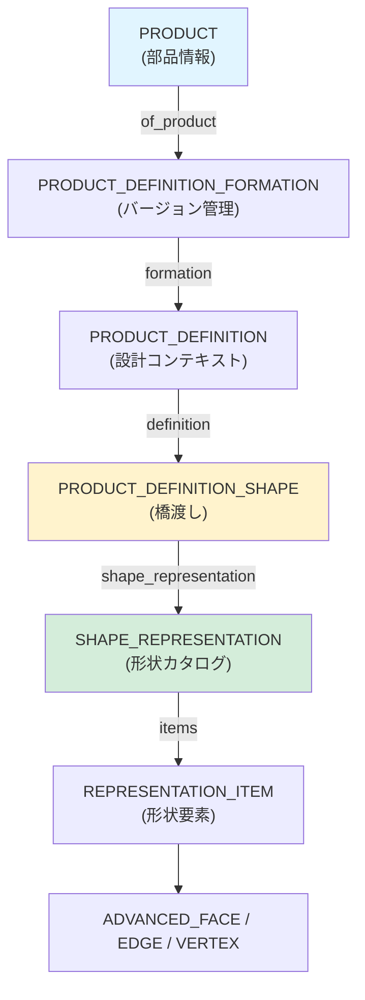
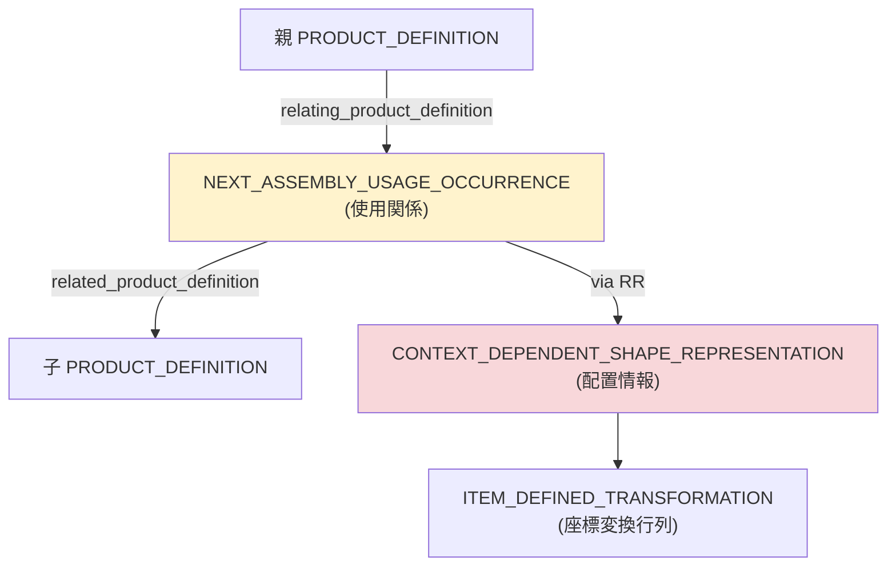
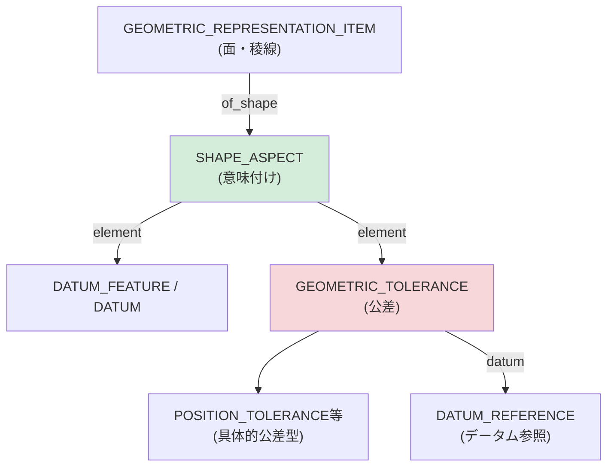
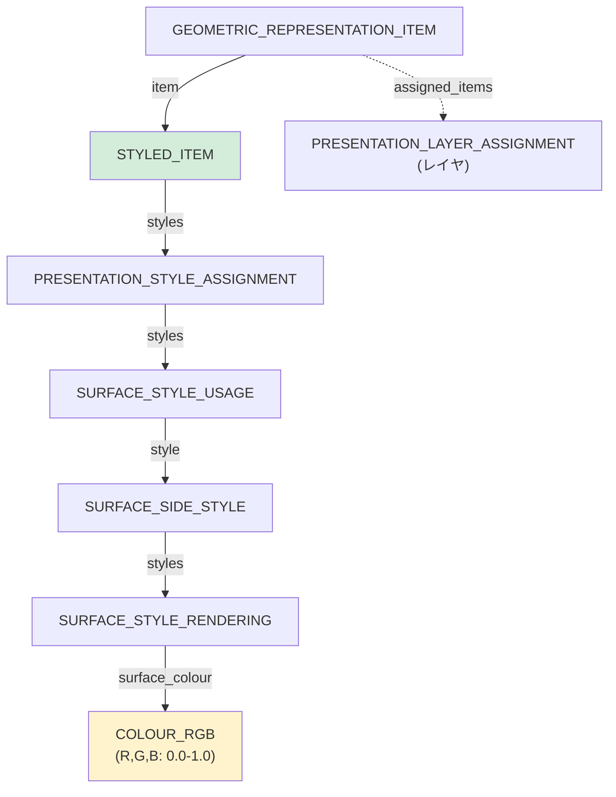

# データモデル・マップ (Data Model Map)

> [!NOTE]
> **対象読者**: 中級者向け  
> **前提知識**: [用語集](../docs/glossary.md)、[Getting Started](../docs/getting-started.md) を先に読んでください

STEPのエンティティは非常に深く、複雑にネストしています。ここでは実装者が迷わないよう、主要な階層とナビゲーションパスを**図示**し、**実装例**を示します。

---

## 🗺️ 全体マップ

STEPファイルの主要な4つの階層:

1. **[コア階層](#1-コア階層-プロダクトから形状まで)**: Product → Shape
2. **[アセンブリ構造](#2-アセンブリ構造-assembly-structure)**: 親子関係
3. **[PMI階層](#3-pmi製品製造情報の階層)**: 寸法公差
4. **[プレゼンテーション](#4-プレゼンテーション色レイヤ)**: 色・レイヤ

---

## 1. コア階層: プロダクトから形状まで

**難易度**: ★★☆（中級）  
**重要度**: ★★★（必須）

すべてのSTEPファイルの基盤となる「管理データ」から「形状」へのリンクです。

### エンティティ階層図



### エンティティ詳細

| エンティティ | 役割 | 必須/任意 | 出現頻度 |
|------------|------|----------|--------|
| **PRODUCT** | 部品そのもの | 必須 | 1個 |
| **PRODUCT_DEFINITION_FORMATION** | バージョン管理 | 必須 | 1個 |
| **PRODUCT_DEFINITION** | 設計コンテキスト | 必須 | 1個以上 |
| **PRODUCT_DEFINITION_SHAPE** | 管理↔形状の橋渡し | 必須 | 1個 |
| **SHAPE_REPRESENTATION** | 形状のコンテナ | 必須 | 1個以上 |
| **REPRESENTATION_ITEM** | 実際の形状要素 | 必須 | 多数 |

### 実ファイルでの例

実際のSTEPファイル（[minimal-product.step.md](../examples/minimal-product.step.md) より抜粋）:

```step
#10 = PRODUCT('Part_A','Part_A','Part_A description',(#20));
#20 = PRODUCT_CONTEXT('',#30,'design');
#30 = APPLICATION_CONTEXT('managed model based 3d engineering');
#40 = PRODUCT_DEFINITION_FORMATION('1','first version',#10);
#50 = PRODUCT_DEFINITION('design','',#40,#60);
#60 = PRODUCT_DEFINITION_CONTEXT('part definition',#30,'design');
#70 = PRODUCT_DEFINITION_SHAPE('','',#50);
#80 = SHAPE_DEFINITION_REPRESENTATION(#70,#90);
#90 = SHAPE_REPRESENTATION('',(#100,#110,#120),#130);
#100 = ADVANCED_FACE(...);  ← 形状データ
```

### パーサー実装のヒント

**基本的なトラバーサルパターン（Python風擬似コード）**:

```python
def get_all_faces_from_product(product_instance):
    """
    PRODUCTインスタンスからすべてのADVANCED_FACEを取得
    """
    # 1. PRODUCT → PRODUCT_DEFINITION
    prod_def_formation = find_referencing(product_instance, 'PRODUCT_DEFINITION_FORMATION', 'of_product')
    prod_def = find_referencing(prod_def_formation, 'PRODUCT_DEFINITION', 'formation')
    
    # 2. PRODUCT_DEFINITION → SHAPE_REPRESENTATION
    prod_def_shape = find_referencing(prod_def, 'PRODUCT_DEFINITION_SHAPE', 'definition')
    shape_def_rep = find_referencing(prod_def_shape, 'SHAPE_DEFINITION_REPRESENTATION', 'definition')
    shape_rep = shape_def_rep.used_representation  # 属性で直接参照
    
    # 3. SHAPE_REPRESENTATION → ADVANCED_FACE
    faces = []
    for item in shape_rep.items:  # リスト属性
        if item.entity_type == 'ADVANCED_FACE':
            faces.append(item)
        elif item.entity_type == 'MANIFOLD_SOLID_BREP':
            # Solidの場合はさらに辿る
            for face in item.outer.cfs_faces:
                faces.append(face)
    
    return faces
```

**実装上の注意点**:
- `find_referencing()`: 他のインスタンスから参照されているものを逆引き検索
- 前方参照に注意（参照先がまだパースされていない可能性）
- キャッシュ（メモ化）で高速化

**効率的な実装**:
```python
# インスタンスIDから直接アクセスできるハッシュマップを構築
instance_map = {}  # {id: instance}
reference_map = {}  # {referenced_id: [referencing_instances]}

# パース時に構築
for inst in instances:
    instance_map[inst.id] = inst
    for attr_value in inst.attributes:
        if isinstance(attr_value, Reference):
            reference_map.setdefault(attr_value.id, []).append(inst)
```

👉 詳細: [プロダクト・エンティティの解剖図](./anatomy-of-product.md)

---

## 2. アセンブリ構造 (Assembly Structure)

**難易度**: ★★★（上級）  
**重要度**: ★★☆（頻出）

アセンブリは、プロダクト定義間の「使用関係」として定義されます。

### エンティティ階層図



### エンティティ詳細

| エンティティ | 役割 | 属性 |
|------------|------|------|
| **NEXT_ASSEMBLY_USAGE_OCCURRENCE** | 親子関係の定義 | `relating_PD`, `related_PD` |
| **CONTEXT_DEPENDENT_SHAPE_REPRESENTATION** | 配置情報 | `representation_relation` |
| **ITEM_DEFINED_TRANSFORMATION** | 座標変換行列 | `transform_item_1`, `transform_item_2` |

### 実ファイルでの例

```step
# 親アセンブリ
#100 = PRODUCT('Assembly_A',...);
#110 = PRODUCT_DEFINITION(..., #100, ...);

# 子部品
#200 = PRODUCT('Part_B',...);
#210 = PRODUCT_DEFINITION(..., #200, ...);

# 使用関係（Assembly_A が Part_B を使用）
#300 = NEXT_ASSEMBLY_USAGE_OCCURRENCE('1','Part B Instance','',#110,#210,$);

# 配置情報（座標変換）
#310 = CONTEXT_DEPENDENT_SHAPE_REPRESENTATION(#320,#330);
#320 = ( REPRESENTATION_RELATIONSHIP('','',#340,#350) 
        REPRESENTATION_RELATIONSHIP_WITH_TRANSFORMATION(#360) );
#360 = ITEM_DEFINED_TRANSFORMATION('','',#370,#380);
#370 = AXIS2_PLACEMENT_3D(...);  # 変換元
#380 = AXIS2_PLACEMENT_3D(...);  # 変換先（配置位置）
```

### パーサー実装のヒント

**アセンブリツリーの構築（Python風）**:

```python
def build_assembly_tree(root_product_def):
    """
    PRODUCT_DEFINITIONを起点にアセンブリツリーを構築
    """
    tree = {
        'product_def': root_product_def,
        'children': []
    }
    
    # NAUOを検索（このPRODUCT_DEFINITIONを親とするもの）
    nauos = find_all_by_type('NEXT_ASSEMBLY_USAGE_OCCURRENCE')
    for nauo in nauos:
        if nauo.relating_product_definition == root_product_def:
            child_pd = nauo.related_product_definition
            
            # 配置行列を取得
            transform = get_placement_transform(nauo)
            
            # 再帰的に子のツリーを構築
            child_tree = build_assembly_tree(child_pd)
            child_tree['transform'] = transform
            child_tree['nauo'] = nauo
            
            tree['children'].append(child_tree)
    
    return tree

def get_placement_transform(nauo):
    """
    NAUOから配置変換行列を取得
    """
    # CONTEXT_DEPENDENT_SHAPE_REPRESENTATIONを検索
    cdsrs = find_referencing(nauo, 'CONTEXT_DEPENDENT_SHAPE_REPRESENTATION')
    for cdsr in cdsrs:
        rep_rel = cdsr.representation_relation
        if hasattr(rep_rel, 'transformation_operator'):
            item_transform = rep_rel.transformation_operator
            # AXIS2_PLACEMENT_3Dから4x4変換行列を構築
            return build_4x4_matrix(item_transform)
    
    return identity_matrix()  # デフォルトは単位行列
```

**実装上の注意点**:
- **循環参照に注意**: 誤ったファイルで親が子を参照し、子が親を参照する循環が発生する場合あり
- **多重インスタンス**: 同じ子部品が複数回使用される（NAUOが複数）
- **配置行列の欠落**: CDSRが存在しない場合は単位行列を仮定

👉 詳細: [アセンブリ構造の解説 (比較ページ)](../comparison/assembly-support.md)

---

## 3. PMI（製品製造情報）の階層

**難易度**: ★★★（上級）  
**重要度**: ★☆☆（AP242のみ）

PMIは形状（FaceやEdge）に「技術的な意味（Shape Aspect）」を持たせ、そこに公差や注記をぶら下げます。

### エンティティ階層図



### パーサー実装のヒント

**PMIの抽出（Python風）**:

```python
def extract_pmi_from_face(face_instance):
    """
    ADVANCED_FACEからPMI情報を取得
    """
    pmi_list = []
    
    # 1. このfaceを参照するSHAPE_ASPECTを探す
    shape_aspects = find_all_referencing(face_instance, 'SHAPE_ASPECT', 'of_shape')
    
    for sa in shape_aspects:
        # 2. このSHAPE_ASPECTに紐付くGEOMETRIC_TOLERANCEを探す
        tolerances = find_all_referencing(sa, 'GEOMETRIC_TOLERANCE')
        
        for tol in tolerances:
            pmi_info = {
                'type': tol.entity_type,  # POSITION_TOLERANCE, FLATNESS_TOLERANCE等
                'value': tol.magnitude,
                'shape_aspect': sa,
                'datum_references': []
            }
            
            # 3. データム参照を取得
            if hasattr(tol, 'datum_system'):
                for datum_ref in tol.datum_system:
                    pmi_info['datum_references'].append({
                        'datum': datum_ref.referenced_datum,
                        'modifiers': datum_ref.modifiers
                    })
            
            pmi_list.append(pmi_info)
    
    return pmi_list
```

**実装上の注意点**:
- PMIはAP242専用（AP214には限定的にしかない）
- `SHAPE_ASPECT`の扱いが複雑（複数の面をまとめて一つのデータムとすることもある）
- CAD間での互換性が完全ではない

---

## 4. プレゼンテーション（色・レイヤ）

**難易度**: ★★☆（中級）  
**重要度**: ★★☆（AP214以降）

形状要素に対して「スタイル」を割り当てることで表現します。

### エンティティ階層図



### 実ファイルでの例

```step
# 面
#100 = ADVANCED_FACE(...);

# 色の定義
#200 = STYLED_ITEM('',(#210),#100);  # #100（面）にスタイル適用
#210 = PRESENTATION_STYLE_ASSIGNMENT((#220));
#220 = SURFACE_STYLE_USAGE(.BOTH.,#230);
#230 = SURFACE_SIDE_STYLE('',(#240));
#240 = SURFACE_STYLE_RENDERING(#250,.MATTE.);
#250 = COLOUR_RGB('Red',1.0,0.0,0.0);  # RGB(1.0, 0.0, 0.0) = 赤

# レイヤ
#300 = PRESENTATION_LAYER_ASSIGNMENT('Layer_1','',(#100));
```

### パーサー実装のヒント

**色の抽出（Python風）**:

```python
def get_face_color(face_instance):
    """
    ADVANCED_FACEの色を取得
    戻り値: (R, G, B) のタプル (0.0-1.0) or None
    """
    # STYLED_ITEMを探す（faceを参照しているもの）
    styled_items = find_all_by_attr('STYLED_ITEM', 'item', face_instance)
    
    for si in styled_items:
        for style in si.styles:
            if style.entity_type == 'PRESENTATION_STYLE_ASSIGNMENT':
                # スタイルを辿る
                for psa_style in style.styles:
                    if psa_style.entity_type == 'SURFACE_STYLE_USAGE':
                        side_style = psa_style.style
                        for ss in side_style.styles:
                            if ss.entity_type == 'SURFACE_STYLE_RENDERING':
                                colour = ss.surface_colour
                                if colour.entity_type == 'COLOUR_RGB':
                                    return (colour.red, colour.green, colour.blue)
    
    return None  # 色が定義されていない

def get_face_layer(face_instance):
    """
    ADVANCED_FACEのレイヤ名を取得
    """
    layers = find_all_referencing(face_instance, 'PRESENTATION_LAYER_ASSIGNMENT', 'assigned_items')
    if layers:
        return layers[0].name  # レイヤ名
    return None
```

**実装上の注意点**:
- 色は0.0〜1.0の範囲（0-255に変換する場合は`int(value * 255)`）
- 複数のSTYLED_ITEMが同じ形状を参照する場合、優先順位に注意
- レイヤは文字列なので、予約語（"HIDDEN"など）に注意

---

## 💡 実装のベストプラクティス

### 1. 段階的なパース

**推奨順序**:
1. **Phase 1**: HEADER解析 → APバージョン確認
2. **Phase 2**: インスタンスマップ構築（全インスタンスをハッシュマップに）
3. **Phase 3**: PRODUCT → SHAPE_REPRESENTATION のコアパス
4. **Phase 4**: アセンブリツリー構築（必要に応じて）
5. **Phase 5**: 色・PMI（オプション）

</ 2. エラーハンドリング

```python
def safe_traverse(instance, target_type, attribute_name=None):
    """
    安全なトラバーサル（参照が存在しない場合にNoneを返す）
    """
    try:
        if attribute_name:
            ref = getattr(instance, attribute_name)
        else:
            ref = find_referencing(instance, target_type)
        
        if ref is None:
            logger.warning(f"{target_type} not found for {instance.id}")
            return None
        
        return ref
    except Exception as e:
        logger.error(f"Error traversing from {instance.id}: {e}")
        return None
```

### 3. パフォーマンス最適化

| 手法 | 効果 | 実装難度 |
|------|------|----------|
| インスタンスマップ（ハッシュマップ） | ◎ | 低 |
| 参照の逆引きマップ | ◎ | 中 |
| メモ化（キャッシュ） | ○ | 低 |
| ストリーミングパース | △ | 高 |

---

## なぜこんなに複雑なのか

STEPは「単なる形状データ」ではなく、**「何が（Product）」「どのような文脈で（Definition）」「どのような形（Shape）をしているか」**を厳密に分離して管理するように設計されているためです。

**メリット**:
- 3D形状を変えずにリビジョンだけ上げられる
- 同じ部品を複数のアセンブリで異なる位置に配置できる
- 設計・解析・製造で同じモデルを文脈を変えて使える

**実装者への影響**:
- 最初は複雑に感じるが、パターンを理解すれば一貫性がある
- 一度トラバーサル関数を実装すれば、他のケースにも応用可能

---

## 📚 次のステップ

データモデルを理解したら:

1. **[STEPファイル完全解説](../examples/step-file-walkthrough.md)** - 実ファイルで確認
2. **[よくある落とし穴](../implementation/common-pitfalls.md)** - 実装の注意点
3. **[EXPRESS言語](./express-overview.md)** - スキーマの読み方

---

[READMEに戻る](../README.md)
