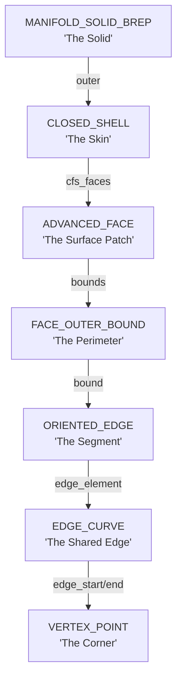
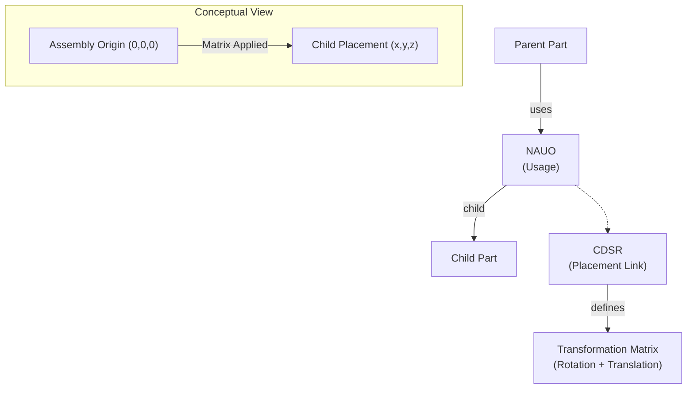
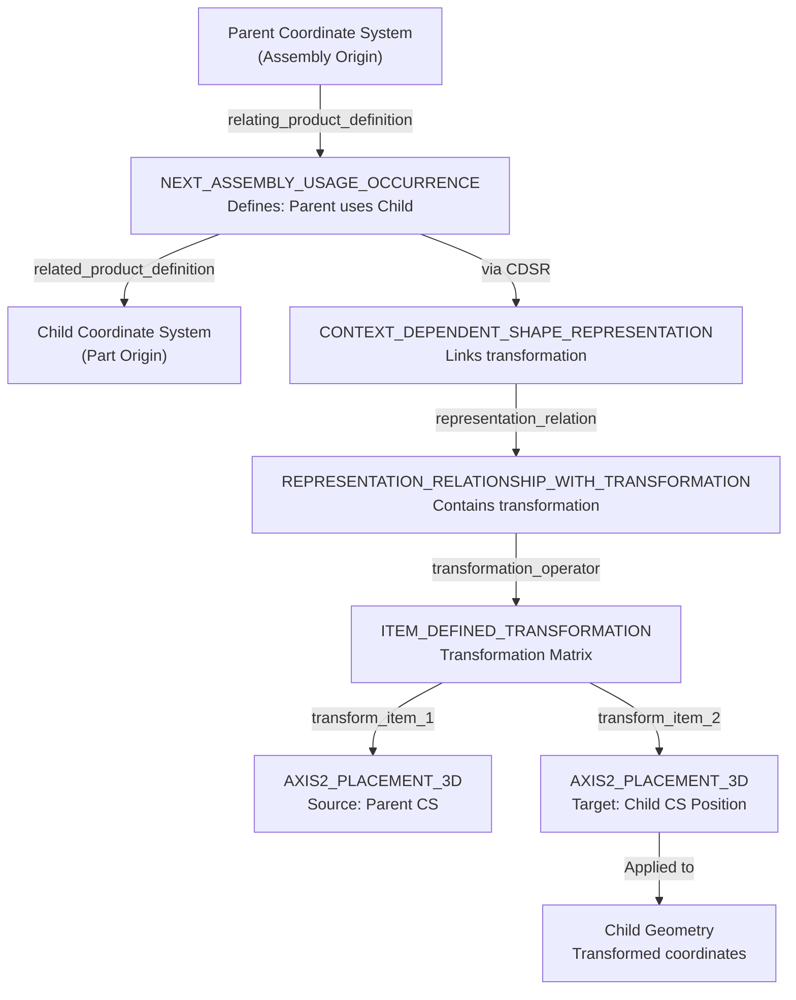
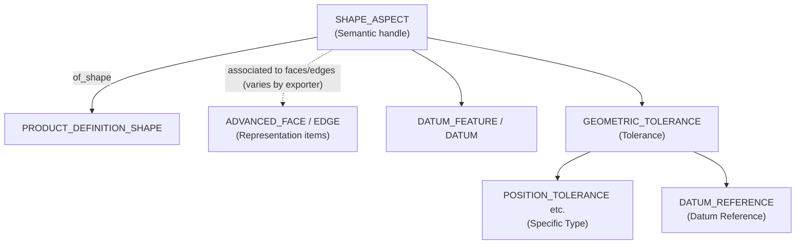
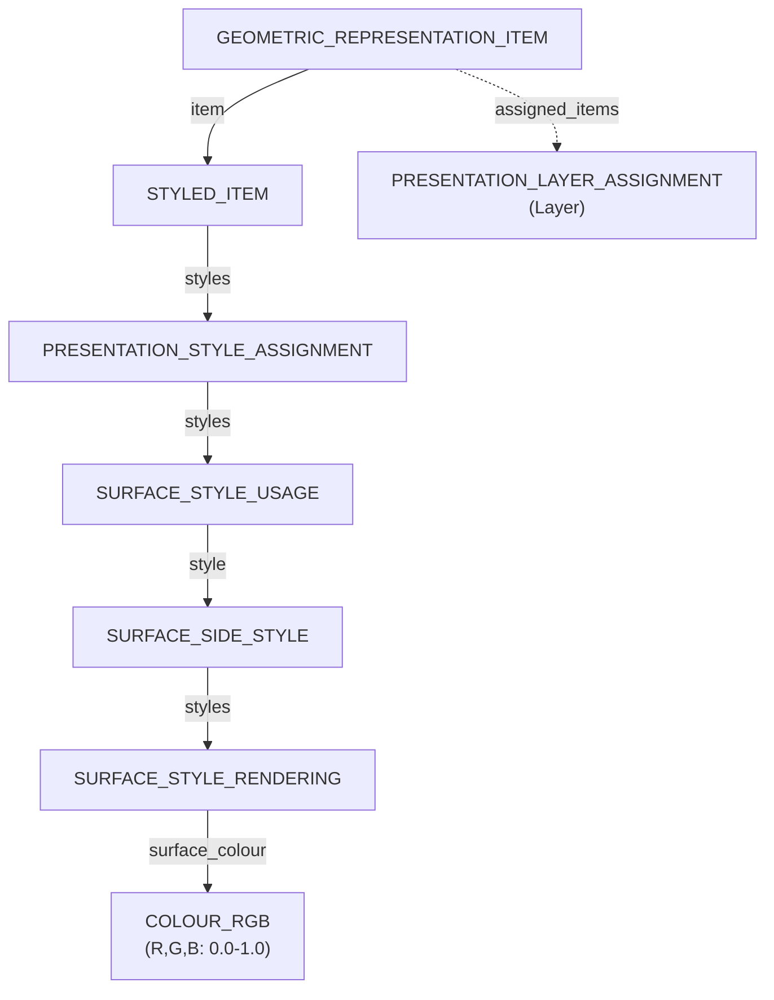

# Data Model Map

> [!NOTE]
> **Target Audience**: Intermediate users  
> **Prerequisites**: Please read the **[Glossary](../docs/glossary.md)** and **[Getting Started](../docs/getting-started.md)** first.

STEP entities are deeply and complexly nested. To prevent implementers from getting lost, this page **illustrates** the primary hierarchies and navigation paths, accompanied by **implementation examples**.

---

## 🗺️ Overall Map

The four primary hierarchies in a STEP file:

1. **[Core Hierarchy](#1-core-hierarchy-from-product-to-geometry)**: From Product to Geometry.
2. **[Assembly Structure](#2-assembly-structure)**: Parent-child relationships.
3. **[PMI Hierarchy](#3-pmi-product-and-manufacturing-information-hierarchy)**: Dimensions and tolerances.
4. **[Styling and Colors](./styling-and-colors.md)**: Colors, transparency, and layers.

---

## 1. Core Hierarchy: From Product to Geometry

**Difficulty**: ★★☆ (Intermediate)  
**Importance**: ★★★ (Essential)

The link from "Management Data" to "Geometry" that forms the foundation of every STEP file.

### B-rep Topology Hierarchy

Once you reach the `REPRESENTATION_ITEM` level, the geometry is organized as a nested hierarchy of topological elements.



### Entity Details

| Entity | Role | Required/Optional | Frequency |
|------------|------|----------|--------|
| **PRODUCT** | The part itself | Required | 1 |
| **PRODUCT_DEFINITION_FORMATION** | Version management | Required | 1 |
| **PRODUCT_DEFINITION** | Design context | Required | 1+ |
| **PRODUCT_DEFINITION_SHAPE** | Bridge between Admin and Shape | Required | 1 |
| **SHAPE_REPRESENTATION** | Geometry container | Required | 1+ |
| **REPRESENTATION_ITEM** | Actual geometry elements | Required | Many |

### Example in a Real File

Excerpt from [Minimal STEP Analysis](../examples/minimal-product.step.md):

```step
#10 = PRODUCT('Part_A','Part_A','Part_A description',(#20));
#20 = PRODUCT_CONTEXT('',#30,'design');
#30 = APPLICATION_CONTEXT('managed model based 3d engineering');
#40 = PRODUCT_DEFINITION_FORMATION('1','first version',#10);
#50 = PRODUCT_DEFINITION('design','',#40,#60);
#60 = PRODUCT_DEFINITION_CONTEXT('part definition',#30,'design');
#70 = PRODUCT_DEFINITION_SHAPE('','',#50);
#80 = SHAPE_DEFINITION_REPRESENTATION(#70,#90);
#90 = SHAPE_REPRESENTATION('',(#100,#110,#120),#130);
#100 = ADVANCED_FACE(...);  ← Geometry data starts here
```

👉 Details: **[Geometry and Topology](./geometry-and-topology.md)**  
👉 Details: **[Anatomy of Product Entities](./anatomy-of-product.md)**

**Basic Traversal Pattern (Python-style Pseudocode)**:

```python
def get_all_faces_from_product(product_instance):
    """
    Retrieve all ADVANCED_FACE entities from a PRODUCT instance.
    """
    # 1. PRODUCT → PRODUCT_DEFINITION
    prod_def_formation = find_referencing(product_instance, 'PRODUCT_DEFINITION_FORMATION', 'of_product')
    prod_def = find_referencing(prod_def_formation, 'PRODUCT_DEFINITION', 'formation')
    
    # 2. PRODUCT_DEFINITION → SHAPE_REPRESENTATION
    prod_def_shape = find_referencing(prod_def, 'PRODUCT_DEFINITION_SHAPE', 'definition')
    shape_def_rep = find_referencing(prod_def_shape, 'SHAPE_DEFINITION_REPRESENTATION', 'definition')
    shape_rep = shape_def_rep.used_representation  # Direct attribute reference
    
    # 3. SHAPE_REPRESENTATION → ADVANCED_FACE
    faces = []
    for item in shape_rep.items:  # List attribute
        if item.entity_type == 'ADVANCED_FACE':
            faces.append(item)
        elif item.entity_type == 'MANIFOLD_SOLID_BREP':
            # For Solids, traverse deeper
            for face in item.outer.cfs_faces:
                faces.append(face)
    
    return faces
```

**Implementation Considerations**:
- `find_referencing()`: Reverse lookups for instances that reference the current one.
- Beware of forward references (the target ID might not be parsed yet).
- Speed up processing with caching (memoization).

**Efficient Implementation**:
```python
# Build a hash map for direct access by instance ID
instance_map = {}  # {id: instance}
reference_map = {}  # {referenced_id: [referencing_instances]}

# Build during parsing
for inst in instances:
    instance_map[inst.id] = inst
    for attr_value in inst.attributes:
        if isinstance(attr_value, Reference):
            reference_map.setdefault(attr_value.id, []).append(inst)
```

👉 Details: **[Anatomy of Product Entities](./anatomy-of-product.md)**

---

## 2. Assembly Structure

**Difficulty**: ★★★ (Advanced)  
**Importance**: ★★☆ (Frequent)

Assemblies are defined as "usage relationships" between product definitions.

### Entity Hierarchy Diagram



### Entity Details

| Entity | Role | Attributes |
|------------|------|------|
| **NEXT_ASSEMBLY_USAGE_OCCURRENCE** | Defines parent-child relation | `relating_PD`, `related_PD` |
| **CONTEXT_DEPENDENT_SHAPE_REPRESENTATION** | Placement information | `representation_relation` |
| **ITEM_DEFINED_TRANSFORMATION** | Transformation matrix | `transform_item_1`, `transform_item_2` |

### Example in a Real File

```step
# Parent Assembly
#100 = PRODUCT('Assembly_A',...);
#110 = PRODUCT_DEFINITION(..., #100, ...);

# Child Part
#200 = PRODUCT('Part_B',...);
#210 = PRODUCT_DEFINITION(..., #200, ...);

# Usage Relationship (Assembly_A uses Part_B)
#300 = NEXT_ASSEMBLY_USAGE_OCCURRENCE('1','Part B Instance','',#110,#210,$);

# Placement Info (Transformation)
#310 = CONTEXT_DEPENDENT_SHAPE_REPRESENTATION(#320,#330);
#320 = ( REPRESENTATION_RELATIONSHIP('','',#340,#350) 
        REPRESENTATION_RELATIONSHIP_WITH_TRANSFORMATION(#360) );
#360 = ITEM_DEFINED_TRANSFORMATION('','',#370,#380);
#370 = AXIS2_PLACEMENT_3D(...);  # Source
#380 = AXIS2_PLACEMENT_3D(...);  # Target (Placement Location)
```

### Tips for Parser Implementation

**Building an Assembly Tree (Python-style)**:

```python
def build_assembly_tree(root_product_def):
    """
    Build an assembly tree starting from a PRODUCT_DEFINITION.
    """
    tree = {
        'product_def': root_product_def,
        'children': []
    }
    
    # Search for NAUOs where this PRODUCT_DEFINITION is the parent
    nauos = find_all_by_type('NEXT_ASSEMBLY_USAGE_OCCURRENCE')
    for nauo in nauos:
        if nauo.relating_product_definition == root_product_def:
            child_pd = nauo.related_product_definition
            
            # Retrieve the placement transformation
            transform = get_placement_transform(nauo)
            
            # Recursively build the child tree
            child_tree = build_assembly_tree(child_pd)
            child_tree['transform'] = transform
            child_tree['nauo'] = nauo
            
            tree['children'].append(child_tree)
    
    return tree

def get_placement_transform(nauo):
    """
    Retrieve the transformation matrix from an NAUO.
    """
    # Search for CONTEXT_DEPENDENT_SHAPE_REPRESENTATION
    cdsrs = find_referencing(nauo, 'CONTEXT_DEPENDENT_SHAPE_REPRESENTATION')
    for cdsr in cdsrs:
        rep_rel = cdsr.representation_relation
        if hasattr(rep_rel, 'transformation_operator'):
            item_transform = rep_rel.transformation_operator
            # Build a 4x4 matrix from AXIS2_PLACEMENT_3D
            return build_4x4_matrix(item_transform)
    
    return identity_matrix()  # Default to identity
```

**How Coordinate Transformation Works**:



**Transformation Process**:
1. **Parent Coordinate System**: The assembly's origin and orientation
2. **NAUO**: Defines the parent-child relationship
3. **Transformation Matrix**: Calculated from `AXIS2_PLACEMENT_3D` (source and target)
4. **Child Geometry**: All child part coordinates are transformed using this matrix
5. **Result**: Child part appears in the correct position within the assembly

**Example**: If a child part is defined at origin (0,0,0) but needs to be placed at (100, 50, 0) in the assembly, the transformation matrix translates all child coordinates by (100, 50, 0).

**Implementation Considerations**:
- **Cyclic References**: Watch for invalid files where a parent references a child and vice-versa.
- **Multiple Instances**: The same child part can be used multiple times (multiple NAUOs).
- **Missing Matrices**: Assume an identity matrix if CDSR is absent.
- **Matrix Calculation**: Convert `AXIS2_PLACEMENT_3D` to a 4x4 transformation matrix for rendering.

👉 Details: **[Assembly Support (Comparison Page)](../comparison/assembly-support.md)**

---

## 3. PMI (Product and Manufacturing Information) Hierarchy

**Difficulty**: ★★★ (Advanced)  
**Importance**: ★☆☆ (AP242 only)

PMI gives “technical meaning” to a product’s shape and links that meaning to tolerances and annotations.

Important: although it’s common to *talk* about “PMI on a face,” the ISO schemas typically define `SHAPE_ASPECT` **on the product’s shape definition** (`PRODUCT_DEFINITION_SHAPE`). Exporters then use additional associativity patterns to connect a given semantic element to specific faces/edges. Do not assume `SHAPE_ASPECT.of_shape` points directly to `ADVANCED_FACE`.

### Entity Hierarchy Diagram



### Tips for Parser Implementation

**Extracting PMI (Python-style, high-level)**:

```python
def extract_pmi(step_file):
    """
    Extract PMI information.

    Note: The exact mapping between semantic elements (e.g., SHAPE_ASPECT)
    and specific faces/edges is exporter-dependent (CAx-IF patterns vary).
    """
    pmi = []

    # 1) Collect semantic handles (shape aspects) and tolerances/datums
    shape_aspects = find_all_by_type(step_file, 'SHAPE_ASPECT')
    tolerances = find_all_by_type(step_file, 'GEOMETRIC_TOLERANCE')

    # 2) Link tolerances/datums to SHAPE_ASPECT (schema-dependent; may require reverse lookups)
    for sa in shape_aspects:
        sa_tols = find_all_referencing(sa, 'GEOMETRIC_TOLERANCE')
        sa_datums = find_all_referencing(sa, 'DATUM_FEATURE') + find_all_referencing(sa, 'DATUM')

        # 3) Resolve targets (faces/edges) using exporter-specific associativity
        targets = resolve_shape_targets(sa)  # exporter/CAx-IF pattern specific

        pmi.append({
            'shape_aspect': sa,
            'tolerances': sa_tols,
            'datums': sa_datums,
            'targets': targets,
        })

    return pmi
```

**Implementation Considerations**:
- PMI is exclusive to AP242 (limited support in AP214).
- `SHAPE_ASPECT` handling can be complex (multiple faces might define a single datum).
- Interoperability between CAD systems is not always perfect.

---

## 4. Presentation (Colors and Layers)

**Difficulty**: ★★☆ (Intermediate)  
**Importance**: ★★☆ (AP214 and later)

Styles are assigned to geometry elements to represent colors, transparency, and layers.

👉 Details: **[Styling and Colors](./styling-and-colors.md)**

### Quick Reference Diagram



---

## 💡 Implementation Best Practices

### 1. Phased Parsing

**Recommended Order**:
1. **Phase 1**: HEADER Analysis → Confirm AP Version.
2. **Phase 2**: Build Instance Map (All instances in a hash map).
3. **Phase 3**: Core Path (PRODUCT → SHAPE_REPRESENTATION).
4. **Phase 4**: Build Assembly Tree (As needed).
5. **Phase 5**: Colors & PMI (Optional).

### 2. Error Handling

```python
def safe_traverse(instance, target_type, attribute_name=None):
    """
    Safe traversal (Returns None if reference does not exist).
    """
    try:
        if attribute_name:
            ref = getattr(instance, attribute_name)
        else:
            ref = find_referencing(instance, target_type)
        
        if ref is None:
            logger.warning(f"{target_type} not found for {instance.id}")
            return None
        
        return ref
    except Exception as e:
        logger.error(f"Error traversing from {instance.id}: {e}")
        return None
```

### 3. Performance Optimization

| Method | Effect | Complexity |
|------|------|----------|
| Instance Map (Hash Map) | Best | Low |
| Reverse Reference Map | Best | Medium |
| Memoization (Caching) | Good | Low |
| Streaming Parsing | Fair | High |

---

## Why is it so complex?

STEP is designed to strictly separate **"What (Product)"**, **"In what context (Definition)"**, and **"What shape (Shape)"** it has, rather than just being "geometric data."

**Benefits**:
- Revisions can be updated without changing the 3D geometry.
- The same part can be placed in multiple locations in different assemblies.
- The same model can be used across design, analysis, and manufacturing with different contexts.

**Impact on Implementers**:
- It feels complex at first, but it's consistent once you understand the patterns.
- Traversal functions developed for one case can be reused for others.

---
## 📚 Next Steps
- **[EXPRESS Language Basics](./express-overview.md)** - Learn how to read schemas.
- **[Common Pitfalls](../implementation/common-pitfalls.md)** - Implementation warnings and solutions.

[Back to README](../README.md)
