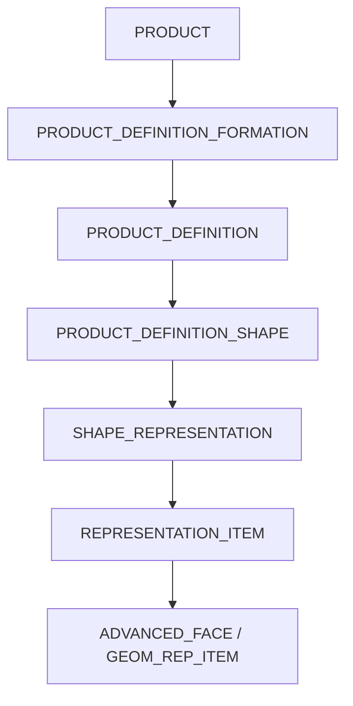
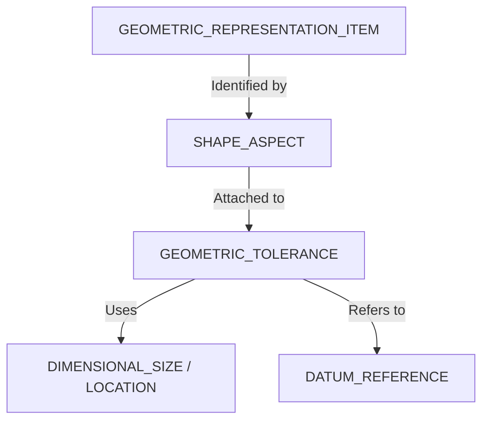
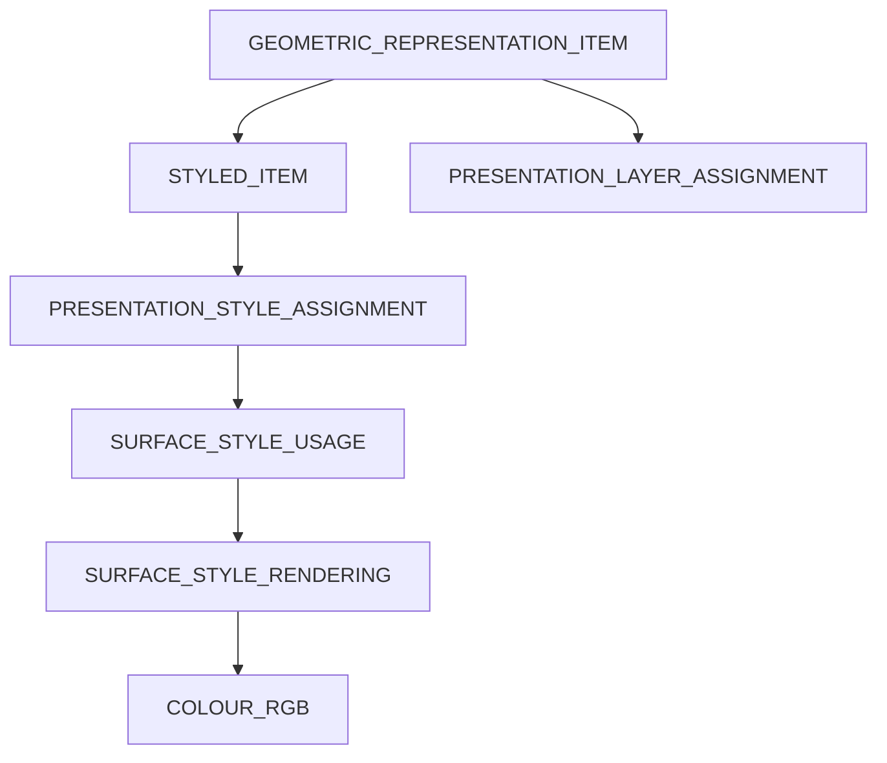

# データモデル・マップ (Data Model Map)

STEPのエンティティは非常に深く、複雑にネストしています。ここでは実装者が迷わないよう、主要な階層とナビゲーションパスを図示します。

## 1. コア階層: プロダクトから形状まで

すべてのSTEPファイルの基盤となる「管理データ」から「形状」へのリンクです。

- **PRODUCT**: 部品そのものを表すトップレベルオブジェクト。 (id, name, description, frame_of_reference)
- **PRODUCT_DEFINITION_FORMATION**: バージョン/リビジョンを管理。 (id, description, of_product)
- **PRODUCT_DEFINITION**: 設計、解析などのコンテキスト定義。 (id, description, formation, frame_of_reference)
- **PRODUCT_DEFINITION_SHAPE**: 管理データと形状データの「橋渡し」役。 (name, description, definition)

👉 詳細: [プロダクト・エンティティの解剖図](./anatomy-of-product.md)

---

## 2. アセンブリ構造 (Assembly Structure)

アセンブリは、プロダクト定義間の「使用関係」として定義されます。

- **NEXT_ASSEMBLY_USAGE_OCCURRENCE**: 子部品が親アセンブリ内で一回使用されることを定義。 (id, name, description, relating_PD, related_PD, reference_designator)
- **CONTEXT_DEPENDENT_SHAPE_REPRESENTATION**: 配置情報（座標変換行列）を形状モデルに紐付けます。 (representation_relation, representation_conformance)

👉 詳細: [アセンブリ構造の解説 (比較ページ)](../comparison/assembly-support.md)

---

## 3. PMI（製品製造情報）の階層

PMIは形状（FaceやEdge）に「技術的な意味（Shape Aspect）」を持たせ、そこに公差や注記をぶら下げます。

- **SHAPE_ASPECT**: 単なる面や線を「データム形体A」などの意味ある要素として定義。
- **GEOMETRIC_TOLERANCE**: `POSITION_TOLERANCE`（位置公差）や `FLATNESS_TOLERANCE`（平面度）などの基底エンティティ。

---

## 4. プレゼンテーション（色・レイヤ）

形状要素に対して「スタイル」を割り当てることで表現します。

- **STYLED_ITEM**: 形状要素と表示スタイルを紐付ける。
- **COLOUR_RGB**: 色情報（0.0〜1.0の実数値）。
- **PRESENTATION_LAYER_ASSIGNMENT**: 形状をレイヤ（"HIDDEN", "CONSTRUCTION" 等）に所属させる。

---

## なぜこんなに複雑なのか
STEPは「単なる形状データ」ではなく、**「何が（Product）」「どのような文脈で（Definition）」「どのような形（Shape）をしているか」**を厳密に分離して管理するように設計されているためです。これにより、3D形状を変えずにリビジョンだけ上げたり、同じ部品を複数のアセンブリで異なる位置に配置したりすることが可能になっています。

---
[READMEに戻る](../README.md)
