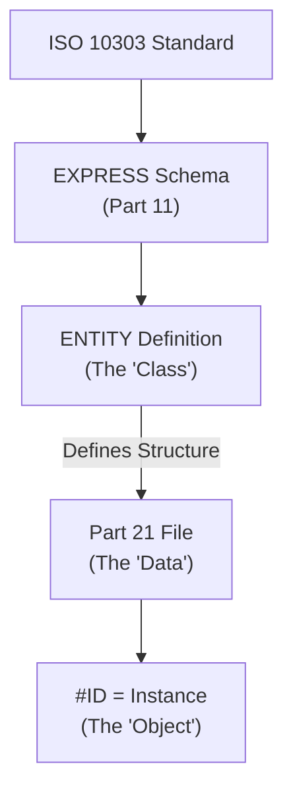
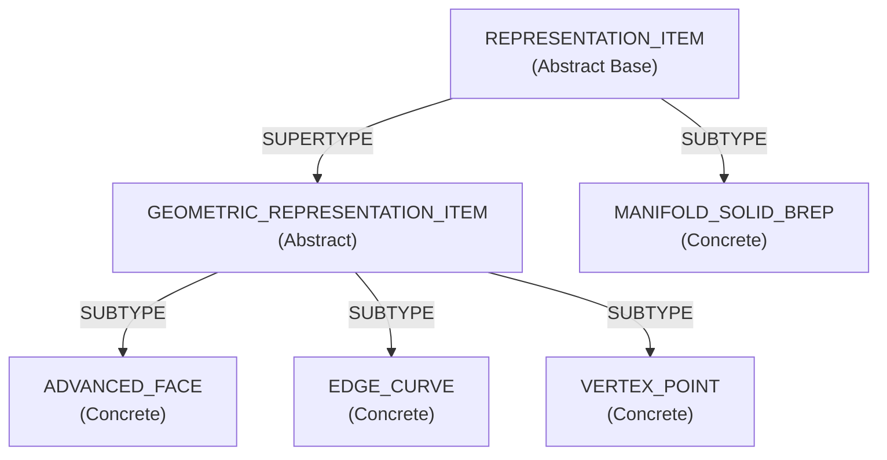

# EXPRESS Overview

The data models for STEP are defined using **EXPRESS** (ISO 10303-11), an information modeling language.

## 1. What is EXPRESS?
- A data definition language with object-oriented-like characteristics.
- It defines Entities, Types, Functions, and Rules.
- A STEP Application Protocol (e.g., AP214) is essentially a massive schema written in EXPRESS.

### Relationship: Schema vs. Data


## 2. How to Read the Schema
```express
ENTITY product;
  id : identifier;
  name : label;
  description : OPTIONAL text;
  frame_of_reference : SET [1:?] OF product_context;
END_ENTITY;
```
- `ENTITY`: Similar to a class.
- `id`, `name`: Attributes.
- `OPTIONAL`: The data value may be null.
- `SET [1:?]`: A set of one or more unique items.

### Entity Inheritance (SUPERTYPE/SUBTYPE)

EXPRESS supports inheritance through SUPERTYPE and SUBTYPE relationships. This allows entities to inherit attributes from parent entities:



**Key Concepts**:
- **SUPERTYPE**: Parent entity (abstract, cannot be instantiated directly)
- **SUBTYPE**: Child entity (inherits all attributes from parent)
- **Abstract Entities**: Cannot appear in Part 21 files directly (e.g., `GEOMETRIC_REPRESENTATION_ITEM`)
- **Concrete Entities**: Can be instantiated in Part 21 files (e.g., `ADVANCED_FACE`, `EDGE_CURVE`)

**Example EXPRESS Definition**:
```express
ENTITY geometric_representation_item
  ABSTRACT SUPERTYPE OF (ONEOF (advanced_face, edge_curve, vertex_point));
  -- No attributes, just a base type
END_ENTITY;

ENTITY advanced_face
  SUBTYPE OF (geometric_representation_item);
  bounds : SET [1:?] OF face_bound;
  face_geometry : surface;
  same_sense : BOOLEAN;
END_ENTITY;
```

**What This Means for Implementers**:
- When parsing, you may encounter references to abstract types, but actual instances will always be concrete subtypes.
- Type checking should consider inheritance: an `ADVANCED_FACE` is also a `GEOMETRIC_REPRESENTATION_ITEM`.

## 3. What Implementers Need to Know
During implementation, rules like "which attributes are mandatory" and "which types are convertible" are all based on these EXPRESS definitions found in the standard.

---
## 📚 Next Steps
- **[Common Pitfalls](../implementation/common-pitfalls.md)** - Problems often encountered during implementation and their solutions.

[Back to README](../README.md)
