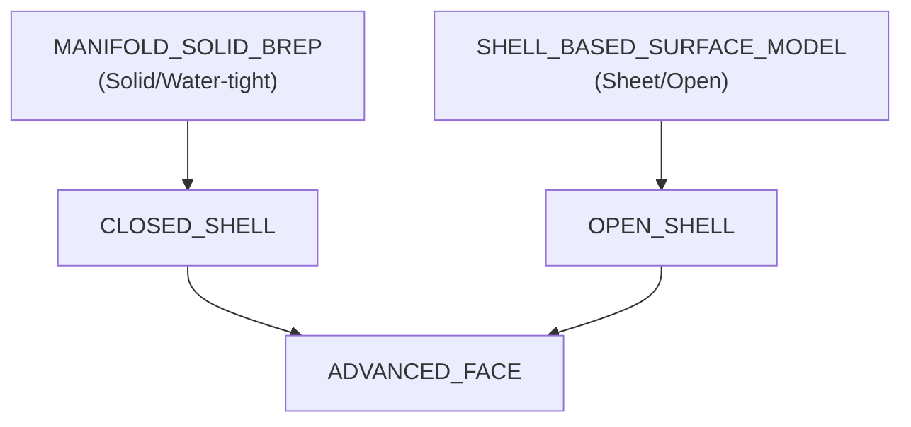

# Geometry and Topology

> [!NOTE]
> **Target Audience**: Advanced Implementers & Geometry Kernel Developers  
> **Prerequisites**: Please read the **[Glossary](../docs/glossary.md)** and **[Data Model Map](./data-model-map.md)** first.

This page provides a deep dive into the mathematical and structural representation of geometry in STEP, covering NURBS, complex topology, and geometric continuity.

---

## 1. Foundations of NURBS

NURBS (Non-Uniform Rational B-Splines) are the mathematical backbone of STEP B-rep.

### Key Components

| Term | Meaning | Impact on Shape |
| :--- | :--- | :--- |
| **Degree** (次数) | The degree of the polynomial (e.g., 3 for cubic splines). | Higher degrees allow for smoother curves but increase calculation cost. |
| **Knot Vector** (ノットベクトル) | A sequence of parameter values that determine where the spline segments meet. | Multiple knots at the same position (multiplicity) create "sharp" corners or discontinuities. |
| **Control Points** | Points that "pull" the curve toward them. | Moving a control point locally affects the shape. |
| **Weights** (重み) | Used in **Rational** B-splines. | Allows exact representation of conic sections (circles, ellipses, hyperbolas). |

### Mathematical Definition

NURBS can represent both curves and surfaces.

#### 1. NURBS Curve $C(u)$

A NURBS curve is defined as:

\[
C(u) = \frac{\sum_{i=0}^n N_{i,p}(u) w_i P_i}{\sum_{i=0}^n N_{i,p}(u) w_i}
\]

*(In plain text: Sum of (Basis * Weight * ControlPoint) / Sum of (Basis * Weight))*

#### 2. NURBS Surface $S(u, v)$

A NURBS surface is defined as the bivariate extension:

\[
S(u, v) = \frac{\sum_{i=0}^n \sum_{j=0}^m N_{i,p}(u) N_{j,q}(v) w_{i,j} P_{i,j}}{\sum_{i=0}^n \sum_{j=0}^m N_{i,p}(u) N_{j,q}(v) w_{i,j}}
\]

*(In plain text: Sum of (Basis_u * Basis_v * Weight * ControlPoint) / Sum of (Basis_u * Basis_v * Weight))*

Where:
*   **$P$**: Control Points (grid for surfaces).
*   **$w$**: Weights.
*   **$N$**: B-spline Basis Functions of degree $p$ (and $q$ for surfaces), defined by the **Cox-de Boor recursion formula**.
*   **$u, v$**: Parameters.

#### Basis Function Recursion (Cox-de Boor)

The basis functions $N_{i,p}(u)$ are defined recursively:
- **Degree 0**: $N_{i,0}(u) = 1$ if $u_i \le u < u_{i+1}$, else $0$.
- **Degree $p$**: $N_{i,p}(u) = \frac{u - u_i}{u_{i+p} - u_i} N_{i,p-1}(u) + \frac{u_{i+p+1} - u}{u_{i+p+1} - u_{i+1}} N_{i+1,p-1}(u)$

#### How is it uniquely determined?

A NURBS curve is uniquely defined by four inputs:
1.  **Degree ($p$)**: Determines the polynomial complexity.
2.  **Knot Vector ($U$)**: A non-decreasing sequence of numbers (e.g., $\{0, 0, 0, 1, 2, 3, 3, 3\}$). It dictates how the control points influence the curve along the parameter $u$.
3.  **Control Points ($P_i$)**: The skeleton of the curve.
4.  **Weights ($w_i$)**: The "strength" of each control point. If all weights are 1.0, the curve is a non-rational B-spline.

**Uniqueness Note**: In STEP, these are explicitly stored in entities like `B_SPLINE_CURVE_WITH_KNOTS`. A NURBS curve is only "determined" within the range of its knot vector (typically $[u_{min}, u_{max}]$).

---

### Parameter Space: 2D vs. 3D

STEP uses two ways to define curves on surfaces:

1.  **Space Curve (3D)**: Defined directly in 3D XYZ space (e.g., `B_SPLINE_CURVE_WITH_KNOTS`).
2.  **PCurve (2D)**: Defined in the 2D UV parameter space of a surface (e.g., `PCURVE`).

**Why both?**  
Robust geometry kernels use `PCURVE` to ensure that the boundary of a face (the trim line) lies exactly on the surface, preventing "gaps" or "leaks" in the model during import/export.

---

## 2. Topology and B-rep Types

STEP differentiates between "Solid" (Closed) and "Surface" (Open) models.

### Closed vs. Open Shells

*   **MANIFOLD_SOLID_BREP**: Represents a "water-tight" solid. It must have a volume.
*   **SHELL_BASED_SURFACE_MODEL**: Represents surfaces with no volume (e.g., a thin sheet of metal).

### Voids and Hollow Solids

For solids with internal cavities (voids), STEP uses `ORIENTED_CLOSED_SHELL`.

1.  **Outer Bound**: The exterior shell (oriented "out").
2.  **Voids**: One or more internal closed shells (oriented "in").

---

## 3. Geometric Entities & Primitives

### Primitives (CSG)
While STEP is primarily B-rep, it supports "Primitives" which can be used in CSG (Constructive Solid Geometry) operations or as B-rep underlying geometry:

*   `BLOCK`: A rectangular box.
*   `CYLINDER`: A cylinder.
*   `SPHERE`: A sphere.
*   `TORUS`: A doughnut shape.

### Complex Surfaces & Fillets

*   **Toroidal Surface**: Used for doughnuts or circular fillets.
*   **Fillets and Blends**: These are almost always represented as **NURBS patches** (`B_SPLINE_SURFACE`) in modern CAD exports.
*   **Offset Surface**: A surface defined at a constant distance from a base surface (`OFFSET_SURFACE`).

---

## 4. Continuity and Quality

### Geometric Continuity (G0, G1, G2)

When two surfaces or curves meet, their "smoothness" is defined by continuity:

| Type | Name | Visual Result |
| :--- | :--- | :--- |
| **G0** | Positional | The elements touch, but there is a visible "crease". |
| **G1** | Tangential | The transition is smooth (no crease), but the reflection might "jump". |
| **G2** | Curvature | The transition is perfectly smooth; reflections flow across the boundary. |

**STEP Implementation**: Continuity is often explicitly declared in NURBS entities (e.g., `continuity: geometric_continuity_2`).

---

## 5. Physical Properties (Mass Properties)

STEP can store calculated physical data so that the receiving system can verify the integrity of the geometry.

*   **Volume**: Stored in `GEOMETRIC_ITEM_SPECIFIC_USAGE` linked to a `VOLUME_UNIT`.
*   **Mass / Center of Gravity**: Often stored under `PROPERTY_DEFINITION` entities.
*   **Validation Properties**: Special entities like `VALUATION_PROPERTY` are used to store "check values" for area and volume. If the imported model's volume differs from this value, the import is considered failed or "lossy".

---

## 💡 Implementation Tips

1.  **Check for Water-tightness**: If you are importing a `MANIFOLD_SOLID_BREP`, verify that every `EDGE_CURVE` is shared by exactly two `ADVANCED_FACE`s (manifold condition).
2.  **Handle Degree 1 Splines**: Often, CAD systems export polylines as degree 1 NURBS.
3.  **Torus Inversion**: Pay attention to the `axis` and `radius` attributes of `TOROIDAL_SURFACE`. If the minor radius is larger than the major radius, it becomes a self-intersecting "spindle torus".

---
## 📚 Next Steps
- **[Common Pitfalls](../implementation/common-pitfalls.md)** - Learn about tolerance issues.
- **[Validation and CAx-IF](../implementation/validation-and-caxif.md)** - How to use validation properties.

[Back to README](../README.md)

