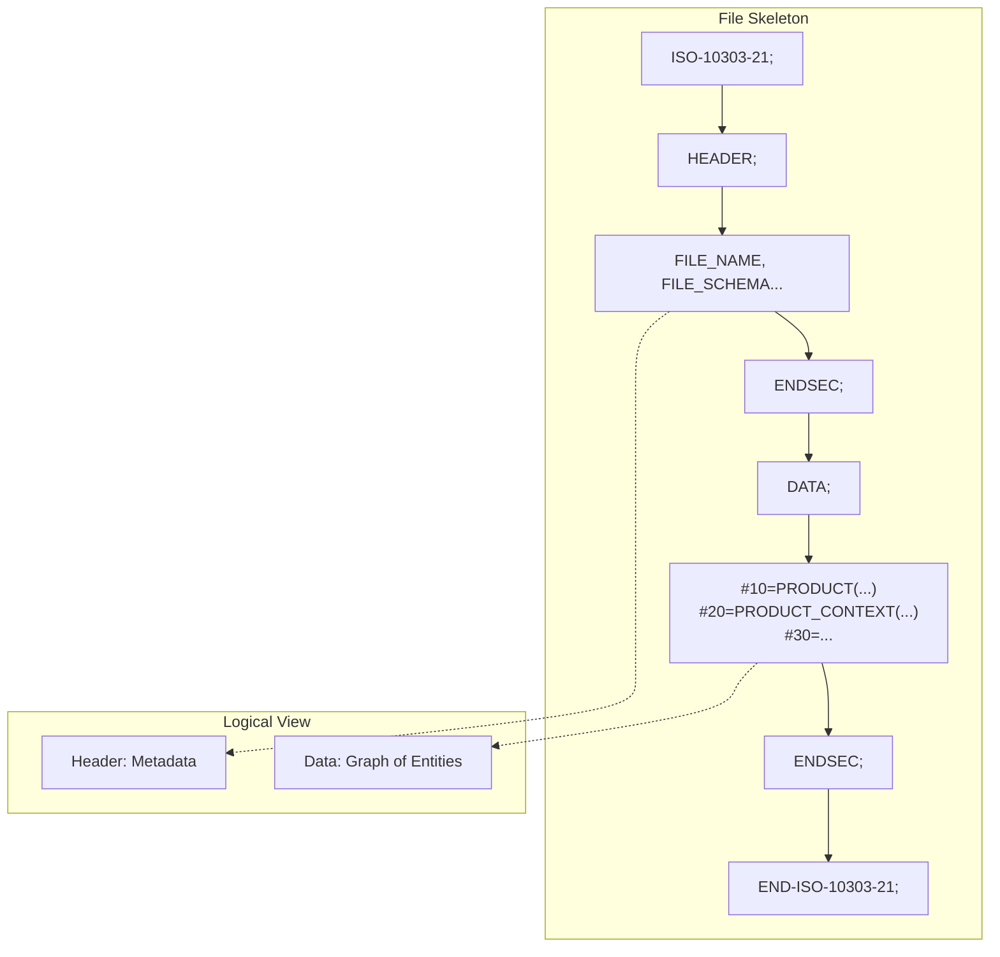
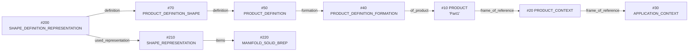
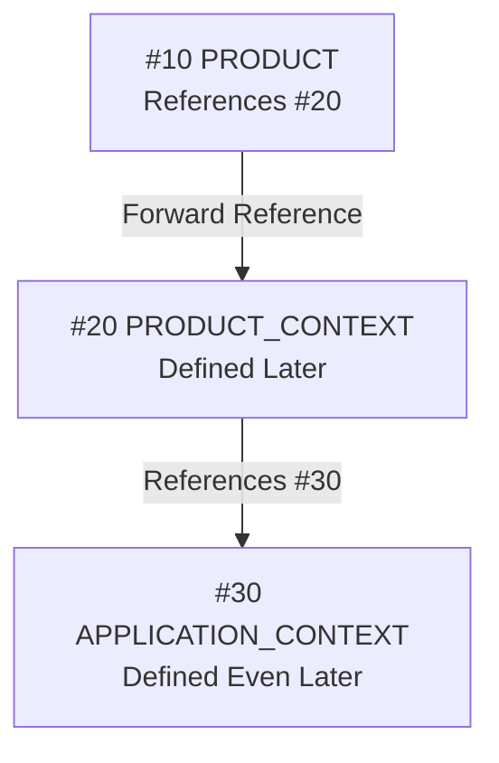

# STEP File Basics

STEP files (`*.stp`, `*.step`) are plain text files specified by ISO 10303-21.

## 1. File Structure (Anatomy)

A STEP file is a collection of "Instances" that reference each other. Visually, you can think of it as a book where each page (Instance) can point to other pages.



```text
ISO-10303-21;
HEADER;
  /* Metadata: Filename, author, AP definition, etc. */
  FILE_NAME(...);
  FILE_SCHEMA(('AP242_MANAGED_MODEL_BASED_3D_ENGINEERING_MIM_LF'));
ENDSEC;

DATA;
  /* Actual data entities */
  #10=PRODUCT('Part1','Part1','',(#20));
  #20=PRODUCT_CONTEXT('',#30,'');
  ...
ENDSEC;

END-ISO-10303-21;
```

## 2. Syntax Overview

Each line in the `DATA` section represents an **entity instance** and follows this standard format:

**`#ID = ENTITY_NAME(Attribute1, Attribute2, ...);`**

| Symbol | Name | Meaning |
| :--- | :--- | :--- |
| `#` | Hash/Pound | Prefix indicating an **Instance ID** follows. |
| `10` | Instance ID | A unique integer identifier for this object within this specific file. |
| `=` | Assignment | Links the ID on the left to the data definition on the right. |
| `ENTITY` | Entity Name | The type of data (defined in the EXPRESS schema, e.g., `PRODUCT`). |
| `(...)` | Attributes | The data values or references to other IDs (e.g., `(#20)`). |
| `;` | Semicolon | Mandatory terminator for every STEP statement. |

## 3. Why Instance IDs (#10, #20...) Matter

- **Reference System**: STEP uses a pointer-based structure. When one entity needs to use another, it refers to its `#ID`.
- **Volatile Nature**: These numbers only need to be unique within the file. It is normal and expected for these numbers to change when a file is re-saved by CAD software.
- **Numbering Convention**: You will often see IDs incremented by 10 (`#10, #20, #30`). This is a legacy practice to allow for manual insertion of entities (e.g., `#15`) without renumbering the whole file.

### How Instance IDs Reference Each Other

The following diagram shows how entities reference each other using Instance IDs:



**Key Points**:
- Each arrow shows a reference from one entity to another using `#ID`.
- `#10` references `#20` via the `frame_of_reference` attribute.
- This creates a chain of references that connects product information to geometry.

### Forward References Are Allowed

STEP files allow **forward references**, meaning an entity can reference another entity that is defined later in the file:



**Why This Matters**:
- Parsers must use **two-pass processing**: First pass builds an instance map, second pass resolves references.
- You cannot resolve references in a single pass because forward references exist.
- This is why using a hash map (dictionary) to store all instances before resolving references is essential.

---
## 📚 Next Steps
- **[Data Model Map](./data-model-map.md)** - Understand the entity hierarchy.

[Back to README](../README.md)
