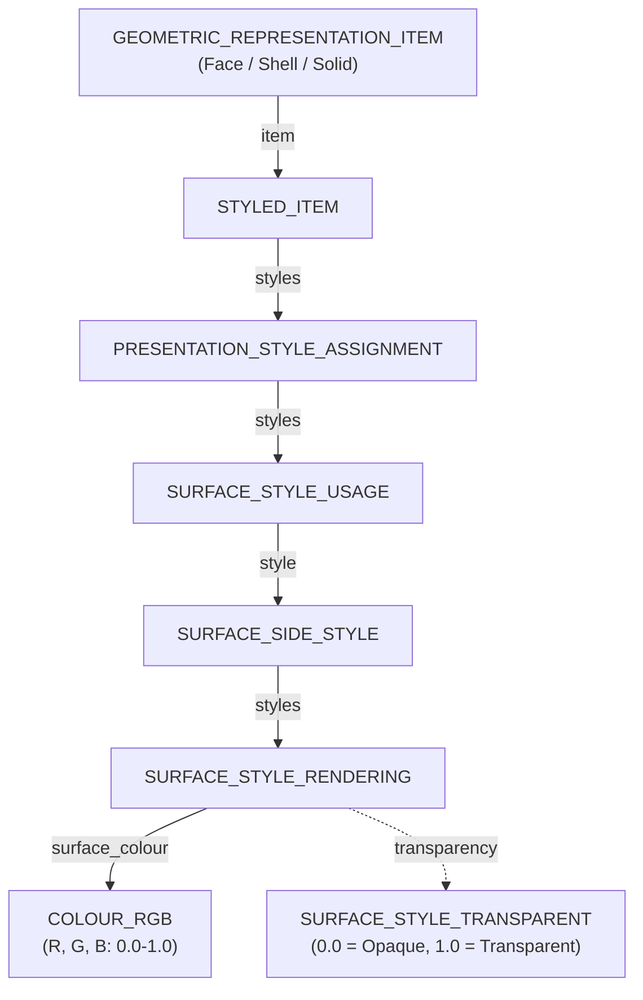
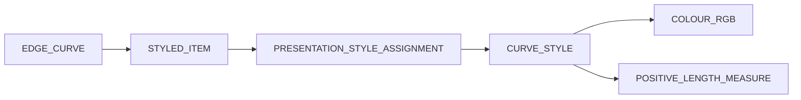

# Styling and Colors (Presentation)

> [!NOTE]
> **Target Audience**: Intermediate to Advanced Implementers  
> **Prerequisites**: Read the **[Data Model Map](./data-model-map.md)** first.

In STEP, visual representation (colors, layers, transparency) is decoupled from the geometry. This allows for rich visual data without altering the underlying mathematical definitions.

---

## 🚦 Version Compatibility

Not all Application Protocols (APs) support visual styling. Choosing the right version is critical.

| Feature | AP203 (Ed.2) | AP214 | AP242 |
| :--- | :---: | :---: | :---: |
| **Basic Colors (RGB)** | ✅ (Yes) | ✅ (Yes) | ✅ (Yes) |
| **Layers** | ✅ (Yes) | ✅ (Yes) | ✅ (Yes) |
| **Transparency** | ❌ (No) | ⚠ (Partial) | ✅ (Yes) |

- **AP203**: The oldest standard. **Edition 1** does not store colors or layers. **Edition 2** added support for basic styling and layers to match AP214.
- **AP214**: The most common standard for "colored" STEP files. Highly compatible with most CAD systems.
- **AP242**: The modern standard. Supports everything in AP214 plus advanced transparency and PMI styling.

---

## 🗺️ Presentation Hierarchy

Styles are assigned to geometry via a chain of entities. The most common path is for surface colors.



### Key Entities

| Entity | Role |
| :--- | :--- |
| **STYLED_ITEM** | The entry point. Links a specific geometry item to a style. |
| **PRESENTATION_STYLE_ASSIGNMENT** | A container for multiple styles (Surface, Curve, Fill, etc.). |
| **SURFACE_STYLE_USAGE** | Specifies which side of the surface the style applies to (`.BOTH.`, `.POSITIVE.`, or `.NEGATIVE.`). |
| **SURFACE_STYLE_RENDERING** | Defines visual properties like color and transparency. |
| **COLOUR_RGB** | Defines color in RGB space using values from `0.0` to `1.0`. |

---

## 🎯 Assignment Levels & Compatibility

Where you attach a `STYLED_ITEM` significantly impacts how CAD systems interpret the file.

### 1. Face Level (Best Practice)
Attaching colors directly to `ADVANCED_FACE` entities.
- **Pros**: Highest compatibility. Supported by almost all STEP-compliant software.
- **Cons**: Increases file size if many faces share the same color.

### 2. Shell/Solid Level
Attaching colors to `CLOSED_SHELL` or `MANIFOLD_SOLID_BREP`.
- **Pros**: Smaller file size. Sets a "default" color for the whole body.
- **Cons**: Some older parsers or lightweight viewers ignore styles attached at this level.

### 3. Part (Product) Level
Styling is sometimes attached at the `SHAPE_REPRESENTATION` level.
- **Note**: This is often treated as a "fallback" or "layer color."

---

## 🌓 Overriding Logic

If a color is defined for a Solid and a different color is defined for one of its Faces, which one wins?

STEP uses **`OVER_RIDING_STYLED_ITEM`** to handle this.

- The `OVER_RIDING_STYLED_ITEM` explicitly references another `STYLED_ITEM` (the one being overridden).
- This is commonly used in assemblies where a part has a default color, but a specific instance in the assembly needs to look different.

---

## 🌫️ Transparency and Opacity

Transparency is defined within the `SURFACE_STYLE_RENDERING` block.

```step
#240 = SURFACE_STYLE_RENDERING(#250,.MATTE.,#260);
#250 = COLOUR_RGB('Glass',0.8,0.9,1.0);
#260 = SURFACE_STYLE_TRANSPARENT(0.5);  /* 50% Transparent */
```

- **0.0**: Fully Opaque (Solid)
- **1.0**: Fully Transparent (Invisible)
- **Note**: Not all viewers support transparency. It is primarily an AP214 and AP242 feature.

---

## 🖋️ Curve and Edge Styling

While surfaces use `SURFACE_STYLE`, edges (wireframes) use `CURVE_STYLE`.



- **CURVE_STYLE**: Can define both color and line width.
- Many CAD systems export edges as "Black" by default, even if the faces are colored.

```step
/* Example: Styling an Edge (Blue, 0.5mm width) */
#100 = EDGE_CURVE('Edge_A',#110,#120,#130,.T.);
#200 = STYLED_ITEM('',(#210),#100);
#210 = PRESENTATION_STYLE_ASSIGNMENT((#220));
#220 = CURVE_STYLE('',$,#230,#240);
#230 = COLOUR_RGB('',0.0,0.0,1.0);  /* Blue */
#240 = POSITIVE_LENGTH_MEASURE(0.5); /* 0.5mm Width */
```

---

## 🗂️ Layer Management

Layers in STEP are managed by **`PRESENTATION_LAYER_ASSIGNMENT`**. Unlike colors, layers are "grouping" entities that reference geometry items.

```step
#300 = PRESENTATION_LAYER_ASSIGNMENT('Mechanical_Parts','Visible parts',(#100,#200));
```

- **Name**: The layer name (e.g., 'CONSTRUCTION', 'SKETCH', '0').
- **Assigned Items**: A list of geometry entities belonging to this layer.
- **Note**: An item can belong to multiple layers, though most CAD systems only use one.

---

## 💡 Implementation Tips

1.  **Normalization**: Always convert `COLOUR_RGB` (0.0-1.0) to your target system's range (e.g., 0-255) by multiplying by 255 and rounding.
2.  **Deduplication**: In export, reuse the same `COLOUR_RGB` and `SURFACE_STYLE_RENDERING` instances for all faces that share the same color to keep the file size small.
3.  **Fallback**: If a face has no style, check its parent Shell. If the Shell has no style, check the Solid. If all fail, apply a default gray `(0.8, 0.8, 0.8)`.

---

## 📚 Next Steps
- **[Anatomy of Product Entities](./anatomy-of-product.md)** - How parts are defined.
- **[Common Pitfalls](../implementation/common-pitfalls.md)** - Common issues with colors.

[Back to README](../README.md)
