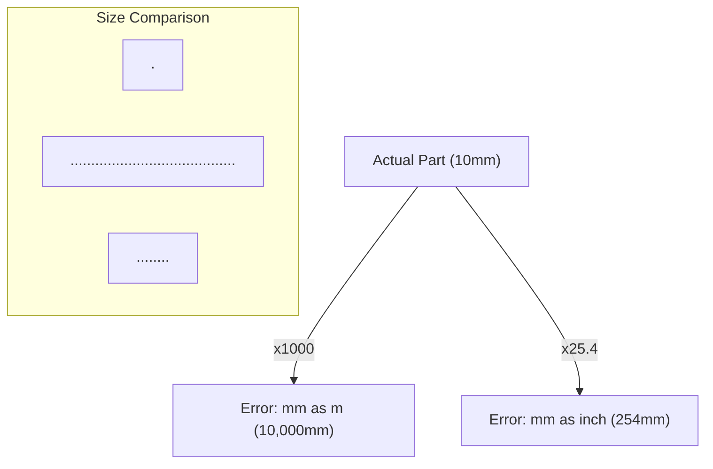
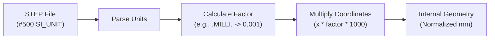
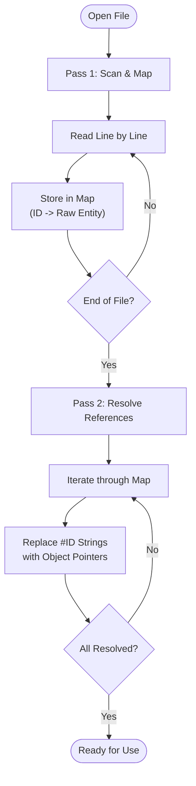

# Common Pitfalls

This document explains problems frequently encountered during STEP implementation and conversion, along with **countermeasures, detection methods, and implementation examples**.

---

## 📋 Table of Contents

1. [Unit Mismatches](#1-unit-mismatches)
2. [Precision (Tolerance) Issues](#2-precision-tolerance-issues)
3. [Face Orientation and Consistency](#3-face-orientation-and-consistency)
4. [Loss of Assembly Structure](#4-loss-of-assembly-structure)
5. [Dangling PMI](#5-dangling-pmi)
6. [Missing Colors and Layers](#6-missing-colors-and-layers)
7. [Encoding Issues](#7-encoding-issues)
8. [Improper Forward Reference Handling](#8-improper-forward-reference-handling)
9. [Persistence and Topology Risks](#9-persistence-and-topology-risks)

---

## 1. Unit Mismatches

**Difficulty**: ★★☆ (Intermediate)  
**Frequency**: ★★★ (Very Common)  
**Impact**: 🔴 High (Drastic changes in geometry size)

### ❌ The Problem

- Conversion errors between `SI_UNIT` and `CONVERSION_BASED_UNIT` (e.g., Inches).
- Definitions like "length in mm, angles in Radians" are not correctly specified in the file.
- **Implementer's Blind Spot**: Missing the interpretation of SI prefixes (kilo, milli).

#### The Unit Mismatch Disaster



**Examples**:
- Interpreting mm as meters → Geometry becomes 1000x larger.
- Misidentifying an Inch file as mm → ~4% error (or 25.4x depending on the direction).

### ✅ Solutions

#### Unit Normalization Flow
Implementers should normalize all incoming data to a single internal unit system (typically mm).



#### 1. Always Verify UNIT_CONTEXT

```step
#500 = ( LENGTH_UNIT() NAMED_UNIT(*) SI_UNIT(.MILLI.,.METRE.) );
#510 = ( PLANE_ANGLE_UNIT() NAMED_UNIT(*) SI_UNIT($,.RADIAN.) );
```

- `.MILLI.,.METRE.` = mm
- `.CENTI.,.METRE.` = cm
- None (`$`) or `.METRE.` = m

#### 2. Implement an SI Prefix Conversion Table

| PREFIX | Factor | Example |
|--------|------|---|
| `.PICO.` | 10^-12 | |
| `.NANO.` | 10^-9 | |
| `.MICRO.` | 10^-6 | μm |
| `.MILLI.` | 10^-3 | mm |
| `.CENTI.` | 10^-2 | cm |
| None or `$` | 1 | m |
| `.KILO.` | 10^3 | km |

### 🔍 Detection Methods

**Validation Code (Python)**:

```python
def validate_and_get_unit_scale(step_file):
    """
    Retrieve units and return the conversion scale to mm.
    """
    # Search for GEOMETRIC_REPRESENTATION_CONTEXT
    contexts = find_all_by_type(step_file, 'GEOMETRIC_REPRESENTATION_CONTEXT')
    
    for ctx in contexts:
        units = ctx.units if hasattr(ctx, 'units') else []
        
        for unit in units:
            if 'LENGTH_UNIT' in str(unit.entity_types):
                # Retrieve prefix from SI_UNIT
                prefix = unit.prefix if hasattr(unit, 'prefix') else None
                
                # Calculate scale from prefix
                scale = get_si_prefix_scale(prefix)  # .MILLI. → 0.001
                
                return scale  # Factor to meters (0.001 if mm)
    
    # Default: assume meters
    logger.warning("LENGTH_UNIT not found, assuming meters")
    return 1.0

def get_si_prefix_scale(prefix):
    """Get factor from SI prefix"""
    prefix_map = {
        'PICO': 1e-12, 'NANO': 1e-9, 'MICRO': 1e-6,
        'MILLI': 1e-3, 'CENTI': 1e-2,
        'DECI': 1e-1,
        'DECA': 1e1, 'HECTO': 1e2, 'KILO': 1e3
    }
    if prefix is None or prefix == '$':
        return 1.0
    return prefix_map.get(prefix.upper().strip('.'), 1.0)
```

### 💡 Implementation Best Practices

- **Pre-calculate and cache unit conversion factors.**
- Automatically convert all coordinates upon retrieval (e.g., unifying internal data to mm).
- Explicitly specify units during export (e.g., `SI_UNIT(.MILLI.,.METRE.)`).

---

## 2. Precision (Tolerance) Issues

**Difficulty**: ★★☆ (Intermediate)  
**Frequency**: ★★☆ (Common)  
**Impact**: 🟡 Medium (Gaps appearing during geometric operations)

### ❌ The Problem

The `UNCERTAINTY_MEASURE_WITH_UNIT` value differs between sender and receiver, causing mismatches in geometric operation tolerances.

**Example**:
- Sender: Precision 10^-6 mm
- Receiver: Evaluates with 10^-2 mm precision
- Result: Incorrectly determines that "there is a gap between faces."

### ✅ Solutions

```step
#600 = UNCERTAINTY_MEASURE_WITH_UNIT(1.0E-6,(#500),'distance_accuracy_value','');
```
→ Precision is 10^-6 (If the unit system is meters, 10^-6 m = 1 μm).

**Recommended Values**:
- mm-based: `1.0E-3` (0.001 mm = 1 μm)
- m-based: `1.0E-6` (1 μm)

### 🔍 Detection Methods

```python
def get_geometric_tolerance(step_file):
    """Retrieve geometric precision"""
    uncertainties = find_all_by_type(step_file, 'UNCERTAINTY_MEASURE_WITH_UNIT')
    
    for unc in uncertainties:
        if 'distance_accuracy' in unc.description.lower():
            value = unc.value_component
            unit = unc.unit_component
            
            # Account for unit conversion
            scale = get_unit_scale(unit)
            tolerance_in_mm = value * scale * 1000  # Convert to mm
            
            return tolerance_in_mm
    
    # Default
    return 0.001  # 1 μm
```

### 💡 Implementation Best Practices

- Use this value to set tolerances in geometric libraries (like OpenCascade).
- Always set an appropriate precision value during export.
- Warn if the precision is excessively large (e.g., > 1mm).

---

## 3. Face Orientation and Consistency

**Difficulty**: ★★★ (Advanced)  
**Frequency**: ★★☆ (Common)  
**Impact**: 🔴 High (Broken solids)

### ❌ The Problem

Orientation flags (`.T.` / `.F.`) for `FACE_BOUND` and `ORIENTED_EDGE` are inverted, leading to the conclusion that a solid is not "closed."

**Face Definition in STEP**:
```step
#100 = ADVANCED_FACE('',(#110),#120,.T.);  ← .T. = Face normal direction
#110 = FACE_OUTER_BOUND('',(#111,#112,#113,#114),.T.);
#111 = ORIENTED_EDGE('',*,*,#115,.F.);  ← .F. = Edge used in reverse direction
```

### ✅ Solutions

#### 1. Check Face Orientation Consistency

```python
def validate_face_orientation(face):
    """
    Verify orientation consistency of an ADVANCED_FACE.
    """
    face_orientation = face.same_sense  # .T. or .F.
    face_surface = face.face_geometry
    
    for bound in face.bounds:
        bound_orientation = bound.orientation
        
        for oriented_edge in bound.bound:
            edge_sense = oriented_edge.orientation
            
            # Check if the combination of orientations is valid
            # (Detailed geometric validation is usually deferred to libraries like OpenCascade)
            
    return True
```

#### 2. Verify Normal Vectors

Traverse the edge loops to calculate the area vector and verify it matches the face normal.

### 🔍 Detection Methods

- **Verify by opening in CAD.**
- Use `BRepCheck_Analyzer` in OpenCascade.
- If implementing manually, verify Euler's polyhedral formula (V - E + F = 2).

### 💡 Implementation Best Practices

- Do not change face orientations; use the export result from CAD as-is.
- Use CAD "repair" functions during export.
- Implement automatic orientation correction on the receiving side (e.g., OpenCascade's `ShapeFix`).

---

## 4. Loss of Assembly Structure

**Difficulty**: ★★★ (Advanced)  
**Frequency**: ★★☆ (Common)  
**Impact**: 🟡 Medium (Loss of structure)

### ❌ The Problem

- Mismatches in linking `NEXT_ASSEMBLY_USAGE_OCCURRENCE` (NAUO) with transformation matrices.
- Broken links between `PRODUCT_DEFINITION`s of parent and child parts.
- The transformation matrix (`ITEM_DEFINED_TRANSFORMATION`) is incorrectly set to identity.

### ✅ Solutions

#### 1. Validate NAUO

```python
def validate_assembly_structure(step_file):
    """
    Validate assembly structure.
    """
    nauos = find_all_by_type(step_file, 'NEXT_ASSEMBLY_USAGE_OCCURRENCE')
    
    issues = []
    for nauo in nauos:
        # Check for existence of parent/child PRODUCT_DEFINITIONs
        parent_pd = nauo.relating_product_definition
        child_pd = nauo.related_product_definition
        
        if parent_pd is None or child_pd is None:
            issues.append(f"NAUO {nauo.id}: Broken PD reference")
            continue
        
        # Verify existence of placement transformation
        cdsrs = find_referencing(nauo, 'CONTEXT_DEPENDENT_SHAPE_REPRESENTATION')
        if not cdsrs:
            issues.append(f"NAUO {nauo.id}: No placement transform")
        
        # Check if transformation is identity
        for cdsr in cdsrs:
            transform = extract_transform_matrix(cdsr)
            if is_identity_matrix(transform):
                logger.warning(f"NAUO {nauo.id}: Identity transform (may be intentional)")
    
    return issues
```

#### 2. Extract Transformation Matrix

```python
def extract_transform_matrix(cdsr):
    """
    Extract 4x4 matrix from CONTEXT_DEPENDENT_SHAPE_REPRESENTATION.
    """
    rep_rel = cdsr.representation_relation
    
    if hasattr(rep_rel, 'transformation_operator'):
        item_transform = rep_rel.transformation_operator
        
        # Build matrix from AXIS2_PLACEMENT_3D
        origin = item_transform.location.coordinates  # (x, y, z)
        axis = item_transform.axis.direction_ratios if hasattr(item_transform, 'axis') else (0, 0, 1)
        ref_direction = item_transform.ref_direction.direction_ratios if hasattr(item_transform, 'ref_direction') else (1, 0, 0)
        
        # Build 4x4 matrix (requires linear algebra knowledge)
        matrix = build_transformation_matrix(origin, axis, ref_direction)
        return matrix
    
    return identity_matrix_4x4()
```

### 🔍 Detection Methods

- **Tree View**: List `PRODUCT` entities in a tree to visualize parent-child relations.
- **Isolation Detection**: Detect `PRODUCT_DEFINITION`s not referenced by any NAUO.
- **Placement Verification**: Check if all matrices are identity by mistake.

### 💡 Implementation Best Practices

- **Set default values**: Use an identity matrix if no transformation is found.
- **Check for cyclic references**: Detect instances where a parent references a child that eventually references the parent.
- **Support multiple instances**: Correctness when the same child part is used multiple times.

---

## 5. Dangling PMI

**Difficulty**: ★★★ (Advanced)  
**Frequency**: ★☆☆ (AP242 only)  
**Impact**: 🟡 Medium (Loss of PMI)

### ❌ The Problem

The tolerance (`GEOMETRIC_TOLERANCE`) exists, but the reference to the target face (`SHAPE_ASPECT`) is broken.

**Causes**:
- Complexity and redundancy of PMI links in AP242.
- Differences in interpretation between CAD systems.
- Incomplete export implementations.

### ✅ Solutions

```python
def validate_pmi_linkage(step_file):
    """
    Validate PMI linkage consistency.
    """
    tolerances = find_all_by_type(step_file, 'GEOMETRIC_TOLERANCE')
    
    for tol in tolerances:
        # 1. Check link to Shape Aspect
        shape_aspects = find_all_referencing(tol, 'SHAPE_ASPECT')
        
        if not shape_aspects:
            logger.warning(f"Tolerance {tol.id}: No SHAPE_ASPECT reference (dangling PMI)")
            continue
        
        # 2. Check link from Shape Aspect to geometric elements
        for sa in shape_aspects:
            if not hasattr(sa, 'of_shape') or sa.of_shape is None:
                logger.warning(f"SHAPE_ASPECT {sa.id}: No geometry reference")
```

### 🔍 Detection Methods

- Check references from every `GEOMETRIC_TOLERANCE` to `SHAPE_ASPECT`.
- Check references from `SHAPE_ASPECT` to actual geometry (like `ADVANCED_FACE`).

### 💡 Implementation Best Practices

- Implement PMI loading as an optional feature (so geometry still loads if PMI fails).
- Follow CAx-IF Recommended Practices.
- Continue with a warning if PMI is incomplete.

---

## 6. Missing Colors and Layers

**Difficulty**: ★★☆ (Intermediate)  
**Frequency**: ★★★ (Very Common)  
**Impact**: 🟢 Low (Visual only)

### ❌ The Problem

- Color information defined on an inappropriate layer (e.g., Shell vs. Face).
- `PRESENTATION_STYLE_ASSIGNMENT` is not directly linked to geometry.
- AP limitations (AP203 does not support colors).

### ✅ Solutions

#### 1. Verify AP
AP203 does not support colors/layers → **Use AP214 or later.**

#### 2. Correct STYLED_ITEM Creation

```step
# Correct Example: Link STYLED_ITEM directly to a FACE
#100 = ADVANCED_FACE(...);
#200 = STYLED_ITEM('',(#210),#100);  # Item is a FACE
#210 = PRESENTATION_STYLE_ASSIGNMENT((#220));
#220 = SURFACE_STYLE_USAGE(.BOTH.,#230);
#230 = SURFACE_SIDE_STYLE('',(#240));
#240 = SURFACE_STYLE_RENDERING(#250,.MATTE.);
#250 = COLOUR_RGB('Red',1.0,0.0,0.0);
```

**Incorrect Example**:
```step
# STYLED_ITEM references a Shell (ignored by some CAD)
#100 = CLOSED_SHELL(...);
#200 = STYLED_ITEM('',(#210),#100);  # Some CAD will not recognize this
```

### 🔍 Detection Methods

```python
def validate_color_assignment(step_file):
    """
    Validate color assignment correctness.
    """
    styled_items = find_all_by_type(step_file, 'STYLED_ITEM')
    
    for si in styled_items:
        item = si.item
        
        # Check what the color is attached to
        if item.entity_type not in ['ADVANCED_FACE', 'MANIFOLD_SOLID_BREP', 'SHELL_BASED_SURFACE_MODEL']:
            logger.warning(f"STYLED_ITEM {si.id}: Attached to {item.entity_type} (may not be supported)")
        
        # Check if it reaches COLOUR_RGB
        color = extract_color_from_styled_item(si)
        if color is None:
            logger.warning(f"STYLED_ITEM {si.id}: No COLOUR_RGB found")
```

### 💡 Implementation Best Practices

- **Attach colors at the FACE level** (highest compatibility).
- Color values are 0.0 to 1.0 (convert to 0-255: `int(value * 255)`).
- Set default colors (e.g., gray if no color is defined).

---

## 7. Encoding Issues

**Difficulty**: ★☆☆ (Beginner)  
**Frequency**: ★☆☆ (Occasional)  
**Impact**: 🟡 Medium (Mangled characters)

### ❌ The Problem
Improper handling of non-ASCII characters (Japanese, Chinese, etc.).

**Specification**: STEP Part 21 is fundamentally ISO 8859-1 (Latin-1); non-ASCII characters must be escaped using `\X2\...\X0\`.

### ✅ Solutions

```step
# Correct Example: Unicode Escape
#10 = PRODUCT('\X2\30D130FC30C8\X0\','Part A',...);
              ↑ Unicode hex (UTF-16BE)
# \X2\30D130FC30C8\X0\ = 「パート」 (Part in Katakana)
```

**Parser Implementation**:
```python
def decode_step_string(s):
    """
    Decode STEP strings (Handle \X2\...\X0\ escapes).
    """
    import re
    
    def replace_unicode_escape(match):
        hex_str = match.group(1)
        # Interpret as UTF-16BE
        bytes_data = bytes.fromhex(hex_str)
        return bytes_data.decode('utf-16-be')
    
    # Replace \X2\...\X0\ patterns
    result = re.sub(r'\\X2\\([0-9A-F]+)\\X0\\', replace_unicode_escape, s)
    return result
```

### 🔍 Detection Methods

- Check if the file contains `\X2\`.
- Warn if non-ASCII characters (0x80 or higher) are included directly.

### 💡 Implementation Best Practices

- Input: Correctly decode escape sequences.
- Output: Always escape non-ASCII characters.
- Read the file as ASCII, not UTF-8.

---

## 8. Improper Forward Reference Handling

**Difficulty**: ★★☆ (Intermediate)  
**Frequency**: ★★☆ (Common)  
**Impact**: 🔴 High (Parsing error)

### ❌ The Problem

Handling cases where the reference target (`#number`) is defined *after* the reference source.

```step
#10 = PRODUCT(..., (#20, #30), ...);  ← References #20, #30
#20 = PRODUCT_CONTEXT(...);  ← Defined after #10
#30 = APPLICATION_CONTEXT(...);
```

**Incorrect Implementation**:
```python
# ❌ Error: Sequential processing
for line in step_file:
    inst = parse_instance(line)
    instance_map[inst.id] = inst
    # Trying to resolve reference here → #20 doesn't exist yet!
    resolve_references(inst)  # ERROR!
```

### ✅ Solutions

#### Two-Pass Parser Strategy
To handle forward references correctly, a "Two-Pass" approach is required.



**Two-Pass Parser Implementation**:
```python
# ✅ Correct: Two-pass processing
# Pass 1: Load all instances
instance_map = {}
for line in step_file:
    inst = parse_instance(line)
    instance_map[inst.id] = inst  # References remain unresolved

# Pass 2: Resolve all references
for inst in instance_map.values():
    resolve_references(inst, instance_map)
```

### 🔍 Detection Methods

- Verify no unresolved references remain after parsing.
- Detect references to non-existent `#numbers`.

```python
def validate_all_references(instance_map):
    """Confirm all references are resolved"""
    for inst in instance_map.values():
        for ref in inst.get_all_references():
            if ref.target_id not in instance_map:
                logger.error(f"Instance {inst.id}: Reference to non-existent #{ref.target_id}")
```

### 💡 Implementation Best Practices

- **Always implement two-pass processing.**
- Check for duplicate instance IDs.
- Detect cyclic references (rare but possible).

---

## 9. Persistence and Topology Risks

**Difficulty**: ★★★ (Advanced)  
**Frequency**: ★★☆ (Common in Simulation)  
**Impact**: 🔴 High (Breakdown of automated simulation pipelines)

### ❌ The Problem

"Persistent IDs" (face names) assigned in CAD are lost or shifted when the model is modified and re-exported.

**Example**:
1. You name a face "Inlet" in Rhino and set up an Ansys simulation.
2. You change the geometry (e.g., move a hole) and re-export the STEP.
3. The new STEP file labels a **different face** as "Inlet" or the label disappears entirely.

### ✅ Solutions

#### 1. Use Semantic Labeling (SHAPE_ASPECT)
Ensure you are using **AP242** for export, as it has the most robust support for attaching names to geometry.

#### 2. Avoid Reliance on Instance IDs (#)
Never write simulation scripts that rely on `#10`, `#500`, etc. These numbers are recalculated every time a file is saved.

#### 3. Best Practices for Stability
- **Name faces as late as possible** in the design process.
- Use CAD-specific "Named Selection" or "Attribute" features that are known to map to `SHAPE_ASPECT`.

### 🔍 Detection Methods
- **Compare two versions of the STEP file**: Check if the `SHAPE_ASPECT` entity still points to the same `ADVANCED_FACE` (by checking its relative position or bounding box).

---

## Summary

The reality is not that "STEP is fragile," but rather that **"CAD vendor implementations can be loose relative to the strictness of the standard, leading to discrepancies."**

**Advice for Implementers**:
1. **Be thorough with validation**: Always check units, precision, and reference integrity.
2. **Robust error handling**: Load as much data as possible, even if it's incomplete.
3. **Follow CAx-IF Recommended Practices**: This will significantly improve interoperability.
4. **Leverage test cases**: Validate your implementation using CAx-IF benchmark files.

---
## 📚 Next Steps
- **[Validation and CAx-IF](./validation-and-caxif.md)** - Ensuring quality and improving interoperability.

[Back to README](../README.md)
