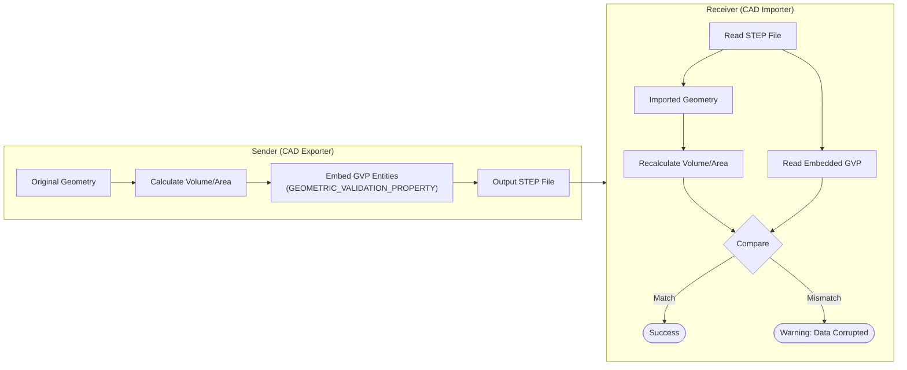

# Validation and CAx-IF

This document explains the mechanisms for ensuring the quality of STEP data and the activities of the community.

## 1. What is CAx-IF (Implementor Forum)?
* An international group consisting of major CAD vendors (Autodesk, Dassault, Siemens, PTC, etc.) that develops the "Recommended Practices," which serve as the implementation bible for STEP.
* **Following these "Recommended Practices" is more critical for successful practical implementation than following the official standard alone.**

## 2. Geometric Validation Properties (GVP)
* A mechanism to verify that geometric data has been transmitted correctly.
* Geometric information such as volume, surface area, and center of mass is embedded within the STEP data. The receiver can then recalculate these values and compare them to detect conversion errors.

### GVP Workflow

## 3. Recommended Resources
* [CAx-IF Recommended Practices](https://www.cax-if.org/joint_testing_info.html) - Guidelines for implementation.
* [MBx Interoperability Forum](https://www.mbx-if.org/) - Latest interoperability information.

---
## 📚 Next Steps
- **[Minimal Export](./minimal-export.md)** - Try exporting your own STEP file.

[Back to README](../README.md)
