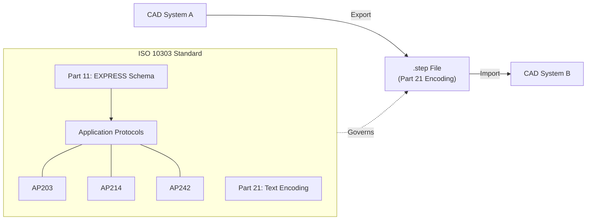

# Overview

A simple, open guide for understanding and implementing the STEP standard (ISO 10303).

**Links**: [🌐 Guide](https://takuto-na.github.io/step-standards-explained/) | [📂 GitHub](https://github.com/takuto-NA/step-standards-explained)

STEP (Standard for the Exchange of Product model data) is an international standard for the computer-interpretable representation and exchange of industrial product data. While powerful, it is notoriously complex. This guide provides the procedural knowledge and context needed to work with STEP files accurately and efficiently.

## Why this guide?

Engineers and developers often don’t have the context they need to implement STEP support reliably. This project solves this by giving you access to technical knowledge and specific implementation details that you can apply immediately.

* **Expert Knowledge**: Specialized knowledge from geometry definitions to PMI (Product and Manufacturing Information).
* **Implementation Focus**: Practical tips for building parsers, exporters, and handling persistent IDs.
* **Open Standard**: Based on ISO 10303, explaining the differences between AP203, AP214, and AP242.

## What can this guide enable?

* **Domain expertise**: Understand the hierarchy of entities and the EXPRESS language used to define them.
* **Accurate Data Exchange**: Learn how to preserve colors, layers, and semantic PMI across different CAD systems.
* **Repeatable Workflows**: Turn complex STEP export/import tasks into consistent and reliable processes.

## Adoption & Compatibility

The STEP standard is supported by all major CAD and simulation tools. Understanding which version (AP) to use is critical for interoperability.

### The Big Picture: How it fits together

| Application Protocol | Primary Focus | Use Case |
| :--- | :--- | :--- |
| **AP203** | Configuration Controlled Design | Legacy systems, basic geometry |
| **AP214** | Automotive Mechanical Design | Mainstream CAD exchange (colors/layers) |
| **AP242** | Managed Model Based 3D Engineering | Modern MBD, PMI, and simulation |

[→ View full CAD Support Matrix](/comparison/cad-support-matrix)

## Learning Path for Implementers

### Step 1: Foundations
* **[Glossary](./docs/glossary)** - Understand STEP-specific terminology.
* **[Getting Started](./docs/getting-started)** - Quickly grasp the big picture.
* **[FAQ](./docs/faq)** - Resolve common questions.

### Step 2: Strategy
* **[Which AP should I use?](./decision-guides/which-ap-should-i-use)** - Choose the right standard for your project.
* **[Capability Matrix](./comparison/capability-matrix)** - Compare functional support across APs.
* **[Format Comparison](./comparison/format-comparison)** - STEP vs IGES, Parasolid, etc.
* **[Deep Dive: STEP vs. 3D PDF](./comparison/step-vs-3dpdf)** - When to use document-based exchange.

### Step 3: Data & Geometry
* **[File Basics](./format/step-file-basics)** - Syntax and structure fundamentals.
* **[File Walkthrough](./examples/step-file-walkthrough)** - Understand real STEP files line-by-line.
* **[Data Model Map](./format/data-model-map)** - Grasp the entity hierarchy.
* **[Geometry & Topology](./format/geometry-and-topology)** - Deep dive into mathematical representation.

### Step 4: Implementation
* **[Common Pitfalls](./implementation/common-pitfalls)** - Implementation warnings and solutions.
* **[Validation and CAx-IF](./implementation/validation-and-caxif)** - Methods for quality assurance.

## Key Resources

  <a href="./docs/getting-started" class="card">
    
Getting Started

    
Quickly grasp the big picture of the STEP standard.

  </a>
  <a href="./format/step-file-basics" class="card">
    
File Basics

    
Understand syntax and structure fundamentals.

  </a>
  <a href="./format/data-model-map" class="card">
    
Data Model Map

    
Visualize entity hierarchies and navigation paths.

  </a>
  <a href="./implementation/common-pitfalls" class="card">
    
Common Pitfalls

    
Learn about units, precision, and orientation issues.

  </a>
  <a href="./decision-guides/which-ap-should-i-use" class="card">
    
AP Selection Guide

    
Which AP (203, 214, 242) is right for you?

  </a>

